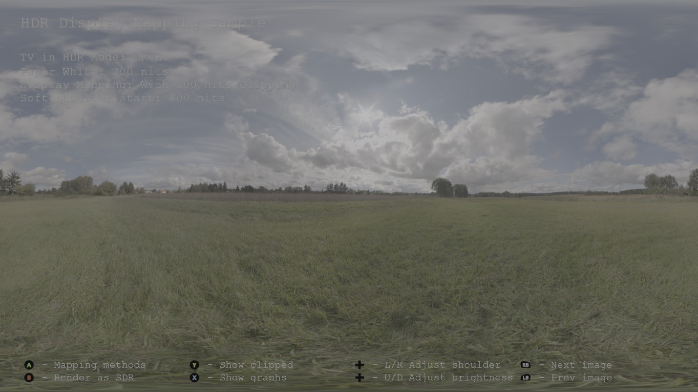
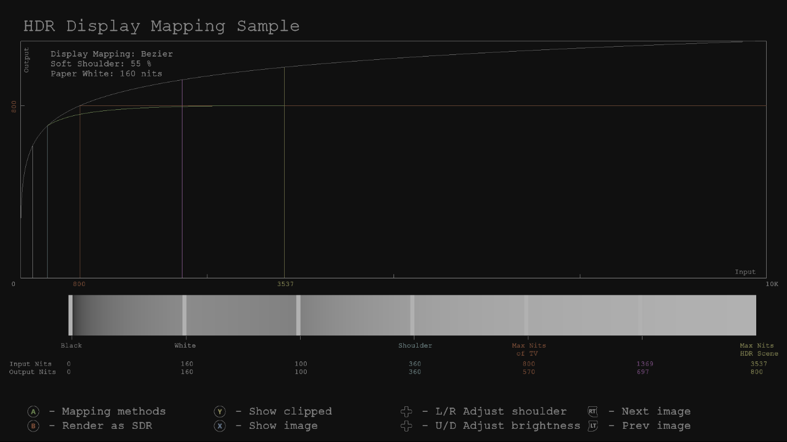
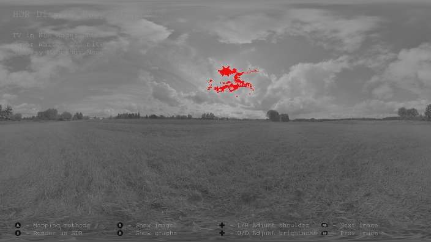
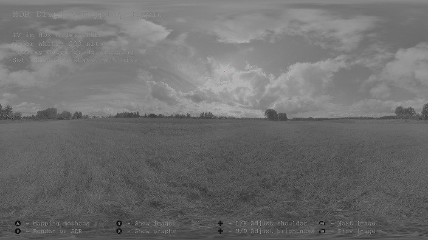
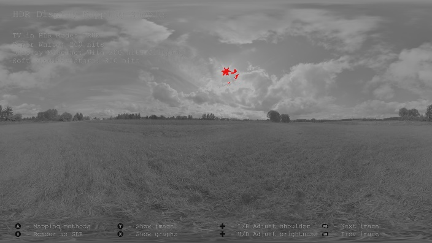

# HDR 表示マッピングのサンプル

*このサンプルは、Microsoft Game Development Kit と互換性があります (2022 年 3 月)*

# 説明

このサンプルは、HDR 対応テレビで HDR シーンをレンダリングする場合でも、"HDR ディスプレイ マッピング" と呼ばれるトーン マッピングがまだ必要であることを示しています。 HDR ディスプレイ マッピングは、HDR テレビが表示できるものよりも明るい値をテレビの機能の上の明るさの範囲にマップします。これにより、シーンの非常に明るい領域の詳細がクリップされなくなります。 ホワイト ペーパー「[HDR ディスプレイ マッピング](http://aka.ms/hdr-display-mapping)」を参照してください。



# サンプルのビルド

Xbox One 開発キットを使用している場合は、アクティブなソリューション プラットフォームを `Gaming.Xbox.XboxOne.x64` に設定します。

Xbox Series X|S を使用している場合は、アクティブなソリューション プラットフォームを `Gaming.Xbox.Scarlett.x64` に設定します。

*詳細については、* *GDK ドキュメント*の「__サンプルの実行__」を参照してください。

# サンプルの使用方法

このサンプルでは、次のコントロールを使用します。

| 操作 | ゲームパッド |
|---|---|
| さまざまなマッピング方法を切り替える | A button |
| HDR と SDR のレンダリングを切り替える | B button |
| テレビの最大輝度より明るい値を強調表示する | Y button |
| グラフ / 曲線の表示を切り替える | X button |
| HDR ディスプレイ マッピングのソフト ショルダーを調整する | 方向パッド (左/右) |
| シーンの全体的な明るさを調整する | 方向パッド (上/下) |

# 実装メモ

SDR テレビの HDR シーンで明るい値を視覚化できるようにするには、HDR から SDR トーンへのマッピングが必要です。 Reinhard や Filmic などのこれらのトーン マッピング演算子では、次のように値がマップされるため、白よりも明るい値はクリップされません

```
[Black..MaxBrightnessOfHDRScene] = [Black..White]
```


このサンプルは、HDR 対応テレビで HDR シーンをレンダリングする場合でも、トーン マッピングが必要であることを示しています。 これを "HDR 表示マッピング" と呼びます。 HDR ディスプレイ マッピングは、最大テレビの輝度よりも明るい値がクリップされないように、次の方法で値をマップします

```
[Black..White] = [Black..White]

[White..BrightShoulder] = [White-BrightShoulder]

[BrightShoulder..MaxBrightnessOfHDRScene] = [BrightShoulder..MaxBrightnessOfTV]
```


その理由は、HDR テレビの最大輝度レベルが異なるからです。たとえば、1 つのテレビで最大 600 ニトを出力できますが、別のテレビでは 2,000 ニトを出力する可能性があります。 HDR シーンの最大輝度値が 1500 ニトの場合、最大輝度 2,000 ニトを出力できるテレビは、HDR シーン内のすべての値を表示できます。 しかし、600 ニトのテレビでは、600 ニトを超えるすべての値が 600 ニトまでに自然にクリッピングされ、シーンの明るいエリアの細部がすべて失われます。 実際、このような場合、単純な HDR から SDR トーンへのマッピングでは、より詳細な情報が表示されます。明るさではなく白に上がりますが、シーンの明るい領域の詳細は、ビジュアル品質に追加することが非常に重要です。

HDR ディスプレイ マッピングの実装は、いくつかの方法で行うことができます。 このサンプルでは、サンプルの X ボタンを使用して視覚化できる非線形 ST.2084 値を使用して実装する方法を示します。 次の 3 つの点が定義されています:

1. **P0**、ソフト ショルダーの始まり (500 ニトなど)

2. **P1**、テレビの最大輝度 (1000 ニトなど)

3. **P2**、HDR シーンの最大輝度 (2000 ニトなど)。

単純なベジエ曲線は、P0、P1、P2 を使用して適合します。

この方法では、より詳細な輝度を損なうため、詳細を確認するためにどの程度の輝度が損なわれるかを選択できるようにすることをお勧めします。 したがって、このサンプルには次の 3 つのモードがあります:

- **なし** -- ディスプレイ マッピングなし。未処理の HDR 値をテレビに出力するだけです。 非常に明るい領域のクリッピングに注目してください

- **クリッピングなし** -- シーンの最大輝度をテレビの最大輝度にマップします。 すべての詳細を表示できますが、画像の輝度は低くなります

- **一部のクリッピング** -- シーンの最大輝度を、テレビの最大輝度 (200 ニトなど) よりも少し明るいものにマップします。 これにより、少量のクリッピングだけで詳細を確認できます。これにより、明るさの一部が追加されます



また、このサンプルには、クリップ (赤) されるシーン内の明るい値と、テレビのピーク輝度 (紫) の値を強調表示するための便利な視覚化もあります。

|  |
|---|---|
|  | トーン マッピングなしで SDR テレビに表示される画像。 紫色のピクセルは、1.0f でレンダリングされたすべての値を示します |
|  | HDR ディスプレイ マッピングなしで HDR テレビに表示される画像。 赤いピクセルは、テレビで表示できる値 (クリップされる明るい値) よりも明るいシーン内のすべての値を示します。 |
|  | HDR ディスプレイ マッピングを使用して HDR テレビに表示される画像。 赤色のピクセルはもう存在しないため、明るい値がテレビの最大輝度を超えないようにマップされていることを示しています。 紫色のピクセルは、テレビの最大輝度にあるが、テレビよりも明るい値を示します。 |
|  | 上記と同じですが、ある程度のクリッピングが可能になり、詳細と明るさの間に適切な妥協が生じるようにしました |

# 既知の問題

なし

# 更新履歴

2016 年 3 月の初期リリース。

2017 年 6 月 12 日に DirectX に更新されました

# プライバシーに関する声明

サンプルをコンパイルして実行する場合、サンプルの使用状況を追跡するために、サンプルの実行可能ファイルのファイル名が Microsoft に送信されます。 このデータ コレクションからオプトアウトするには、Main.cpp の "サンプル使用状況テレメトリ" というラベルの付いたコードのブロックを削除します。

Microsoft のプライバシー ポリシー全般の詳細については、「[Microsoft のプライバシーに関する声明](https://privacy.microsoft.com/en-us/privacystatement/)」を参照してください。


