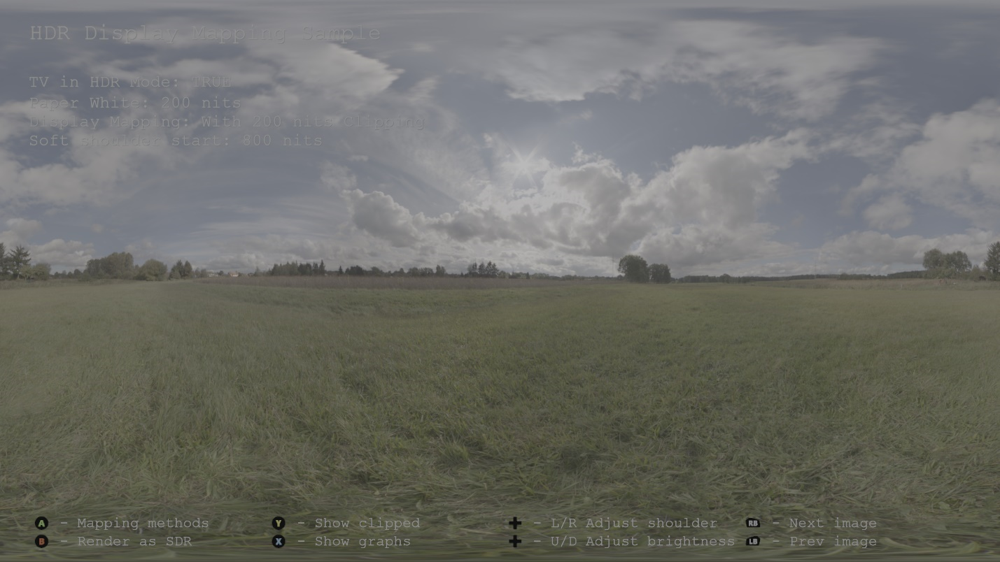
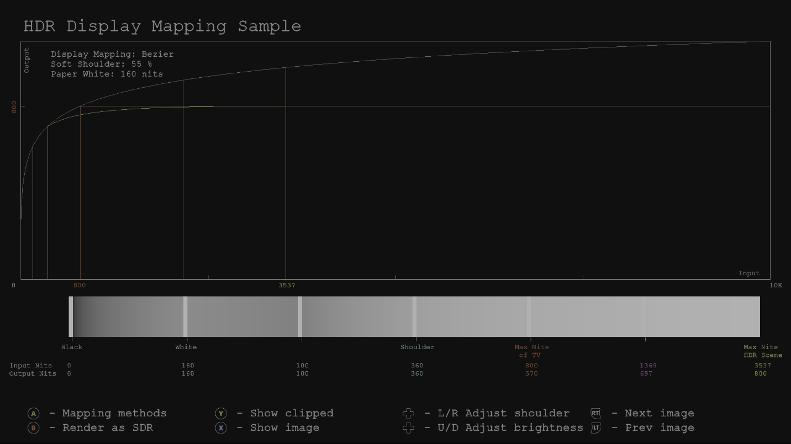
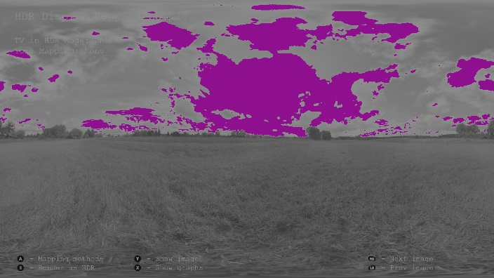

# HDR 显示映射示例

*此示例可用于 Microsoft 游戏开发工具包 (2022 年 3 月)*

# 说明

此示例表明，即使是在支持 HDR 的电视上渲染 HDR 场景，仍然需要一些音调映射，该映射称为&ldquo;HDR 显示映射&rdquo;。 HDR 显示映射将比 HDR 电视可显示亮度范围更亮的值映射到电视功能的上部亮度范围中，以便场景中非常亮的区域中的细节不会被剪裁。 请参阅白皮书&ldquo;[HDR 显示映射](http://aka.ms/hdr-display-mapping)&rdquo;。



# 生成示例

如果使用 Xbox One 开发工具包，请将活动解决方案平台设置为 `Gaming.Xbox.XboxOne.x64`。

如果使用 Xbox Series X|S，请将活动解决方案平台设置为 `Gaming.Xbox.Scarlett.x64`。

*有关详细信息，请参阅* __运行示例__，*在 GDK 文档中。*

# 使用示例

该示例使用以下控制。

| 操作 | 游戏板 |
|---|---|
| 在不同的映射方法之间切换 | A button |
| 在 HDR 和 SDR 呈现之间切换 | B button |
| 突出显示比电视最大亮度亮的值 | Y button |
| 切换显示图形/曲线 | X button |
| 调整 HDR 显示映射软肩膀 | 方向键向左键/向右键 |
| 调整场景的整体亮度 | 方向键上/下 |

# 实现说明

需要 HDR 到 SDR 色调映射才能在 SDR 电视上的 HDR 场景中可视化明亮值。 这些色调映射运算符（如 Reinhard 和 Filmic）按以下方式映射值，以便不会剪裁比白色亮的值

```
[Black..MaxBrightnessOfHDRScene] = [Black..White]
```


此示例表明，即使在支持 HDR 的电视上呈现 HDR 场景时，仍需要一些音调映射。 我们将这称为&ldquo;HDR 显示映射&rdquo;。 HDR 显示映射按以下方式映射值，以便小于最大电视亮度的值不会被剪裁

```
[Black..White] = [Black..White]

[White..BrightShoulder] = [White-BrightShoulder]

[BrightShoulder..MaxBrightnessOfHDRScene] = [BrightShoulder..MaxBrightnessOfTV]
```


原因是不同的 HDR 电视具有不同的最大亮度级别，例如，一台电视最多可输出 600 尼特，但另一台电视可以输出 2000 尼特。 如果 HDR 场景的最大亮度值为 1500 尼特，则最大亮度为 2000 尼特的电视将能够显示 HDR 场景中的所有值。 但是，在 600 尼特电视上，超过 600 尼特的所有值都会自然被电视剪裁为 600 尼特，从而丢失场景的明亮区域的所有细节。 事实上，在这种情况下，简单的 HDR 到 SDR 色调映射将显示更多细节，它只会升到白色，不亮，但在场景明亮区域的细节对于增加视觉质量非常重要。

可以通过多种方式实现 HDR 显示映射。 此示例演示如何使用非线性 ST.2084 值实现它，这些值可以使用示例中的 X 按钮进行可视化。 定义了以下三个点：

1. **P0**，软肩的开始，例如 500 尼特

2. **P1**，电视的最大亮度，例如 1000 尼特

3. **P2，HDR** 场景的最大亮度，例如 2000 尼特

使用 P0、P1 和 P2 拟合简单的贝塞尔曲线。

由于此方法会降低亮度以获取更多细节，因此最好能够选择细节的亮度受到损害。 因此，该示例有三种模式：

- **无** -- 无显示映射，只需将原始 HDR 值输出到电视。 请注意在非常明亮的区域剪裁

- **无剪辑** - 将场景的最大亮度映射到电视的最大亮度。 可以看到所有细节，但图像不太明亮

- **一些剪裁** - 将场景的最大亮度映射到比电视的最大亮度略亮的某个值，例如 200 尼特。 这允许仅通过少量剪裁来查看细节，从而增加了一些亮度



该示例还具有有用的可视化效果，用于突出显示场景中的明亮值，这些值将被剪裁 (红色) ，以及处于电视 (紫色) 峰值亮度的值。

|  |
|---|---|
|  | 在 SDR 电视上显示的图像，没有任何音调映射。 紫色像素表示以 1.0f 呈现的所有值 |
|  | 在 HDR 电视上显示的图像，没有任何 HDR 显示映射。 红色像素表明场景中比电视显示的更亮的所有值，即将剪裁的亮度值。 |
|  | 使用 HDR 显示映射在 HDR 电视上显示的图像。 请注意，不再有红色像素，这表示亮度值现在已映射，这样就不会超过电视的最大亮度。 紫色像素表明处于电视最大亮度的值，但不比电视更亮。 |
|  | 与上面相同，但现在我们允许进行一些剪裁，以便在细节和亮度之间实现良好的折衷 |

# 已知问题

无

# 更新历史记录

2016 年 3 月初始发布

2017 年 6 月 DirectX 12 更新

# 隐私声明

在编译和运行示例时，将向 Microsoft 发送示例可执行文件的文件名以帮助跟踪示例使用情况。 若要选择退出此数据收集，你可以删除 Main.cpp 中标记为&ldquo;示例使用遥测&rdquo;的代码块。

有关 Microsoft 的一般隐私策略的详细信息，请参阅 [Microsoft 隐私声明](https://privacy.microsoft.com/en-us/privacystatement/)。


