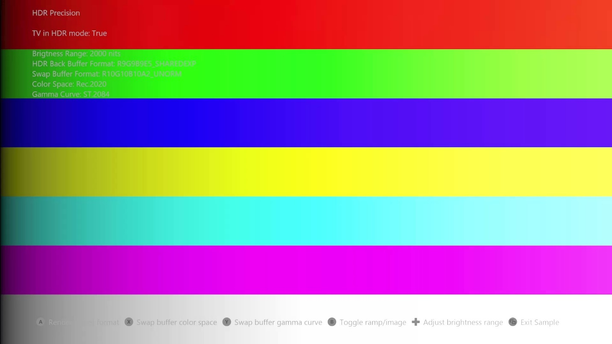

# HDR 精度示例

*此示例可用于 Microsoft 游戏开发工具包（2022 年 3 月）*

# 说明

此示例演示了渲染 HDR 时，使用不同格式和色彩空间对精度和 GPU 性能的影响。
标志允许将一些 GPU 处理卸载到显示硬件上，而一些组合则在进入显示器的最终值中产生更高的精度。 本示例还演示了在渲染 HDR 场景时使用 999e5 格式。 
| | |
|---|---|
|Xbox Series X|S 主机。 例如，交换缓冲区的一些组合|


# 生成示例

可用的平台是 Gaming.Xbox.Scarlett.x64。 *有关更多信息，请参阅*&nbsp;__运行示例__（位于 *GDK&nbsp;文档）中。*
| | |
|---|---|
|此示例仅适用于 Xbox Series X|S，因此是唯一的解决方案|


# 控件

| 操作 | 游戏板 |
|---|---|
| 更改 HDR 场景渲染目标格式 | A 按钮 |
| 更改交换缓冲区颜色空间 | X 按钮 |
| 更改交换缓冲区伽玛曲线 | Y 按钮 |
| 调整渐变亮度 | D-pad |
| 切换渲染渐变/图像 | B button |
| 选择下一个/上一个图像 | 左/右肩 |
| 退出 | &ldquo;视图&rdquo;按钮 |

# 实现说明

**HDR 场景渲染**

该示例可以使用以下渲染目标格式进行 HDR 场景渲染。 999e5 在 Xbox 上作为呈现目标格式提供
D-pad 用于调整渐变亮度，以检查黑暗和明亮区域中的精度。 使用&ldquo;A&rdquo;按钮在格式之间切换。
| | |
|---|---|
|Series X|S 主机，而不仅仅是像 Xbox One 上的纹理格式。 使用|

```cpp
DXGI_FORMAT HDRBackBufferFormat[] = { DXGI_FORMAT_R9G9B9E5_SHAREDEXP,
                                      DXGI_FORMAT_R11G11B10_FLOAT,
                                      DXGI_FORMAT_R32G32B32A32_FLOAT };
```


**交换缓冲区**

颜色转换和应用伽玛曲线。 因此，HDR 游戏可以选择处理 GPU 上的 HDR10 转换，或让显示硬件自由执行此操作。 **伽玛曲线**
| | |
|---|---|
|Xbox Series X|S 主机上的显示硬件能够执行 |


HDR10 要求主机将图像发送到使用 ST.2084 伽玛曲线编码的显示器。 游戏可以在着色器中应用 ST.2084 伽玛曲线，可能在最后一次处理绘图调用后。 可在函数 LinearToST2084() 中找到伽玛曲线实现。尽管这是相当数量的 ALU 指令，但它在着色器中的性能仍然足够，因为还涉及其他因素，例如带宽成本。 在着色器中实现伽玛曲线时，交换缓冲区格式必须为 10:10:10:2。

如果游戏希望显示硬件执行该转换，则交换缓冲区格式必须为 999e5，并且着色器必须呈现规范化的线性值。 请参阅&ldquo;switch (GammaCurve)&rdquo;部分中 PerpareSwapBuffer.hlsl 中的代码。

使用 Y 按钮在格式之间切换。

```cpp
DXGI_FORMAT SwapBufferFormat[] = { DXGI_FORMAT_R9G9B9E5_SHAREDEXP,
                                   DXGI_FORMAT_R10G10B10A2_UNORM };
```


必须使用正确的&ldquo;演示&rdquo;标志来告诉图形驱动程序交换缓冲区中的内容。 当着色器输出规范化线性值时，需要 DXGI_COLOR_SPACE_RGB_FULL\_**G10**\_NONE\_\* 标志之一，指的是 gamma 1.0。 当着色器输出 ST.2084 伽玛曲线时，需要标志 DXGI_COLOR_SPACE_RGB_FULL\_**G2084**\_NONE\_\* 之一。

**颜色转换**

HDR10 要求主机将图像发送到 Rec.2020 色彩空间中的显示器。 目前，大多数游戏都使用 Rec.709 进行主控，有些游戏扩展为 P3-D65 颜色空间。 因此，必须将颜色旋转到 Rec.2020。 游戏可以在着色器中执行该颜色旋转，或让显示硬件执行此操作。 如果显示硬件需要进行转换，则游戏必须指定其本机主控颜色空间，即交换缓冲区中渲染的颜色空间。

必须使用正确的 Present 标志来告知图形驱动程序交换缓冲区中的颜色空间。 应指定以下标志之一。

```
DXGI_COLOR_SPACE_RGB_FULL_*_NONE_P709
DXGI_COLOR_SPACE_RGB_FULL_*_NONE_D65P3
DXGI_COLOR_SPACE_RGB_FULL_*_NONE_P2020
```

使用 X 按钮在不同的颜色空间之间切换。

# 更新历史记录

2021/3/26 -- 示例创建。

# 隐私声明

在编译和运行示例时，将向 Microsoft 发送示例可执行文件的文件名以帮助跟踪示例使用情况。 若要选择退出此数据收集，你可以删除 Main.cpp 中标记为&ldquo;示例使用遥测&rdquo;的代码块。

有关 Microsoft 的一般隐私策略的详细信息，请参阅 [Microsoft 隐私声明](https://privacy.microsoft.com/en-us/privacystatement/)。


