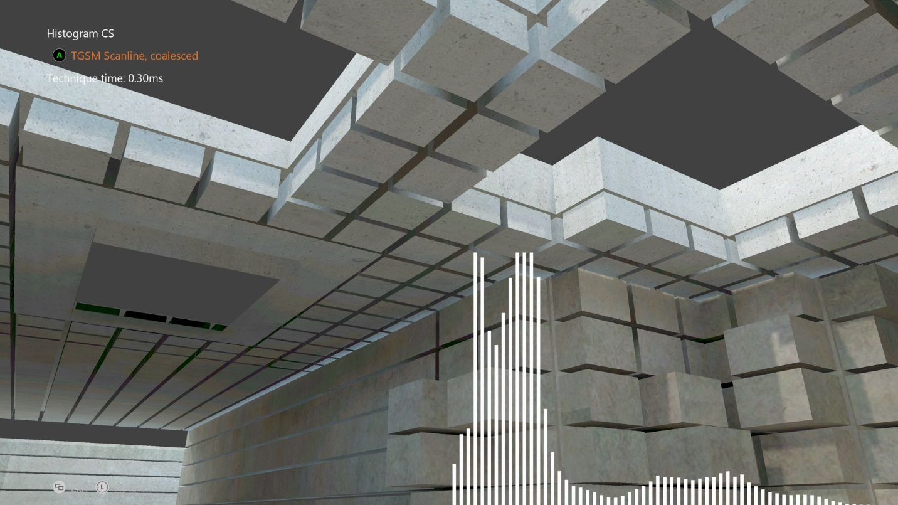

  

#   Histogram CS Sample

*This sample is compatible with the Microsoft Game Development Kit (March 2022)*

# Description

This sample demonstrates some performance considerations for Compute Shaders on Xbox. In essence, it demonstrates an optimal approach for computing a 64-bucket histogram of intensities for a scene, doing so (with the optimal implementation) in under 0.2 milliseconds. 

# Building the sample

If using an Xbox One devkit, set the active solution platform to `Gaming.Xbox.XboxOne.x64`.

If using the Xbox Series X|S devkit, set the active solution platform to `Gaming.Xbox.Scarlett.x64`.

*For more information, see* __Running samples__, *in the GDK documentation.*

# Using the sample

| Action                                |  Gamepad                      |
|---------------------------------------|------------------------------|
| Cycle Histogram Technique             |  A button                     |
| Rotate view                           |  Left thumbstick              |
| Reset view                            |  Left thumbstick (click)      |
| Exit                                  |  View Button                  |

# Implementation notes

With CPU programming, when spreading work across multiple cores we often try to have each core grab a sequential block of data, to improve cache utilization and thus performance. It's easy to think in the same way when implementing algorithms on the GPU, since in HLSL, each shader program looks like it runs in its own space (similar to a thread on a CPU). However, due to the highly parallel nature of modern GPUs, this is far from the case.

The Xbox One GPU actually works on groups of threads called waves, up to 64 wide. This means each thread is part of a larger group of parallel threads, running in lockstep, which are all executing the exact same instructions. You could think of this as being similar to a 64-float wide SIMD instruction set on a CPU.

The upshot is that having each individual thread pull neighboring data ends up being suboptimal. The ideal case is to coalesce reads -- so neighboring threads read neighboring data. Effectively each thread in a thread group reads every 64th item for each iteration of the loop. This ends up being much more optimal as can be seen from the sample. 

However, read order is not the only blocking factor in this sample. The histogram is generated by performing atomic adds to each bucket of the histogram (there's a total of 64 buckets). The Xbox One GPU does these very quickly (they are actually performed in the L2 cache), but it still becomes a gating factor. To make this run even faster, we can leverage the extremely fast internal LDS cache, which is exposed via Group Shared Memory in HLSL. By having each thread chew on an entire scanline, building results in LDS, and then atomically adding the final result at the end. Atomic operations in LDS are significantly faster than in main memory (or L2), so this yields a massive speedup in performance.

**For more information on this technique, and other stuff, be sure to check out the Compute Shader talk from Xfest 2013.**

# Known issues

None.

# Update history

The original version of the sample was written using the XSF-based
framework. It was rewritten to use the ATG sample templates in June
2020.

# Privacy Statement

When compiling and running a sample, the file name of the sample
executable will be sent to Microsoft to help track sample usage. To
opt-out of this data collection, you can remove the block of code in
Main.cpp labeled "Sample Usage Telemetry".

For more information about Microsoft's privacy policies in general, see
the [Microsoft Privacy
Statement](https://privacy.microsoft.com/en-us/privacystatement/).
