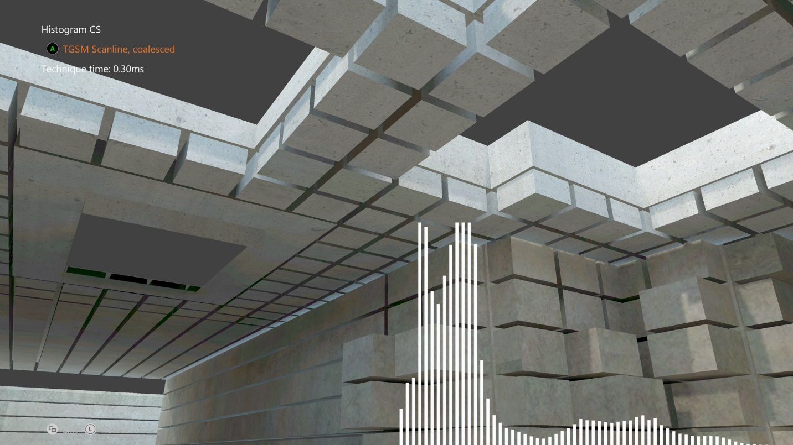

  

#   히스토그램 CS 샘플

*이 샘플은 Microsoft 게임 개발 키트(2020년 8월)와 호환 가능합니다.*

# 설명

# 이 샘플은 Xbox의 컴퓨팅 셰이더에 대한 몇 가지 성능 고려 사항을 보여줍니다. 본질적으로, 컴퓨팅 셰이더는 장면에 대한 64-버킷 강도 히스토그램을 계산하기 위한 최적의 접근 방식을 보여주며, 이 작업을 0.2 밀리초 이내에 수행합니다. 

# 샘플 빌드

Xbox One 개발 키트를 사용하는 경우 활성 솔루션 플랫폼을
Gaming.Xbox.XboxOne.x64로 설정합니다.

Xbox Series X|S 개발 키트를 사용하는 경우 활성 솔루션 플랫폼을
Gaming.Xbox.Scarlett.x64로 설정합니다.

*자세한 내용은 GDK 설명서에서* 샘플 실행을 *참조하세요.*

# 샘플 사용

| 작업                                  |  게임 패드                    |
|---------------------------------------|------------------------------|
| 주기 히스토그램 기술                  |  A 버튼                       |
| 뷰 회전                               |  왼쪽 엄지스틱                |
| 보기 다시 설정                        |  왼쪽 엄지스틱(클릭)          |
| 끝내기                                |  보기 버튼                    |

# 구현 참고 사항

# CPU 프로그래밍을 사용하면 여러 코어에 작업을 분산할 때 각 코어가 순차적 데이터 블록을 가져와서 캐시 사용률 및 성능을 향상시키려고 하는 경우가 많습니다. HLSL에서 각 셰이더 프로그램은 CPU의 스레드와 유사하게 자체 공간에서 실행되는 것처럼 보이므로 GPU에서 알고리즘을 구현할 때 동일한 방식으로 쉽게 생각할 수 있습니다. 그러나 최신 GPU는 고도로 병렬화된 특성을 갖고 있어 이 경우와는 다릅니다.

# Xbox One GPU는 실제로 웨이브라는 스레드 그룹에서 최대 64 와이드로 작동합니다. 즉, 각 스레드는 모두 정확히 동일한 명령을 실행하는 lockstep에서 실행되는 더 큰 병렬 스레드 그룹의 일부입니다. CPU에 설정된 64-float 와이드 SIMD 명령과 비슷하다고 생각할 수 있습니다.

# Upshot은 각 개별 스레드가 인접 데이터를 끌어오면 최적화되지 않게 되는 것입니다. 이상적인 경우는 인접 스레드가 인접한 데이터를 읽을 수 있도록 읽기를 병합하는 것입니다. 실제로 스레드 그룹의 각 스레드는 루프의 각 반복에 대해 매번 64번째 항목을 읽습니다. 그러면 샘플에서 볼 수 있듯이 훨씬 더 최적화됩니다. 

# 그러나 읽기 순서가 이 샘플의 유일한 차단 요소는 아닙니다. 히스토그램은 히스토그램의 각 버킷에 원자성 추가를 수행하여 생성됩니다(총 64개의 버킷이 포함됨). Xbox One GPU는 이러한 작업을 매우 빠르게 수행하지만(실제로 L2 캐시에서 수행됨) 여전히 게이팅 요인이 됩니다. 이 작업을 더 빠르게 실행하려면 HLSL의 그룹 공유 메모리를 통해 노출되는 매우 빠른 내부 LDS 캐시를 활용할 수 있습니다. 각 스레드가 전체 스캔라인에 쌓이도록 하여 LDS 결과를 구축한 다음 최종 결과를 원자 단위로 마지막에 추가합니다. LDS의 원자 작업은 주 메모리(또는 L2)보다 훨씬 빠르므로 성능과 속도가 크게 향상됩니다.

# 이 기술 및 기타 항목에 대한 자세한 내용은 Xfest 2013의 컴퓨팅 셰이더 대화를 확인하세요.

# 알려진 문제

없음

# 업데이트 기록

샘플의 원래 버전은 XSF 기반 프레임워크를 사용하여 작성되었습니다. 2020년
6월에 ATG 샘플 템플릿을 사용하도록 다시 작성되었습니다.

# 개인정보처리방침

샘플을 컴파일하고 실행하는 경우 샘플 사용량을 추적할 수 있도록 샘플 실행
파일의 파일 이름이 Microsoft에 전송됩니다. 이 데이터 수집을
옵트아웃하려면 \"샘플 사용량 원격 분석\"으로 레이블이 지정된
Main.cpp에서 코드 블록을 제거할 수 있습니다.

Microsoft의 개인정보 정책에 대한 자세한 내용은 [Microsoft
개인정보처리방침](https://privacy.microsoft.com/en-us/privacystatement/)을
참조하세요.
