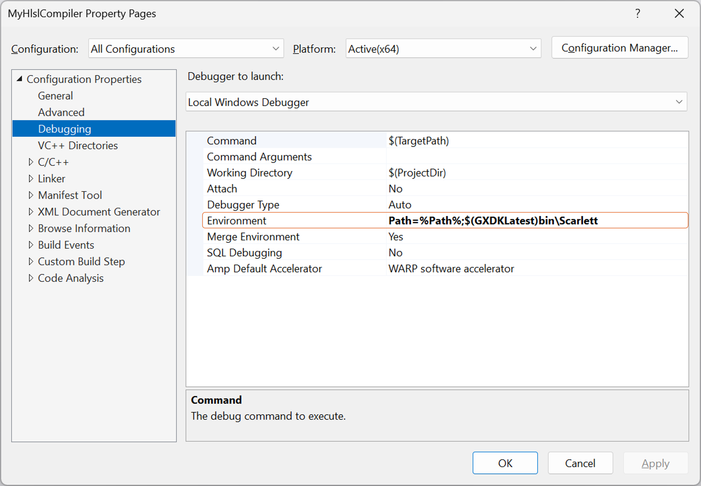

# HlslCompile サンプル

*このサンプルは、Microsoft Game Development Kit と互換性があります (2022 年 3 月)*

# 説明

このサンプルでは、PC 側の資産ビルドの様々なオプションを示すために、色々な方法で同じピクセル シェーダーをコンパイルします。 シェーダー コンパイラは現在活発に開発されている最中であり、機能の変更に応じてサンプルを更新します。

このサンプルでは、以下の 2 つの異なるコンパイラ インターフェイスを使用してシェーダーを作成します。

- `Dxc.exe` -- 新しいシェーダー コンパイラ フロントエンド用のコマンド ライン インターフェイス

- `DxCompiler_x[s].dll` 新しいシェーダー コンパイラ フロントエンド用の呼び出し可能なインターフェイス

Xbox One 用の exe と dll 別々のコピーがあり、
`DxCompiler_xs.dll`.) シェーダー シンボルは、C++ シンボルが Visual Studio やその他のツールのコンテキストを提供するのと同じ方法で、PIX 向けの重要な情報を提供します。 シェーダー コンパイラ インターフェイスでは、シンボルのストレージに関するいくつかのオプションがサポートされています。
| | | |
|---|---|---|
|Xbox Series X|S 用。 (dll の Xbox Series X|S コピーは|

- バイナリに埋め込み済み -- このメソッドは最も簡単ですが、通常はランタイム メモリの使用にコストがかかりすぎます。 埋め込みシンボルは、新しいシェーダー コンパイラ フロントエンドには推奨されていません。

- 手動で選択したファイル名に削除 -- たとえば、呼び出し元がソース ファイル名の認識可能なバリアントとして名前を選択できます。

- 自動的に選択されたファイル名に削除 -- 名前はコンパイル済みシェーダーのハッシュに基づいて選択されます。 PIX はヒントなしで同じシェーダー ハッシュを計算できるため、この方法をお勧めします。

# サンプルのビルド

Xbox One 開発キットを使用している場合は、アクティブなソリューション プラットフォームを `Gaming.Xbox.XboxOne.x64` に設定します。

Xbox Series X|S 開発キットを使用している場合は、アクティブ ソリューション プラットフォームを `Gaming.Xbox.Scarlett.x64` に設定します。

*詳細については、**GDK ドキュメント*の「__サンプルの実行__」を参照してください。

ソリューションをビルドして実行すると、Visual Studioは

- MyHlslCompiler プロジェクトをビルドする
- HlslCompile プロジェクトをビルドする
   - そのビルドの一環として、MyHlslCompiler.exe を使用して特定のシェーダーをコンパイルします
- コンパイル結果を使用してコンソールで HlslCompile の実行可能ファイルを実行する

# サンプルの使用方法

サンプルは非対話型です。 下の画面の画像の各行には三角形が含まれています。 各三角形は、同じピクセル シェーダーのコピーを使用してレンダリングされ、各コピーは異なる方法でコンパイルされます。 各ピクセル シェーダー バイナリのサイズは、水色で一覧表示されます (スクリーンショットの数値は古い可能性があります)。 各行のテキストの残りの部分では、シェーダーのコンパイル方法とシンボルの格納方法について説明します。

シンボルが正しく生成されたことを確認するには、サンプルの PIX GPU キャプチャを取得し、各三角形のピクセル シェーダーの PIX 内でシンボルの取得を試みることをお勧めします。 場合によっては、PIX は自動的に適切なシンボルを取得しますが、それ以外の場合は、ユーザー側で手動で操作する必要があります。

PC で MyHlslCompiler プロジェクトをデバッグする場合は、次に示すように Path 環境変数を GDK バイナリにポイントする必要があります。

# 既知の問題

ありません。

# 更新履歴

初期リリース 2019 年 4 月

Microsoft GDK 2019 年 11 月向けの更新

# プライバシーに関する声明

サンプルをコンパイルして実行する場合、サンプルの使用状況を追跡するために、サンプルの実行可能ファイルのファイル名が Microsoft に送信されます。 このデータ コレクションからオプトアウトするには、Main.cpp の "サンプル使用状況テレメトリ" というラベルの付いたコードのブロックを削除します。

Microsoft のプライバシー ポリシー全般の詳細については、「[Microsoft のプライバシーに関する声明](https://privacy.microsoft.com/en-us/privacystatement/)」を参照してください。

