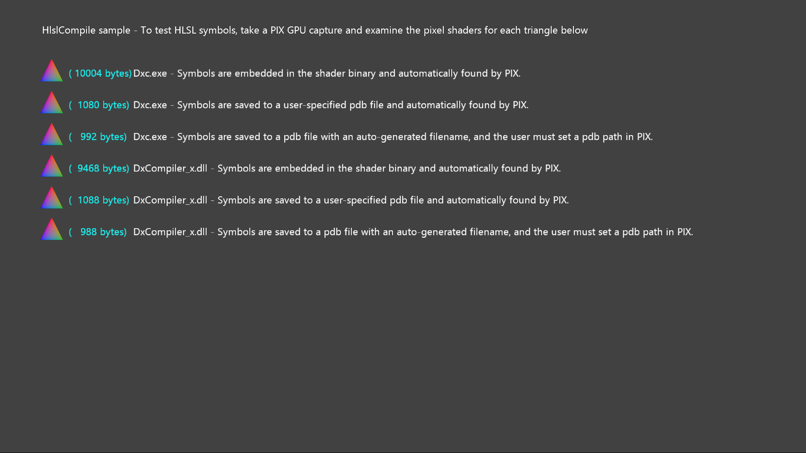

  

#   HlslCompile サンプル

*このサンプルは、Microsoft ゲーム開発キットのプレビュー (2019 年 11 月)
に対応しています。*

# 説明

このサンプルでは、PC 側のアセット
ビルドのさまざまなオプションを示すために、同じピクセル
シェーダーをさまざまな方法でコンパイルします。シェーダー
コンパイラーは、アクティブな開発の対象です。機能変更に合わせてサンプルを更新します。

このサンプルでは、2 つの異なるコンパイラ
インターフェイスを使用してシェーダーをビルドします。

-   Dxc.exe -- 新しいシェーダー コンパイラ フロントエンドのコマンド
    ライン インターフェイス

-   DxCompiler_x\[s\].dll 新しいシェーダー コンパイラ
    フロントエンドの呼び出し可能インターフェイス

XboxOne 向けおよび Scarlett 向けに、exe と dll
の両方で別々のコピーが用意されています。(dll の Scarlett 向けコピーは
DxCompiler_xs.dll です。)

シェーダー シンボルは、C++ シンボルが Visual Studio
およびその他のツールのコンテキストを提供するのと同じ方法で、PIX
に重要な情報を提供します。シェーダー コンパイラ
インターフェイスでは、シンボルの格納に関するいくつかのオプションをサポートしています。

-   バイナリへの埋め込みーこの方式が最も簡単ですが、一般的にランタイム
    メモリの使用量の点でコストがかかりすぎます。新しいシェーダー
    コンパイラ フロントエンドでは、埋め込みシンボルは廃止されます。

-   手動で選択されたファイル名に縮小されます。たとえば、この名前は、呼び出し元が選び、元のファイル名が認識可能なバリアントとなります。

-   自動で選択されたファイル名に縮小されます。この名前は、コンパイル済のシェーダーのハッシュに基づいて選択されます。PIX
    では、ヒントがなしで同じシェーダー
    ハッシュを計算できるため、この方法をお勧めします。

# サンプルのビルド

Xbox One の devkit を使用している場合は、アクティブなソリューション
プラットフォームを Gaming.Xbox.XboxOne.x64 に設定します。Scarlett の
devkit を使用している場合は、アクティブなソリューション
プラットフォームを Gaming.Xbox.Scarlett.x64 に設定します。

*詳細については、GDK
ドキュメント*の「サンプルの実行」を*参照してください*。

# サンプルの使用

サンプルは非対話型です。下の画面イメージの各行には三角形が表示されます。各三角形は同じピクセル
シェーダーのコピーを使用してレンダリングされ、各コピーは異なる方法でコンパイルされます。各ピクセル
シェーダーのバイナリのサイズは水色で表示されます
(スクリーンショットの数値は最新ではない可能性があります)。各行のテキストの残りの部分は、シェーダーのコンパイル方法、およびシンボルの格納方法を説明しています。

シンボルが正しく生成されたことを確認するには、サンプルの PIX GPU
キャプチャを取得して、各三角形のピクセル シェーダーPIX
内のシンボルを取得することをお勧めします。場合によっては、PIX
が自動的に適切なシンボルを取得しますが、それ以外の場合は、ユーザー側での手動操作が必要です。

# 既知の問題

\[なし\]

# 更新履歴

初期リリース: 2019 年 4 月

Scarlett 対応の更新 2019 月 11 月

# プライバシーに関する声明

サンプルをコンパイルして実行すると、サンプルの使用状況を追跡するため、サンプル実行可能ファイルのファイル名が
Microsoft に送信されます。このデータ収集を無効にするには、「Sample Usage
Telemetry」とラベル付けされた Main.cpp
内のコードのブロックを削除します。

Microsoft のプライバシー方針の詳細については、「[Microsoft
プライバシーに関する声明](https://privacy.microsoft.com/en-us/privacystatement/)」を参照してください。
