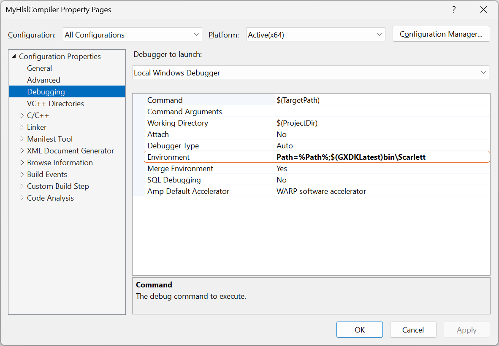

# HlslCompile 샘플

*이 샘플은 Microsoft 게임 개발 키트(2022년 3월)와 호환됩니다.*

# 설명

이 샘플에서는 다양한 방법으로 동일한 픽셀 셰이더를 컴파일하여 PC 쪽 자산 빌드에 대한 다양한 옵션을 보여줍니다. 셰이더 컴파일러는 활발히 개발 중이며, 기능이 변경되면 샘플이 업데이트될 것입니다.

이 샘플에서는 두 가지 다른 컴파일러 인터페이스를 사용하여 셰이더를 빌드합니다.

- `Dxc.exe` -- 새 셰이더 컴파일러 프런트 엔드에 대한 명령줄 인터페이스

- `DxCompiler_x[s].dll` 새 셰이더 컴파일러 프런트 엔드에 대해 호출 가능한 인터페이스

Xbox One용 exe 및 dll 파일의 개별 복사본이 있습니다.
`DxCompiler_xs.dll`.) 셰이더 기호는 C++ 기호가 Visual Studio 및 기타 도구에 대한 컨텍스트를 제공하는 것과 동일한 방식으로 PIX에 관련된 중요한 정보를 제공합니다. 셰이더 컴파일러 인터페이스는 기호 스토리지에 대한 다양한 옵션을 지원합니다.
| | | |
|---|---|---|
|for Xbox Series X|S. (The Xbox Series X|S copy of the dll is|

- 이진 파일에 포함됩니다. 이 방법은 가장 간단하지만 일반적으로는 런타임 메모리를 가장 많이 사용합니다. 포함된 기호는 새 셰이더 컴파일러 프런트 엔드에 사용되지 않습니다.

- 수동으로 선택한 파일 이름만 남고 제거됩니다. 예를 들어 호출자가 원본 파일 이름을 인식 가능하도록 변형한 이름을 선택할 수 있습니다.

- 자동으로 선택된 파일 이름만 남고 제거됩니다. 컴파일된 셰이더의 해시에 따라 이름이 선택됩니다. PIX가 힌트 없이도 동일한 셰이더 해시를 계산할 수 있으므로 이 방법을 사용하는 것이 좋습니다.

# 샘플 빌드

Xbox One 개발 키트를 사용하는 경우 활성 솔루션 플랫폼을 `Gaming.Xbox.XboxOne.x64`(으)로 설정합니다.

Xbox Series X|S 개발 키트를 사용하는 경우 활성 솔루션 플랫폼을 `Gaming.Xbox.Scarlett.x64`(으)로 설정합니다.

*자세한 내용은* *GDK 설명서의* __샘플 실행을 참조하세요.__

솔루션을 빌드하고 실행하면 Visual Studio에서

- MyHlslCompiler 프로젝트 빌드
- HlslCompile 프로젝트 빌드
   - MyHlslCompiler.exe를 사용하여 해당 빌드의 일부로 특정 셰이더를 컴파일합니다.
- 컴파일 결과를 사용하여 콘솔에서 HlslCompile 실행 파일을 실행합니다.

# 샘플 사용

샘플은 비대화형입니다. 아래 화면 이미지에는 행마다 삼각형이 포함되어 있습니다. 각 삼각형은 동일한 픽셀 셰이더의 복사본을 사용하여 렌더링되며, 각 복사본은 다른 방식으로 컴파일됩니다. 각 픽셀 셰이더 이진 파일의 크기는 녹청색으로 나열됩니다(스크린샷의 숫자는 만료되었을 수 있음). 각 줄의 나머지 텍스트는 셰이더의 컴파일 방식과 기호 저장 방식을 설명합니다.

기호가 제대로 생성되었는지 확인하려면 샘플의 PIX GPU 캡처를 사용하고, 각 삼각형의 픽셀 셰이더 관련 PIX에서 기호를 검색하는 것이 좋습니다. 경우에 따라 PIX는 적절한 기호를 자동으로 검색하기도 하지만, 어떤 경우에는 사용자 쪽에서 수동으로 작업해야 할 수도 있습니다.

PC에서 MyHlslCompiler 프로젝트를 디버그하려면 아래와 같이 패스 환경 변수로 GDK 바이너리를 가리켜야 합니다.

# 알려진 문제

없습니다.

# 업데이트 기록

2019년 4월 초기 릴리스

Microsoft GDK 2019년 11월에 업데이트됨

# 개인정보처리방침

샘플을 컴파일하고 실행하는 경우 샘플 사용량을 추적할 수 있도록 샘플 실행 파일의 파일 이름이 Microsoft에 전송됩니다. 이 데이터 수집을 옵트아웃하려면 Main.cpp에서 "샘플 사용량 원격 분석"이라는 레이블이 지정된 코드 블록을 제거할 수 있습니다.

일반적인 Microsoft의 개인 정보 정책에 대한 자세한 내용은 [Microsoft 개인정보처리방침](https://privacy.microsoft.com/en-us/privacystatement/)을 참조하세요.

