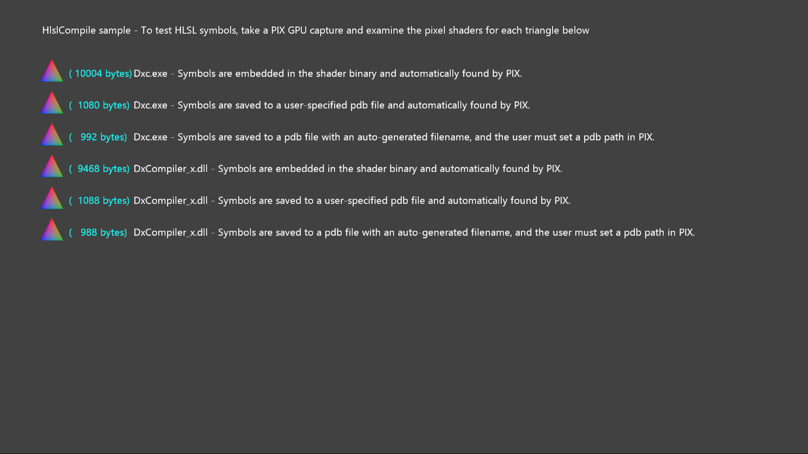

  

#   HlslCompile 示例

此示例与 Microsoft 游戏开发工具包预览版（2019 年 11 月）兼容

# 说明

此示例以多种不同的方式来编译同一像素着色器，以说明电脑端资产构建的不同选项。目前正在积极开发着色器编译器，随着功能的更改，我们将更新示例。

此示例使用两个不同的编译器接口来构建着色器：

-   Dxc.exe -- 新着色器编译器前端的命令行接口

-   新着色器编译器前端的 DxCompiler_x\[s\].dll 可调用接口

对于 XboxOne 和 Scarlett，exe 和 dll 都有单独的副本。（dll 的 Scarlett
副本为 DxCompiler_xs.dll。）

着色器符号为 PIX 提供重要信息，就像 C++ 符号为 Visual Studio
和其他工具提供上下文一样。着色器编译器接口支持几种存储符号的选项：

-   嵌入二进制文件中
    --此方法最为简单，但通常会占用过多的运行时内存使用量。新的着色器编译器前端已弃用嵌入符号。

-   去除为手动选择的文件名 --
    例如，调用方可选择该名称作为源文件名的可识别变体。

-   去除为自动选择的文件名 --
    将基于编译的着色器的哈希选择该名称。推荐使用此方法，因为 PIX
    可以在没有提示的情况下计算相同的着色器哈希。

# 构建示例

如果使用 Xbox One 开发工具包，请将活动解决方案平台设置为
Gaming.Xbox.XboxOne.x64。如果使用 Scarlett
开发工具包，请将活动解决方案平台设置为 Gaming.Xbox.Scarlett.x64

有关详细信息，请参阅 GDK 文档中的"运行示例"。

# 使用示例

示例是非交互式示例。下面屏幕图像中的每一行都包含一个三角形。使用相同像素着色器的副本呈现每个三角形，并且每个副本均以不同的方式编译。每个像素着色器二进制文件的大小以蓝绿色列出（屏幕截图中的数字可能已过时）。每行文本的其余部分描述了着色器的编译方式以及符号的存储方式。

若要验证是否正确生成了符号，建议对示例进行 PIX GPU 捕获，并尝试在 PIX
中为每个三角形的像素着色器检索符号。在某些情况下，PIX
将自动检索正确的符号，而在其他情况下，则需要用户进行手动操作。

# 已知问题

\[无\]

# 更新历史记录

初始发布：2019 年 4 月

2019 年 11 月进行了更新以适用于 Scarlett

# 隐私声明

在编译和运行示例时，示例可执行文件的文件名将发送给
Microsoft，用于帮助跟踪示例使用情况。要选择退出此数据收集，你可以删除
Main.cpp 中标记为"示例使用遥测"的代码块。

有关 Microsoft 的一般隐私策略的详细信息，请参阅《[Microsoft
隐私声明](https://privacy.microsoft.com/en-us/privacystatement/)》。
