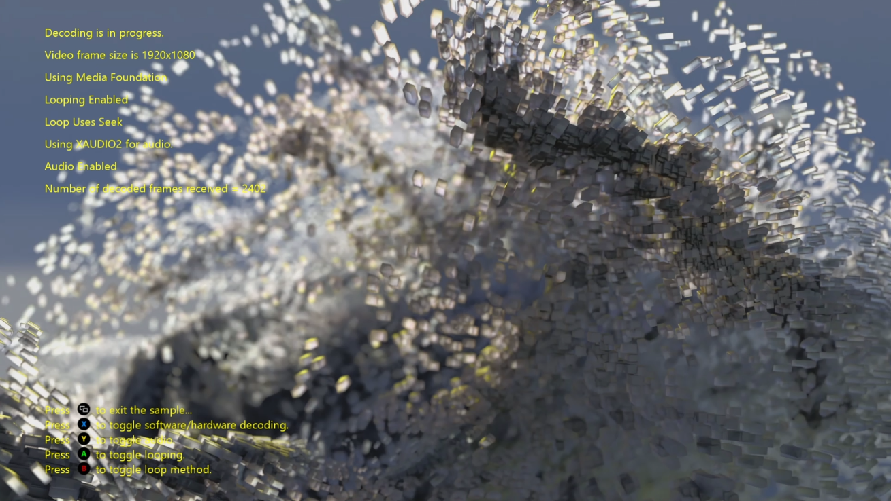

  

#   MP4Reader のサンプル (DirectX 12)

*このサンプルは、Microsoft ゲーム開発キットのプレビュー (2019 年 11 月)
に対応しています。*

# 

# 説明

このサンプルでは、メディア ファンデーション ソース
リーダーを使用して、H264 ビデオ ストリームを含む MP4
ファイルを読み取り、ハードウェア
アクセラレーションを使用してデコードする方法を示します。 また、XAudio2
と WASAPI を使用してオーディオ
ストリームをデコードする方法も示します。このサンプルは、H264 video
のデコードを既存のムービー再生パイプラインに統合する必要があるタイトルに対しては特に便利です。

このサンプルは、ビデオ ソース
フレームレートに基づくビデオの同期再生をサポートしていないため、ムービー再生ソリューションのデモを目的としたものではありません。

# サンプルのビルド

Xbox One の devkit を使用している場合は、アクティブなソリューション
プラットフォームを Gaming.Xbox.XboxOne.x64 に設定します。

Project Scarlett を使用している場合は、アクティブなソリューション
プラットフォームを Gaming.Xbox.Scarlett.x64 に設定します。

*詳細については、GDK
ドキュメント*の「サンプルの実行」を*参照してください*。

# サンプルの使用

このサンプルでは、次のコントロールが使用されます。

| 動作                                         |  コントローラー        |
|----------------------------------------------|-----------------------|
| 終了                                         |  ビュー ボタン         |

# 実装に関する注意事項

このサンプルは、Media\\Videos フォルダーから、H264
ビデオストリームを含む MPEG 4
ファイルを読み取り、デコード済みフレームが生成されるとすぐに画面にレンダリングします。

このサンプルは、H.264 ビデオ ストリームのハードウェア アクセラレーション
デコードのみを使用し、ソフトウェア デコードをサポートしていません。
オーディオ ストリームは、Microsoft Media Foundation
を使用してデコードされ、XAudio2 または WASAPI
でオーディオをレンダリングするように構成できます。これは、MP4Reader.h
の先頭のプロセッサ定義を変更することによって制御されます。

> //
>
> //この 2 つの定義のいずれかを使用して、2
> つの異なるテクノロジの動作を確認します。
>
> //
>
> //#define USE_XAUDIO2
>
> #define USE_WASAPI

vs.

> //
>
> //この 2 つの定義のいずれかを使用して、2
> つの異なるテクノロジの動作を確認します。
>
> //
>
> #define USE_XAUDIO2
>
> //#define USE_WASAPI

# 既知の問題

なし

# プライバシーに関する声明

サンプルをコンパイルして実行すると、サンプルの使用状況を追跡するため、サンプル実行可能ファイルのファイル名が
Microsoft に送信されます。このデータ収集を無効にするには、「Sample Usage
Telemetry」とラベル付けされた Main.cpp
内のコードのブロックを削除します。

Microsoft のプライバシー方針の詳細については、「[Microsoft
プライバシーに関する声明](https://privacy.microsoft.com/en-us/privacystatement/)」を参照してください。
