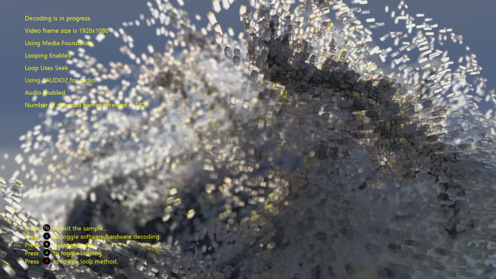

  

#   MP4Reader 示例 (DirectX 12)

此示例与 Microsoft 游戏开发工具包预览版（2019 年 11 月）兼容

# 

# 说明

该示例演示了如何使用媒体基础源读取器读取包含 H264 视频流的 MP4
文件，并使用硬件加速对其进行解码。 它还演示如何使用 XAudio2 和 WASAPI
解码音频流。对于需要将 H264
视频解码集成到现有的电影播放管道的标题，该示例特别有用。

由于本示例不支持基于视频源帧速率的视频同步播放，因此，此示例不用于演示电影播放解决方案。

# 构建示例

如果使用 Xbox One 开发工具包，请将活动解决方案平台设置为
Gaming.Xbox.XboxOne.x64。

如果使用 Project Scarlett，请将活动解决方案平台设置为
Gaming.Xbox.Scarlett.x64。

有关详细信息，请参阅 GDK 文档中的"运行示例"。

# 使用示例

此示例使用以下控制。

| 操作                                         |  游戏手柄              |
|----------------------------------------------|-----------------------|
| 退出                                         |  "视图"按钮            |

# 实现说明

该示例从"Media\\Videos"文件夹中读取一个 MPEG 4 文件，其中包含一个 H264
视频流，并在解码帧生成后立即将其呈现到屏幕上。

该样本仅使用硬件加速解码，不支持 H.264 视频流的软件解码。 音频流使用
Microsoft 媒体基础进行解码，并可配置为使用 XAudio2 或 WASAPI
呈现音频。这可以通过修改 MP4Reader.h 顶部设置的预处理器定义来进行控制：

> //
>
> // 使用这两个定义中的一个来查看这两种不同技术的性能如何。
>
> //
>
> //#define USE_XAUDIO2
>
> #define USE_WASAPI

与

> //
>
> // 使用这两个定义中的一个来查看这两种不同技术的性能如何。
>
> //
>
> #define USE_XAUDIO2
>
> //#define USE_WASAPI

# 已知问题

无

# 隐私声明

在编译和运行示例时，示例可执行文件的文件名将发送给
Microsoft，用于帮助跟踪示例使用情况。要选择退出此数据收集，你可以删除
Main.cpp 中标记为"示例使用遥测"的代码块。

有关 Microsoft 的一般隐私策略的详细信息，请参阅《[Microsoft
隐私声明](https://privacy.microsoft.com/en-us/privacystatement/)》。
