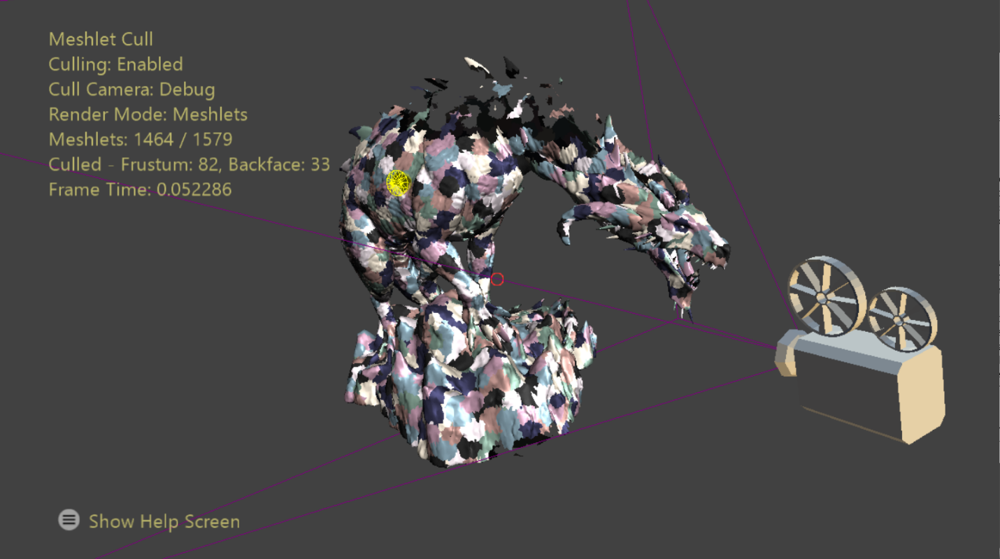

# Meshlet 剔除样本

*此示例兼容 Microsoft 游戏开发工具包（2022 年 3 月）和 Windows 10（版本 2004）2020 年 5 月更新*

# 说明

放大着色器是在网格着色器管道中的网格着色器阶段之前的可选阶段。 其目的是确定特定 GPU 任务中所需的网格着色器线程组的数量，可选择将数据的有效负载传递给其调度的 MS 子线程组。 这可用于在工作负载到达管道中的网格着色器阶段之前减少或扩展工作负载。

此示例演示如何利用放大着色器使用每 Meshlet 剔除元数据针对相机剔除 Meshlet。 目标是将所需的网格着色器线程组数量降低至仅那些在启动之前被认为可能可见的部分。

# 生成示例

如果使用 Xbox Series X|S 开发工具包，请将可用解决方案平台设置为 `Gaming.Xbox.Scarlett.x64`。

如果使用具有适当硬件和 Windows 10 版本的电脑，请将活动解决方案平台设置为 Gaming.Deskop.x64。

此示例不支持 Xbox One。

*有关更多信息，请参阅*&nbsp;__运行示例__（位于 *GDK&nbsp;文档）中。*

# 使用示例

该示例的重点是展示基于放大着色器的 meshlet 剔除技术。 可以打开/关闭剔除，并且可以在主相机和调试相机之间切换发生剔除的相机。 调试相机的位置和方向由世界空间中的相机模型表示。 可视化剔除相机的视锥体，以便更容易地观察应该在哪里发生视锥体剔除。

该示例提供了几种渲染模式：平面着色和 meshlet 可视化。 在 Meshlet 视图模式下，可以从场景中选择一个 Meshlet 来可视化其边界球体和一个表示 Meshlet 内法线宽度的圆锥。 如果该 Meshlet 的法线圆锥形成退化圆锥(比半球宽)，则不会渲染圆锥。 对于某些种类，用户还可以在网格的六个细节层级之间循环。

在屏幕上绘制统计信息，显示场景对象渲染经过的 GPU 时间以及从帧中剔除的 meshlet 数量。

# 控件

| 操作 | 游戏板 | 键盘 |
|---|---|---|
| 移动相机 | 左控制杆/方向键 | WASD 或箭头键 |
| 旋转相机 | 右控制杆 | 按住 LMB + 鼠标 |
| 重置相机 | 右控制杆（推） | 不适用 |
| 控制调试相机 | 左肩 | 左移 |
| 切换剔除 | A 按钮 | Tab |
| 更改渲染模式 | X 按钮 | 空格键
 |
| 切换剔除相机 | B 按钮 | Q |
| 选择 Meshlet | Y 按钮 | RMB |
| 循环 LOD | 右侧肩/扳机键 | +/- |
| 显示&ldquo;帮助&rdquo;菜单 | &ldquo;菜单&rdquo;按钮 | 不适用 |
| 退出 | &ldquo;视图&rdquo;按钮 | 退出 |

# 实现说明

此技术从在 Meshlet 生成时生成剔除数据开始。 Meshlet 列表完成后，将计算每个 Meshlet 的对象空间边界球体和法锥。 执行这一系列步骤的算法示例代码通过单独的示例 MeshletConverter 提供。 然后，通过量化压缩此数据以节省磁盘上的内存和读取带宽。

法锥表示法线在 Meshlet 中的*分布*，该圆锥环绕其基元的所有法线。 它存储为标准化浮点值的 4 元组: 3D 单元向量表示平均法线方向，标量表示该向量与最离散三角形法线之间的点积。

为了获得剔除测试的好处，实际存储的值为 -cos(*最大角度*+ 90º)。 添加 90º 是因为在整个半球上都可以观察到一个三角形(或关于其法线的 90º)，并且圆锥包含一组视图方向，而此表面法线将从中背向。 这将剔除测试简化为单点积和浮点比较。

放大着色器的结构为处理每个线程上的单个 Meshlet。 因此，若要渲染由 *n* 个 Meshlet 组成的网格，必须调度 $\left\lceil \frac{n}{GroupSize} \right\rceil$ 线程组。 选择与平台的波大小相等的线程组大小，以促进将波次内部函数用于线程组范围的操作。 每个线程负责针对其 Meshlet (按其调度线程 ID 编制索引) 执行视锥体和法锥剔除测试。 使用前缀和波次内部函数，可见 meshlet 的索引将被压缩到组共享内存查找表中，用于启动的网格着色器线程组。 着色器以调用放大着色器内部函数 DispatchMesh 结尾，以启动必要的网格着色器线程组数，并将组共享查找表指定为有效负载数据。

# 更新历史记录

2020/4/20 &ndash; 创建示例。

2020/4/28 - 更新为使用 D3DX12 帮助程序创建网格着色器管道

# 隐私声明

在编译和运行示例时，将向 Microsoft 发送示例可执行文件的文件名以帮助跟踪示例使用情况。 若要选择退出此数据收集，你可以删除 Main.cpp 中标记为&ldquo;示例使用遥测&rdquo;的代码块。

有关 Microsoft 的一般隐私策略的详细信息，请参阅 [Microsoft 隐私声明](https://privacy.microsoft.com/en-us/privacystatement/)。

