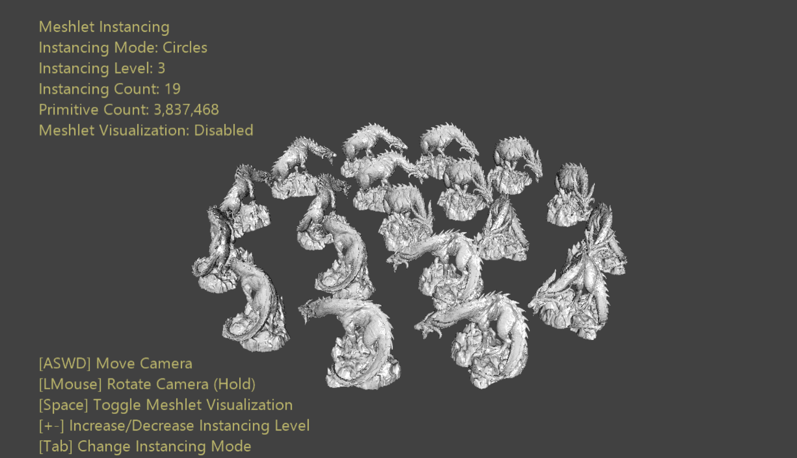

# 메시렛 인스턴스화 샘플

*이 샘플은 Microsoft 게임 개발 키트(2022년 3월) 및 Windows 10(버전 2004) 2020년 5월 업데이트와 호환됩니다.*

# 설명

메시 셰이더 파이프라인에는 인덱스 처리 및 인스턴스화 기능을 담당하는 입력 어셈블러가 없습니다. 이러한 이유로 메시 셰이더 파이프라인은 기존 그래픽 파이프라인과 같이 인스턴스화에 대한 상위 수준 인터페이스를 노출하지 않습니다. 대신 개발자에게는 메시 셰이더 스레드 ID를 사용하여 자체 인스턴스화 솔루션을 구현할 책임이 있습니다.

GPU는 워크로드를 *웨이브*라는 고정 크기의 스레드 청크로 디스패치합니다. 이 크기는 아키텍처에 따라 다르지만, 디스패치될 수 있는 최소 스레드입니다. 입력 어셈블러가 수행하는 기능 중 하나가 해당 스레드 사용률*을 최적화하기 위해 이러한 웨이브를 패킹하는 것이었습니다. 웨이브 사용률*은 디스패치된 총 웨이브 수에 대한 실제 데이터를 처리하는 웨이브 스레드의 비율입니다.

메시 셰이더 파이프라인은 입력 어셈블러를 사용하지 않기 때문에 웨이브를 작업과 함께 패킹하는 것에 대한 우려는 개발자의 몫입니다. 메시렛은 웨이브 사용률을 최적화하는 친숙한 크기의 작업 청크로 메시를 사전 처리하는 도구입니다. 그러나 메시렛에 완전히 꽉 차 있어야 한다는 엄격한 제약이 없기 때문에 최적의 웨이브 활용도가 떨어질 수 있습니다. 특히 메시의 마지막 메시렛은 채워지기 전에 기본 형식이 소진되어 가득 차 있지 않을 가능성이 높습니다. 메시의 메시렛 수가 0에 가까워질수록 이 문제는 점점 더 커집니다. 낙엽, 털, 파티클 등에서 이러한 작은 메시를 많이 인스턴스화하는 것이 일반적입니다.

이 샘플에서는 마지막으로 채워지지 않은 메시렛의 여러 인스턴스를 단일 스레드 그룹으로 패킹하여 효율적으로 인스턴스화하는 일반화된 방법을 보여줍니다. 이렇게 하면 디스패치하는 데드 스레드 수를 최소화하여 웨이브 사용률을 100%에 가깝게 유지할 수 있습니다.

# 샘플 빌드

Xbox Series X|S 개발 키트를 사용하는 경우 활성 솔루션 플랫폼을 `Gaming.Xbox.Scarlett.x64`(으)로 설정합니다.

적절한 하드웨어 및 Windows 10 또는 Windows 11 릴리스가 설치된 PC를 사용하는 경우 활성 솔루션 플랫폼을 Gaming.Deskop.x64로 설정합니다.

이 샘플은 Xbox One을 지원하지 않습니다.

*GDK 설명서의* __샘플 실행__에서 *자세한 내용을 참조하세요.*

# 샘플 사용

샘플에서는 동심원과 정육면체의 두 가지 인스턴스화 레이아웃 중에서 선택할 수 있는 옵션을 제공합니다. 따라서 다양한 비율로 확장할 수 있습니다. 플랫 셰이딩이나 인스턴스의 기본 메시렛 구조 시각화 사이를 전환할 수도 있습니다.

# 컨트롤

| 동작 | Gamepad | 키보드 |
|---|---|---|
| 카메라 이동 | 왼쪽 엄지스틱 | WASD 또는 화살표 키 |
| 카메라 회전 | 오른쪽 엄지스틱 | LMB + 마우스 누르기 |
| 카메라 다시 설정 | 오른쪽 엄지스틱(푸시) | \- |
| 인스턴스 모드 변경 | A | 탭 |
| 메시렛 시각화 토글 | X | 스페이스바 |
| 인스턴스화 수준 증가 | 오른쪽 어깨 | \+ |
| 인스턴스화 수준 감소 | 오른쪽 트리거 | \- |
| 끝내기 | 보기 버튼 | ESC |

# 구현 참고 사항

메시 셰이더 인스턴스화는 작업을 완료하기에 충분한 셰이더 인스턴스를 디스패치하고 제공된 ID를 사용하여 처리할 올바른 메시렛 및 인스턴스를 결정하는 간단한 작업입니다. 선택한 인덱싱 체계에 따라 어떤 스레드 그룹이 어떤 작업을 처리하는지가 결정됩니다.

스레드 그룹당 하나의 메시렛을 가정하면 가장 간단한 구현은 MeshletCount \* InstanceCount 스레드 그룹을 디스패치하는 것입니다. 워크로드를 완전히 처리하기에 충분한 스레드 그룹임을 확신할 수 있습니다. 또한 매우 간단한 인덱싱 체계도 제공합니다.

- *MeshletIndex* = *GroupID.x* / *InstanceCount*

- *InstanceIndex* = *GroupID.x* % *InstanceCount*

즉, 첫 번째 *InstanceCount* 스레드 그룹은 모두 메시렛 *0*을 처리하지만 서로 다른 인스턴스를 처리합니다. 가장 중요한 것은 마지막 *InstanceCount* 스레드 그룹이 모두 메시렛*(MeshletCount -- 1)*을 처리한다는 것입니다. 첫 번째 *(MeshletCount -- 1)* 메시렛이 'full'(거의 최대 꼭짓점 및/또는 프리미티브 포함)이고 마지막 메시렛이 덜 채워진다고 가정합니다. 따라서 마지막 *(MeshletCount -- 1)* 스레드 그룹은 첫 번째 *(MeshletCount -- 1) \* InstanceCount* 스레드 그룹보다 최적이 아닌 웨이브 사용률을 갖습니다. 충분히 희박한 경우 여러 인스턴스를 단일 스레드 그룹으로 패킹할 수 있습니다.

실제로 스레드 그룹 크기가 최대 메시렛 크기와 같다고 가정하면 단일 스레드 그룹에 $\lfloor MaxMeshletSize\ /\ LastMeshletSize\rfloor$ 인스턴스를 끼워 넣을 수 있습니다. 따라서 마지막 메시렛을 처리하려면 $\lfloor(LastMeshletSize*InstanceCount)/MaxMeshletSize\rfloor$ 패킹된 스레드 그룹이 필요합니다. 이렇게 하면 셰이더에서 이러한 스레드 그룹에 일부 ALU를 추가하는 대신 최적의 웨이브 효율을 얻을 수 있습니다.

# 업데이트 기록

2019년 10월 31일 -- 샘플 만들기.

2020년 4월 28일 - 메시 셰이더 파이프라인 생성에 D3DX12 도우미를 사용하도록 업데이트됨

# 개인정보처리방침

샘플을 컴파일하고 실행하는 경우 샘플 사용량을 추적할 수 있도록 샘플 실행 파일의 파일 이름이 Microsoft에 전송됩니다. 이 데이터 수집을 옵트아웃하려면 Main.cpp에서 "샘플 사용량 원격 분석"이라는 레이블이 지정된 코드 블록을 제거할 수 있습니다.

일반적인 Microsoft의 개인 정보 정책에 대한 자세한 내용은 [Microsoft 개인정보처리방침](https://privacy.microsoft.com/en-us/privacystatement/)을 참조하세요.

