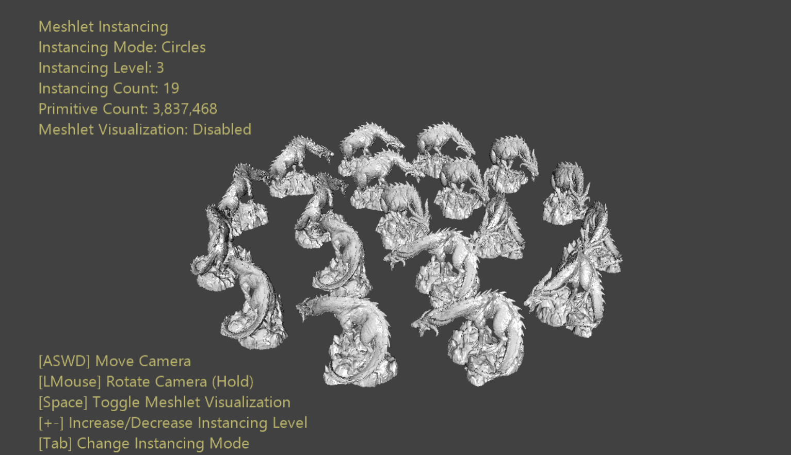

  

#   网格片段实例示例

此示例与 Microsoft 游戏开发工具包预览版（2019 年 11 月）和 Windows
10"20H1"Insider for PC 兼容

# 说明

网格着色器管道放弃了输入组装器，该组装器负责执行索引处理和实例化功能。因此，网格着色器管道不会像传统图形管道那样公开用于实例化的高级接口，而是由开发人员负责使用网格着色器线程
ID 来实现其自己的实例化解决方案。

GPU
在称为"波形"的固定大小的线程块中调度工作负荷。此大小特定于体系结构，但为可调度的最小线程数。输入组装器执行的一项功能是将这些波形与工作打包在一起以优化其线程利用率。波形利用率是指处理实例数据的波形线程与调度的波形总数之比。

由于网格着色器管道不使用输入组装器，因此开发人员需要考虑如何将波形与工作打包在一起。网格片段是一种工具，可将网格预处理成友好大小的工作块，从而优化波形利用率。但是，对网格片段并没有严格的约束，它们会完全填满，因此，导致产生次优波形利用率。具体来说，网格的最后一个网格片段很可能不会被填满（因为在填充网格之前，网格的基元已经耗尽了）。
随着网格中的网格片段数量接近于零，这导致产生了一个越来越大的问题。这些小网格通常需要大量实例化，例如在树叶、头发、颗粒等中。

该示例通过将最后一个未填充的网格片段的许多实例打包到单个线程组中，提出了一种有效实例化的通用方法。这样，可以最大程度地减少调度终止线程的数量，从而使我们的波形利用率非常接近
100%。

# 构建示例

如果使用 Project Scarlett，请将活动解决方案平台设置为
Gaming.Xbox.Scarlett.x64。

如果使用电脑且结合使用相应的硬件和 Windows 10
版本，请将活动解决方案平台设置为 Gaming.Deskop.x64。

本示例不支持 Xbox One。

有关详细信息，请参阅 GDK 文档中的"运行示例"。

# 使用示例

该示例提供了两个实例化布局的选项：同心圆和立方体。这样就可以按照不同的比例进行缩放。也可以在平面着色或可视化实例的底层网格片段结构之间切换。

# 控件

| 操作                         |  游戏手柄         |  键盘              |
|------------------------------|------------------|-------------------|
| 移动相机                     |  左操纵杆         |  WASD 或箭头键     |
| 旋转相机                     |  右操纵杆         |  按住 LMB 操作鼠标 |
| 重置相机                     |  右操纵杆（按）   |  \-                |
| 更改实例化模式               |  A                |  Tab               |
| 切换网格片段可视化效果       |  X                |  空格键            |
| 增加实例化级别               |  右肩按钮         |  \+                |
| 降低实例化级别               |  右扳机键         |  \-                |
| 退出                         |  "视图"按钮       |  ESC 键            |

# 实现说明

网格着色器实例化是一个简单的问题，就是调度足够多的着色器实例来完成工作，并使用提供的
ID
来确定要处理的正确的网格片段和实例。所选的索引方案将确定哪个线程组处理哪个工作位。

假设每个线程组有一个网格片段，最直接的实现是调度 MeshletCount \*
InstanceCount
线程组。可以肯定的是，这样的线程组已经足以充分处理我们的工作负荷。这也提供了一个非常直接的索引方案：

-   MeshletIndex = GroupID.x / InstanceCount

-   InstanceIndex = GroupID.x & InstanceCount

这意味着，第一个 InstanceCount 线程组都将处理 Meshlet
0，但处理的实例不同。更重要的是，最后一个 InstanceCount 线程组都将处理
Meshlet (MeshletCount -- 1)。我们假设第一批 (MeshletCount -- 1)
网格片段是"满的"（具有接近最大的顶点和/或基元），而最后一个网格片段的填充量较少。因此，最后一个
(MeshletCount -- 1) 线程组将比第一个 (MeshletCount -- 1) \*
InstanceCount
线程组的最优波形利用率低。如果足够稀疏，则可以将多个实例打包到一个线程组中。

事实上，假设线程组的大小等于可将
$\lfloor MaxMeshletSize\ /\ LastMeshletSize\rfloor$
实例放入单个线程组的最大的网格片段大小。因此，需要
$\lfloor(LastMeshletSize*InstanceCount)/MaxMeshletSize\rfloor$
打包的线程组来处理最后一个网格片段。这提供了最佳的波形效率，但代价是着色器中这些线程组会产生一些额外的
ALU。

# 更新历史记录

2019 年 10 月 31 日 - 创建示例。

# 隐私声明

在编译和运行示例时，示例可执行文件的文件名将发送给
Microsoft，用于帮助跟踪示例使用情况。要选择退出此数据收集，你可以删除
Main.cpp 中标记为"示例使用遥测"的代码块。

有关 Microsoft 的一般隐私策略的详细信息，请参阅《[Microsoft
隐私声明](https://privacy.microsoft.com/en-us/privacystatement/)》。
