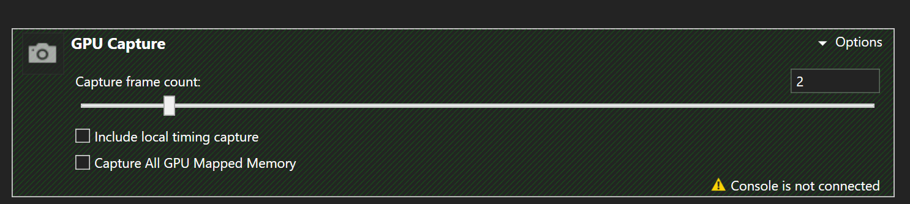

# Pipeline Postprocess Sample

*This sample is compatible with the Microsoft Game Development Kit (March 2023)*

# Description

This sample demonstrates how to overlap the postprocess phase of one frame with the beginning of the next frame, potentially achieving some performance benefit from parallelization. The sample begins with a simple scene in three passes:

These passes are much simpler than a frame of a full title, but in one respect they are typical – the beginning of the frame is light on computation, and the end of the frame is heavy on computation. Consequently, these portions of the frame are well-suited to parallelization using graphics and async compute. However, because the relevant workloads are part of different frames, they can only run in parallel if structural changes are made to the main render loop. These changes essentially mean moving the postprocess pass to the async queue and then calling presentX from there. With these changes, the render loop looks like this:

The following screenshots show how pipelined postprocess looks disabled vs enabled on PIX (for 2 frames):

> **NOTE**: For this sample, we want to show how to schedule the postprocess work to minimize latency.
The gains from this technique are easier to show when the GPU interval (in our case 16.67 ms)
is being used fully. Given that this sample's postprocess and geometry work is not enough to fill
the interval, both **Geometry - fake GPU load** and **Postprocess - fake GPU load** are used to spin the GPU with fake work in order to emulate the desired behaviour.

Pipeline postprocess off: The yellow line shows the boundary between the first and second frame.

Pipeline postprocess on. Now compute work overlaps both graphics DepthPrepass and the Geometry - Fake GPU load pass.

Note how the first screenshots shows FXAA to be a pass with VALU and texture fetch as bottlenecks, which matches well with prepass (which is more intensive on primitives, dram and vertices).

# Building the sample

If using an Xbox One devkit, set the active solution platform to `Gaming.Xbox.XboxOne.x64`.

If using Xbox Series X|S, set the active solution platform to `Gaming.Xbox.Scarlett.x64`.

*For more information, see* __Running samples__, *in the GDK documentation.*

# Controls

| Action                                       |  Gamepad               |
|----------------------------------------------|------------------------|
| Toggle async compute                         |  A                     |
| Exit the sample.                             |  View Button           |

# Implementation notes

PIX GPU captures taken from the PIX UI include GPU work from one Present call to the next (by default). In the presence of pipelining, however, at least two full frames are needed for accurate GPU profiling. Otherwise, one or more operations will appear to run in isolation, only because work which ran in parallel was not part of the capture. To get a better visualization of the frame and dependencies, expand the Gpu Capture section on PIX and increase the Capture frame count to 2.

## Latency and present

For this sample, it is useful looking at PIX's timing captures in order to understand how the work is being scheduled and present handled both when using and not using pipelined postprocess.

When **not** using pipelined post process, the frame will try to render and present between frame 1 and 2 (in this case, defined as an interval of 16.67ms). In the picture below, the small light blue boxes are the VBLANK events. Since the workload is more than an interval long, it will always miss the first VBLANK, so it aims for the next one, and while this happens, more work is scheduled right away. Bue due to the duration of the frame being more than one interval, the new frames are pushed to start later each time (as shown by the light blue lines in the image getting longer) until the frame will start so close to the next VBLANK, it ends up skipping two. At this point, the frame was late and the framerate gets impacted (green line). From the next frame, the light blue line shows the starting offset went back to being small, so this will affect one every x frames.

When using pipelined post process, the frame will try to render and present between frame 1 and 2 (again, using 16.67ms intervals). We are also adding an offset to when the rendering work starts (represented by the yellow line, more on this later). In this case, because we allow for one more frame of latency, even though we miss the first VBLANK we can have the next rendering work start in parallel to the compute work. The result is we get work being presented every frame at 60FPS instead of 30FPS. If the workload was less than an interval in duration, we would be able to present in time for the first VBLANK (adjusting the offset accordingly).

The reason for the offset added to the graphic's work is that we want to minimize the latency between when we call present and the next VBLANK (represented here by the orange line). By scheduling the frame start as late as possible, the framework can, for example, adquire the most up to date input data. More on this on the [ScheduleFrameEventX docs](https://developer.microsoft.com/en-us/games/xbox/docs/gdk/id3d12device_scheduleframeeventx).

# Update history

3/28/2023 -- Ported Sample.

# Privacy Statement

When compiling and running a sample, the file name of the sample
executable will be sent to Microsoft to help track sample usage. To
opt-out of this data collection, you can remove the block of code in
Main.cpp labeled "Sample Usage Telemetry".

For more information about Microsoft's privacy policies in general, see
the [Microsoft Privacy
Statement](https://privacy.microsoft.com/en-us/privacystatement/).
