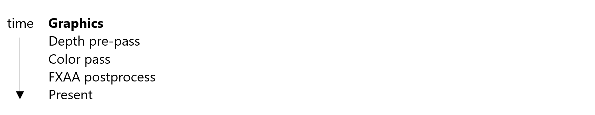
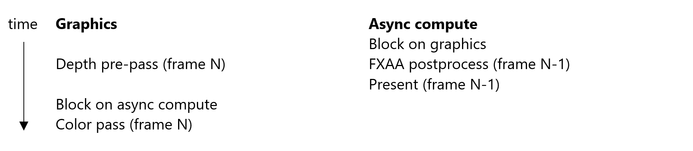
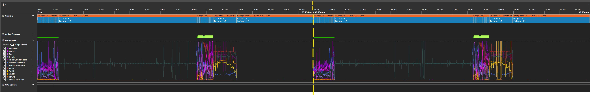
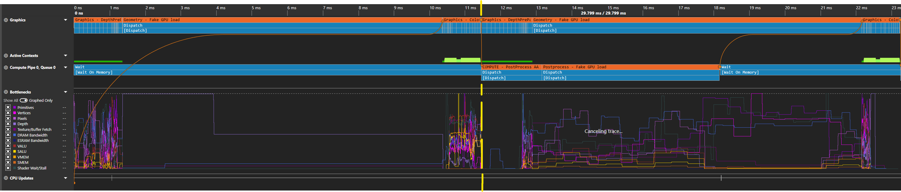
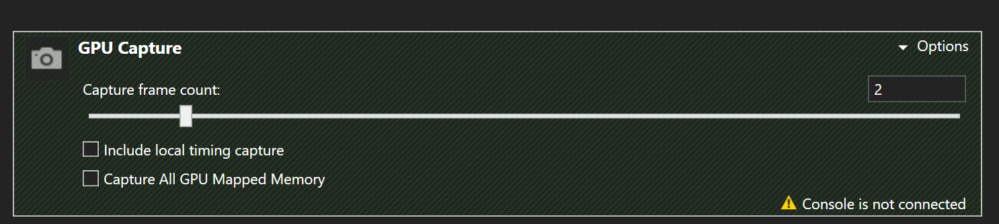
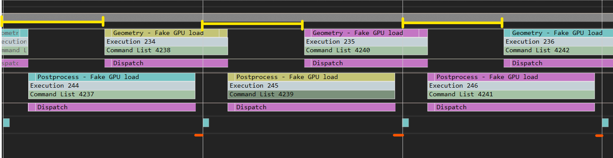

# パイプライン ポストプロセスのサンプル

*このサンプルは、Microsoft Game Development Kit と互換性があります (2023 年 3 月)*

# 説明

このサンプルでは、1 つのフレームの後処理フェーズを次のフレームの先頭にオーバーラップする方法について説明します。これは並列化により何らかのパフォーマンス向上を達成できる可能性があります。 サンプルは、次の 3 つのパスで単純なシーンから始まります:

これらのパスは、フルタイトルの 1 フレームよりもはるかに単純ですが、ある点では典型的です。フレームの始めは計算が軽く、フレームの終わりは計算が重くなります。 そのため、フレームのこれらの部分は、グラフィックスと非同期コンピューティングを使用した並列化に適しています。 ただし、関連するワークロードは異なるフレームの一部であるため、メイン レンダリング ループに構造上の変更が加えられた場合にのみ並列で実行できます。 基本的に、これらの変更は、ポストプロセス パスを非同期キューに移動し、そこから presentX を呼び出すことを意味します。 これらの変更により、レンダリング ループは次のようになります:

次のスクリーンショットは、PIX (2 フレームの場合) でパイプライン化された後処理がどのように無効になっているか、または有効になっているかを示しています。

> **注**: このサンプルでは、待機時間を最小限に抑えるために後処理作業をスケジュールする方法を示します。
> この手法の向上は、GPU 間隔 (ここでは 16.67 ミリ秒) が完全に使用されている場合に簡単に示されます。 このサンプルの後処理とジオメトリの作業では間隔を埋めるには十分でない場合、**ジオメトリ (偽の GPU 負荷)** と**後処理 (偽の GPU 負荷)** の両方を使用して、目的の動作をエミュレートするために偽の処理で GPU をスピンします。

パイプラインの後処理オフ: 黄色の線は、1 番目と 2 番目のフレーム間の境界を示します。 

パイプラインの後処理が有効です。 これで、計算作業がグラフィックス DepthPrepass とジオメトリ - 偽の GPU ロード パスの両方と重複するようになりました。 

最初のスクリーンショットでは、FXAA が VALU とテクスチャ フェッチをボトルネックとして持つパスであることが示されていることに注意してください。これは、プリパスとよく一致します (プリミティブ、dram、頂点に対する負荷が高くなります)。

# サンプルのビルド

Xbox One 開発キットを使用している場合は、アクティブなソリューション プラットフォームを `Gaming.Xbox.XboxOne.x64` に設定します。

Xbox Series X|S を使用している場合は、アクティブなソリューション プラットフォームを `Gaming.Xbox.Scarlett.x64` に設定します。

*詳細については、* *GDK ドキュメント*の「__サンプルの実行__」を参照してください。

# Controls

| 操作 | ゲームパッド |
|---|---|
| 非同期コンピューティングの切り替え | A |
| サンプルを終了する。 | ビュー ボタン |

# 実装メモ

PIX UI から取得された PIX GPU キャプチャーには、ある Present 呼び出しから次の呼び出しへの GPU 処理が含まれます (既定)。 ただし、パイプライン処理が存在する場合は、正確な GPU プロファイリングを行うには、少なくとも 2 つの完全なフレームが必要です。 それ以外の場合、1 つ以上の操作が分離して実行されているように見えます。これは、並列で実行された作業がキャプチャの一部ではないためです。 フレームと依存関係をより適切に視覚化するには、PIX の GPU Capture セクションを展開し、キャプチャ フレーム数を 2 に増やします。

## 待機時間と現在

このサンプルでは、パイプライン化されたポストプロセスを使用する場合と使用しない場合の両方で、作業がどのようにスケジュールされ、処理されているかを理解するために、PIX のタイミング キャプチャを確認すると便利です。

パイプライン化されたポスト プロセスを使用**しない**場合、フレームはフレーム 1 から 2 (この場合は 16.67 ミリ秒の間隔として定義) の間でレンダリングと表示を試みます。 以下の図では、小さな薄い青のボックスが VBLANK イベントです。 ワークロードは 1 つ以上の間隔が長いため、常に最初の VBLANK を見逃すので、次の VBLANK を目指します。この場合、すぐにスケジュールされる作業が増えます。 フレームの継続時間が複数の間隔であるため、フレームが次の VBLANK に近づくまで、新しいフレームは後で開始するようにプッシュされます (画像の薄い青い線が長くなるなど)。フレームが次の VBLANK に近づくまで、2 つスキップされます。 この時点で、フレームは遅延し、フレーム レートが影響を受けます (緑の線)。 次のフレームから、水色の線は開始オフセットが小さい状態に戻ったことを示しているため、x フレームごとに 1 つに影響します。

パイプライン化されたポスト プロセスを使用する場合、フレームはフレーム 1 から 2 の間 (16.67 ミリ秒間隔を使用して) レンダリングと表示を試みます。 また、レンダリング作業の開始時にオフセットを追加します (黄色の線で表されます。これについては後で詳しく説明します)。 この場合、最初の VBLANK を見逃した場合でも、1 フレーム以上の待機時間が許容されるため、次のレンダリング作業をコンピューティング作業と並行して開始できます。 その結果、30FPS ではなく 60FPS でフレームごとに作業が提示されます。 ワークロードが継続時間の間隔未満の場合は、最初の VBLANK に時間内に表示できます (それに応じてオフセットを調整します)。  グラフィックの作業に追加されるオフセットの理由は、現在と次の VBLANK (ここではオレンジ色の線で表される) を呼び出すときの待機時間を最小限に抑えるためです。 フレームの開始をできるだけ遅くスケジュールすることで、フレームワークは、たとえば、最新の入力データを必要とすることができます。 詳細については、[ScheduleFrameEventX のドキュメント](https://developer.microsoft.com/en-us/games/xbox/docs/gdk/id3d12device_scheduleframeeventx)を参照してください。

# 更新履歴

2023 年 3 月 28 日 -- 移植されたサンプル。

# プライバシーに関する声明

サンプルをコンパイルして実行する場合、サンプルの使用状況を追跡するために、サンプルの実行可能ファイルのファイル名が Microsoft に送信されます。 このデータ コレクションからオプトアウトするには、Main.cpp の "サンプル使用状況テレメトリ" というラベルの付いたコードのブロックを削除します。

Microsoft のプライバシー ポリシー全般の詳細については、「[Microsoft のプライバシーに関する声明](https://privacy.microsoft.com/en-us/privacystatement/)」を参照してください。

