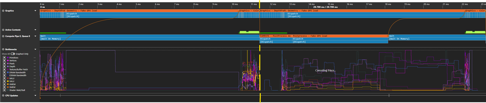

# 파이프라인 후처리 샘플

*이 샘플은 Microsoft 게임 개발 키트(2023년 3월)와 호환됩니다.*

# 설명

이 샘플은 한 프레임의 후처리 단계와 다음 프레임의 시작을 중첩하여 병렬 처리의 성능 이점을 달성하는 방법을 보여줍니다. 샘플은 다음 세 번의 패스로 간단한 장면으로 시작합니다.

이러한 패스는 전체 타이틀의 프레임보다 훨씬 간단하지만 한 가지 측면에서는 일반적입니다. 계산에서 프레임의 시작은 가볍고 프레임의 끝은 무겁다는 점입니다. 따라서 프레임의 이러한 부분들은 그래픽과 비동기 컴퓨팅을 사용하는 병렬화에 적합합니다. 그러나 관련 워크로드들은 서로 다른 프레임의 일부이기 때문에 기본 렌더링 루프를 구조적으로 변경한 경우에만 병렬로 실행될 수 있습니다. 이러한 변경은 기본적으로 사후 처리 패스를 비동기 큐로 이동한 다음, 그곳에서 presentX를 호출함을 의미합니다. 이러한 변경으로 렌더링 루프는 다음과 같아집니다.

다음 스크린샷은 파이프라인된 후처리가 PIX(2프레임의 경우)에서 어떻게 비활성화 및 활성화된 것처럼 보이는지 나타냅니다.

> **참고**: 이 샘플에서는 대기 시간을 최소화하기 위해 사후 처리 작업을 예약하는 방법을 보여주려고 합니다.
> 이 기술의 이점은 GPU 간격(이 경우 16.67ms)이 완전히 사용될 때 더 쉽게 보여줄 수 있습니다. 이 샘플의 후처리와 기하 도형 작업이 간격을 채우기에 충분하지 않다는 점을 감안하여 원하는 동작을 에뮬레이트하기 위해 **기하 도형 - 가짜 GPU 부하**와 **후처리 - 가짜 GPU 로드**를 사용하여 가짜 작업에서 GPU를 회전합니다.

파이프라인 후처리 끄기: 노란색 선은 첫 번째 프레임과 두 번째 프레임 사이의 경계를 표시합니다. 

파이프라인 후처리 켜짐. 이제 컴퓨팅 작업이 두 그래픽 DepthPrepass와 기하 도형 - 가짜 GPU 로드 패스와 겹칩니다. 

첫 번째 스크린샷은 FXAA가 VALU 및 텍스처 페치가 병목 상태로 있는 패스임을 보여줍니다. 이는 기본형, 드램 및 꼭짓점에 더 집중되는 프리패스와 잘 어울립니다.

# 샘플 빌드

Xbox One 개발 키트를 사용하는 경우 활성 솔루션 플랫폼을 `Gaming.Xbox.XboxOne.x64`(으)로 설정합니다.

Xbox Series X|S를 사용하는 경우 활성 솔루션 플랫폼을 `Gaming.Xbox.Scarlett.x64`(으)로 설정합니다.

*자세한 내용은* *GDK 설명서의* __샘플 실행을__ 참조하세요.&nbsp;

# 컨트롤

| 동작 | Gamepad |
|---|---|
| 비동기 컴퓨팅 설정/해제 | A |
| 샘플을 종료합니다. | 보기 버튼 |

# 구현 참고 사항

PIX UI에서 가져온 PIX GPU 캡처에는 기본적으로 한 번의 Present 호출에서 다음 호출로의 GPU 작업이 포함됩니다. 하지만 파이프라인이 있는 경우 정확한 GPU 프로파일링을 위해 두 개 이상의 전체 프레임이 필요합니다. 그렇지 않으면 하나 이상의 작업이 격리된 상태로 실행되는 것처럼 보이는데, 이는 단지 병렬로 실행된 작업이 캡처의 일부가 아니었기 때문입니다. 프레임 및 종속성을 더 잘 시각화하려면 PIX에서 Gpu 캡처 섹션을 확장하고 캡처 프레임 수를 2로 늘입니다.

## 대기 시간 및 present

이 샘플에서는 파이프라인된 후처리를 사용할 때 및 사용하지 않을 때 작업이 어떻게 예약되고 present가 처리되는지 이해하기 위해 PIX의 타이밍 캡처를 살펴보는 것이 유용합니다.

파이프라인된 후처리를 사용하지 **않는** 경우 프레임은 프레임 1과 2 사이에 렌더링하고 표시하려고 합니다(이 경우 16.67ms 간격으로 정의됨). 아래 그림에서 작은 연한 파란색 상자는 VBLANK 이벤트입니다. 워크로드가 간격보다 길기 때문에 항상 첫 번째 VBLANK를 놓치므로 다음 VBLANK를 목표로 하며, 그러는 동안 더 많은 작업이 즉시 예약됩니다. 프레임 기간이 두 번 이상인 경우 프레임이 다음 VBLANK에 매우 가깝게 시작될 때까지 새 프레임이 나중에 시작되도록 푸시됩니다(이미지의 연한 파란색 선이 더 길게 표시됨). 그러면 두 프레임을 건너뜁니다. 이 시점에서 프레임은 늦었고 프레임 속도가 영향을 받습니다(녹색 선). 다음 프레임에서 연한 파란색 선은 시작 오프셋이 다시 작아지는 것을 보여주므로 각 x 프레임마다 하나씩 영향을 줍니다. 

파이프라인된 후처리를 사용하는 경우 프레임은 프레임 1과 2 사이에 렌더링하고 표시하려고 시도합니다(또 16.67ms 간격 사용). 또한 렌더링 작업이 시작될 때 오프셋을 추가할 것입니다(노란색 선으로 표시되며 나중에 자세히 설명). 이 경우 대기 시간 프레임을 하나 더 허용하므로 첫 번째 VBLANK를 놓치더라도 다음 렌더링 작업을 컴퓨팅 작업과 병렬로 시작할 수 있습니다. 그 결과 모든 프레임에서 30FPS가 아닌 60FPS로 작업이 표시됩니다. 워크로드가 기간의 간격보다 작으면 첫 번째 VBLANK에 대해 제 시간에 표시할 수 있습니다(그에 따라 오프셋 조정).  오프셋을 그래픽 작업에 추가하는 이유는 present를 호출할 때와 다음 VBLANK(여기서는 주황색 선으로 표시) 사이의 대기 시간을 최소화하려고 하기 때문입니다. 프레임 시작을 가능한 한 늦게 예약하면, 예를 들어 프레임워크가 최신 입력 데이터를 얻을 수 있습니다. 이에 대한 자세한 내용은 [ScheduleFrameEventX 문서](https://developer.microsoft.com/en-us/games/xbox/docs/gdk/id3d12device_scheduleframeeventx)를 참조하세요.

# 업데이트 기록

2023년 3월 28일 -- 샘플 이식.

# 개인정보처리방침

샘플을 컴파일하고 실행하는 경우 샘플 사용량을 추적할 수 있도록 샘플 실행 파일의 파일 이름이 Microsoft에 전송됩니다. 이 데이터 수집을 옵트아웃하려면 Main.cpp에서 "샘플 사용량 원격 분석"이라는 레이블이 지정된 코드 블록을 제거할 수 있습니다.

일반적인 Microsoft의 개인 정보 정책에 대한 자세한 내용은 [Microsoft 개인정보처리방침](https://privacy.microsoft.com/en-us/privacystatement/)을 참조하세요.

