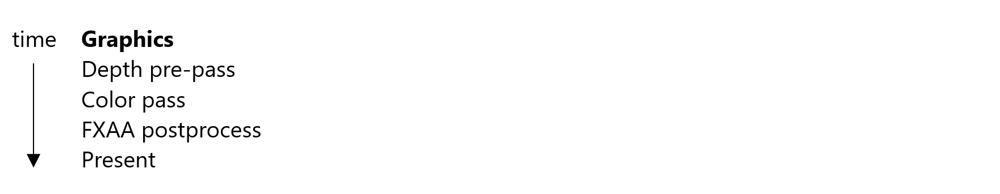
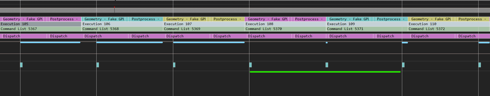
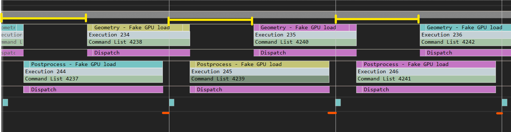

# 管道后处理示例

*此示例可用于 Microsoft 游戏开发工具包（2023 年 3 月）*

# 说明

此示例演示了如何将一帧的后处理阶段与下一帧的开头重叠，这样即有可能通过并行化实现一些性能优势。 该示例以三个传递中的简单场景开头：

这些传递比完整标题的帧简单得多，但一方面它们是典型的 - 框架的开头是计算上的浅色，并且帧的末尾在计算方面很繁重。 因此，框架的这些部分非常适合使用图形和异步计算进行并行化。 但是，由于相关工作负荷属于不同的帧，因此只有在对主呈现循环进行结构更改时，它们才能并行运行。 这些更改实质上意味着将后处理传递移动到异步队列，然后从那里调用 presentX。 通过这些更改，呈现循环如下所示：

以下屏幕截图显示了管道处理如何在 PIX 上显示禁用和启用（对于 2 帧）：

> **注意**：对于此示例，我们想要演示如何计划后期处理工作，以最大程度地减少延迟。
> 当完全使用 GPU 间隔（在本例中为 16.67 毫秒）时，可以更轻松地显示此方法的增益。 鉴于此示例的后期处理和几何图形工作不足以填充间隔，因此几何图形（**假 GPU 负载** 和 **后处理假 GPU 负载**）用于通过虚假工作来旋转 GPU，以模拟所需行为。

管道后处理关闭：黄色线条显示第一个帧和第二个帧之间的边界。 

管道处理开启。 现在，计算工作与图形 DepthPrepass 和 Geometry - Fake GPU 负载传递重叠。 

请注意，第一个屏幕截图显示 FXAA 是一个传递，其中 VALU 和纹理提取是瓶颈，与 prepass 非常匹配（在基元、dram 和顶点上更密集）。

# 生成示例

如果使用 Xbox One 开发工具包，请将活动解决方案平台设置为 `Gaming.Xbox.XboxOne.x64`。

如果使用 Xbox Series X|S，请将活动解决方案平台设置为 `Gaming.Xbox.Scarlett.x64`。

*有关详细信息，请参阅* *GDK 文档*中的__运行示例__。

# 控件

| 操作 | 游戏板 |
|---|---|
| 切换异步计算 | A |
| 退出示例。 | &ldquo;视图&rdquo;按钮 |

# 实现说明

从 PIX UI 获取的 PIX GPU 捕获包括从一个当前调用到下一个（默认情况下）的 GPU 工作。 但是，如果存在管道处理，准确的 GPU 分析至少需要两个完整帧。 否则，一个或多个操作将显示为隔离运行，只是因为并行运行的工作不是捕获的一部分。 若要更好地可视化帧和依赖项，请展开 PIX 上的 Gpu 捕获部分，并将捕获帧计数增加到 2。

## 延迟和存在

对于此示例，查看 PIX 的计时捕获非常有用，以便了解如何在使用和不使用管道处理后处理时计划和呈现工作。

如果 **不** 使用管道后进程，帧将尝试在帧 1 和 2 之间呈现和呈现（在本例中，定义为 16.67ms 的间隔）。 在下图中，小的浅蓝色框是 VBLANK 事件。 由于工作负荷超过一个时间间隔，因此它始终会错过第一个 VBLANK，因此它的目标是下一个 VBLANK，在发生这种情况时，会立即计划更多工作。 由于帧持续时间超过一个间隔，因此每次推送新帧以稍后开始（如图中浅蓝色的线条越来越长所示），直到帧开始如此接近下一个 VBLANK，最后跳过两个帧。 此时，帧延迟，帧速率受到影响（绿线）。 从下一帧开始，浅蓝色线条显示起始偏移回到小偏移量，因此这会影响每 x 帧一个帧。 

使用管道后进程时，帧将尝试在帧 1 到 2 之间呈现和呈现（同样，使用 16.67ms 间隔）。 我们还将在呈现工作开始时添加偏移量（由黄色线表示，稍后对此进行详细介绍）。 在这种情况下，由于我们允许再延迟一帧，即使我们错过了第一个 VBLANK，我们也可以让下一个呈现工作与计算工作并行启动。 结果是，我们以 60FPS 而不是 30FPS 为每个帧呈现工作。 如果工作负载的持续时间小于间隔，我们将能够为第一个 VBLANK 及时显示（相应地调整偏移量）。  添加到图形工作的偏移量的原因是，我们希望最大程度地减少调用 present 和下一个 VBLANK（此处用橙色线表示）之间的延迟。 例如，通过尽可能晚地计划帧启动，框架可以查询最新的输入数据。 有关详细信息， [请参阅 ScheduleFrameEventX 文档](https://developer.microsoft.com/en-us/games/xbox/docs/gdk/id3d12device_scheduleframeeventx)。

# 更新历史记录

2023/03/28 -- 移植示例。

# 隐私声明

在编译和运行示例时，将向 Microsoft 发送示例可执行文件的文件名以帮助跟踪示例使用情况。 若要选择退出此数据收集，你可以删除 Main.cpp 中标记为&ldquo;示例使用遥测&rdquo;的代码块。

有关 Microsoft 的一般隐私策略的详细信息，请参阅 [Microsoft 隐私声明](https://privacy.microsoft.com/en-us/privacystatement/)。

