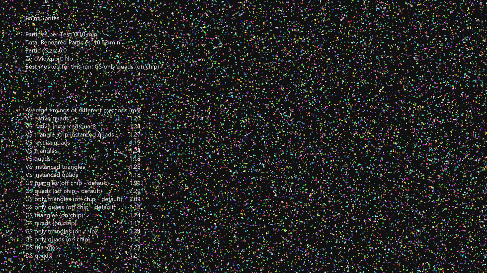

# 点子画面

*此示例可用于 Microsoft 游戏开发工具包 (2022 年 3 月)*

# 说明

演示在 DirectX 12 中呈现点子画面的十种方法。 对每种方法都进行了剖析，并显示了提醒比较，以显示在给定渲染参数的情况下每种方法的性能特征。

在 Xbox One 上，该示例还详细介绍了如何为几何着色器指定片上/片外内存。 此区别在 Xbox Series 上不可用
| | |
|---|---|
|X|S.|

# 生成示例

如果使用 Xbox One 开发工具包，请将活动解决方案平台设置为 `Gaming.Xbox.XboxOne.x64`。

如果使用 Xbox Series X|S 开发工具包，请将活动解决方案平台设置为 `Gaming.Xbox.Scarlett.x64`。

*有关详细信息，请参阅* __运行示例__，*在 GDK 文档中。*

# 使用示例

此示例使用以下控件。

| 操作 | 游戏板 |
|---|---|
| 退出示例。 | &ldquo;视图&rdquo;按钮 |
| 增加子画面大小 | A 按钮 |
| 减小子画面大小 | B 按钮 |
| 切换 Null 视区 | Y 按钮 |
| 更改所选测试 | 方向键上/下 |
| 切换突出显示的测试 | X 按钮 |

# 实现说明

随着图形管道的发展，已删除对点子画面的一流支持，转而使用完全灵活且可自定义的阶段，如几何着色器。 事实上，点子画面可以在 GPU 的每个与几何图形相关的阶段（顶点着色器、几何着色器、细化着色器和网格着色器）中实现。 尽管方法的理想选择应基于逐个测量性能，但似乎使用几何着色器扩展点子画面并不是呈现简单点子画面的最有效方法。

## 三角形与四边形

根据呈现管道出现瓶颈的位置，三角形或四边形的性能可能不同。 在填充率受限的情况下，四边形的性能优于三角形，因为它们不需要在透明像素上运行像素着色器。 在几何阶段限制渲染时，可以输出三角形而不是四边形。 在许多复杂的渲染情况下，三角形可能比四边形更快。

此示例演示了对三角形和四边形进行对比的每种方法，以显示不同大小的点子画面的差异。

## 方法 1 - 顶点 + 几何着色器

初始化管道，使顶点着色器正常读取顶点，然后几何着色器为每个输入顶点输出一个四边形或三角形。 这些测试还比较了片上和片外几何着色器分配。 编译器默认使用片外内存，该内存用于在顶点阶段和几何阶段之间存储阶段间数据。

*优点*

- 众所周知且简单。

*缺点*

- 需要大多数设置。

- 并非在所有情况下都最快。

## 方法 2 -- 仅几何着色器

此方法使用空顶点着色器。 为了加载顶点数据，几何着色器使用 SV_PrimitiveID 索引对顶点缓冲区的原始字节视图执行缓冲区加载（对于点列表，几何着色器中的 SV_PrimitiveID 与顶点着色器中的 SV_VertexID 相同）。 加载顶点后，点子画面扩展的执行方式与方法 1 中相同。 此处对片上 GS 性能与片外 GS 性能进行了类似测试。

*优点*

- 不需要输入布局，因为 VS 是空操作。

- 它的执行速度比方法 1 更快，因为 VS 和 GS 之间没有产生内部流量。

*缺点*

- 手动顶点加载需要为每个顶点布局使用不同的着色器变体。 对于高度优化的代码，这不是问题。

- 此方法更难以理解。

## 方法 3 -- 仅顶点着色器

DX11 中实际上不需要仅使用几何着色器将点扩展到四边形或三角形，而顶点着色器可用于执行此操作。 在 DX11 中，顶点着色器阶段可以读取原始字节 UAV，因此具有 SV_VertexID 和顶点缓冲区的原始字节视图，可以手动读取顶点。

因此，如果要将顶点展开为三角形或四边形，我们只需在绘制调用中呈现 3 倍或 6 倍以上的顶点，在着色器中执行除法 3 或 6 以获取顶点的索引，使用此索引加载顶点，并根据除法的其余部分将其展开以获取子画面的角。

*优点*

- 这种方法简单、快捷，任何水平的图形程序员都能轻松理解。

- VS 不需要输入布局，因为它只使用系统生成的值 SV_VertexID。

*缺点*

- 顶点加载手动进行，因此可能需要使用不同的着色器来加载不同的顶点布局。 如果需要绝对最快的方法，这不是问题。

## 方法 4 -- 顶点着色器实例化

我们可以使用实例化使 GPU 加载点子画面顶点，并使用 SV_VertexID 来确定子画面的角进行扩展。 此方法比前一种方法稍慢，但仍始终快于其他任何方法。

*优点*

- 第二快方法，性能与方法 3 非常相似。

- 无需除法，因此着色器具有较少的 ALU。

- 使用输入布局执行顶点加载，因此无需修改着色器即可加载不同的顶点布局。

- 似乎是非常大的点子画面的制胜法宝。

*缺点*

- 无

## 方法 5 -- 细化阶段

可以使用细化阶段从单个输入顶点生成三角形和四边形。 此方法的性能与基于几何着色器的方法不相上下，但是它更灵活，因为可以使用更多的子画面形状。 例如，通过在四边形域中进行细化，可以输出圆而不是四边形 -- 如果像素着色器非常慢并且子画面是圆形，则可能更有效。

*优点*

- 可以输出几乎任意几何图形。

*缺点*

- 与几何着色器方法相同。

## 方法 6 -- 网格着色器管道

网格着色器为渲染程序化几何图形提供了一个非常自然的编程模型。 此方法可从网格着色器管道中省略输入汇编程序中获得巨大好处。 当工作负载在管道的剔除后部分出现瓶颈时，性能优势就会降低。

使用网格着色器时，没有三角形与四边形选项 -- 输出几何图形是线条或三角形的索引顶点列表。

*优点*

- 快如闪电！ 还提供了在网格着色器中剔除粒子的功能（尚未实现）。

*缺点*

- 网格着色器在结构上有点复杂，需要了解计算和传统图形工作负载。 缺少输入汇编程序需要在 CPU 调度端进行一些计算，以及在着色器代码中手动提取输入。

## 结论:

在 GPU 负载不同的情况下，上述所有方法都将以不同的方式执行，因此请选择最适合的方法。

# 更新历史记录

2019/4/12 -- 从 Xbox 示例框架移植到 DX12。

| | |
|---|---|
| 2020/2/20 -- Xbox Series X 更新 | S |

2020/6/8 -- 添加了网格着色器粒子。

# 隐私声明

在编译和运行示例时，将向 Microsoft 发送示例可执行文件的文件名以帮助跟踪示例使用情况。 若要选择退出此数据收集，你可以删除 Main.cpp 中标记为&ldquo;示例使用遥测&rdquo;的代码块。

有关 Microsoft 的一般隐私策略的详细信息，请参阅 [Microsoft 隐私声明](https://privacy.microsoft.com/en-us/privacystatement/)。

