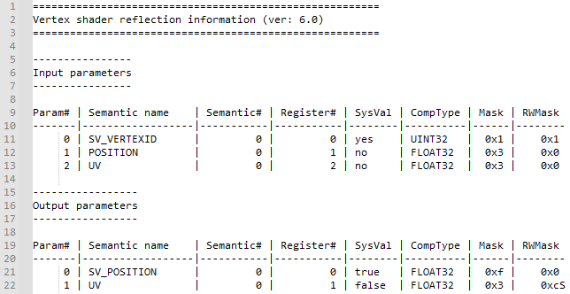

  

#   Shader Reflection Tool

*This sample is compatible with the Microsoft Game Development Kit
(March 2022).*

# Description

This sample demonstrates how you can access shader reflection
information and how it relates to the root signature. The sample is
implemented as a PC tool using the GXDK's toolkit includes and libraries
to show you how this functionality could be integrated into your game's
shader or asset pipeline.

# Using the sample

The tool consumes shader objects produced by the Xbox One or Scarlett
shader compiler. Please see `dxc.exe /?` for more information on how to
compile shaders into object files.

You can invoke the tool using this command line:

`ShaderReflect.exe <shader obj file> [root signature obj file]`

The tool will load the shader object file and print reflection
information to the console.

Input and output parameters:

Resource bindings and their relation to root signature parameters,
descriptor tables and static samplers:

Constant buffer layout with recursive structure breakdown:

# Implementation notes

The tool relies on reflection and root signature data embedded in the
shader object files to produce the output.

Reflection data is embedded in objects files (inside STAT chunks)
produced by the shader compiler (dxc.exe) by default. Inside the tool,
the reflection data is turned into an object model (the root interface
is `ID3D12ShaderReflection`) using the shader compiler library\'s DxcUtils
helper. Note that STAT chunks can be omitted from shader objects, if you
use the compiler\'s `-Qstrip_reflect` option. You can also opt to save
reflection information to a separate file using the `-Fre <file>` option
(this works even if you use `-Qstrip_reflect` to remove reflection data
from the main shader object file).

Similar to reflection data, root signature data is embedded in shader
objects (RTS0 chunks) by default. You can use `-Qstrip_rootsignature` to
omit the data from the main shader object and `-Frs <file>` to output it
to a separate file.

The tool uses header files, libraries and DLLs from the GXDK's toolkit
to perform the reflection operations on PC. It is also possible to
perform reflection operations at runtime on the Xbox using the inbox
shader compiler DLL supplied with the GameCore OS.

# Platform support

This sample is written for the Scarlett and Xbox One platforms but could
easily be adapted to support the same interfaces on Desktop PC. Do note
that the shader compiler headers, libraries and binaries supplied in the
Windows SDK tend to be out of date, so we recommend you download a
recent release from <https://github.com/microsoft/DirectXShaderCompiler>
to have the latest features and bugfixes.

# Update history

11/15/2021 -- Sample creation.
