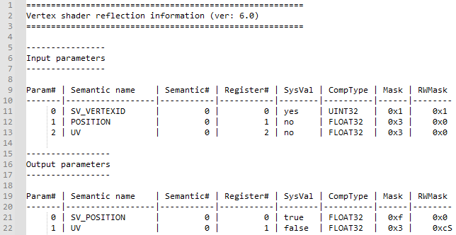
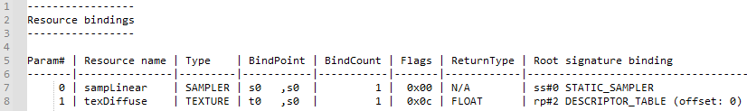
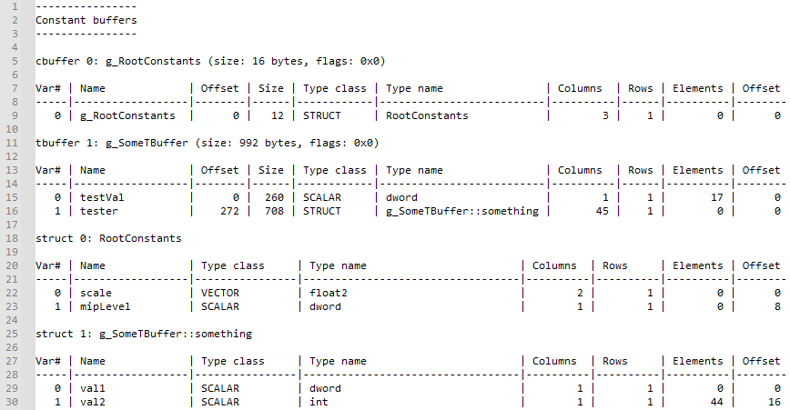

# 셰이더 반사 도구

*이 샘플은 Microsoft 게임 개발 키트(2022년 3월)와 호환됩니다.*

# 설명

이 샘플은 셰이더 반사 정보에 ​​액세스하는 방법과 루트 서명과 관련된 방법을 보여줍니다. 샘플은 GXDK의 도구 키트 포함 사항 및 라이브러리를 사용하여 PC 도구로 구현되어 이 기능을 게임의 셰이더 또는 자산 파이프라인에 통합할 수 있는 방법을 보여줍니다.

# 샘플 사용

이 도구는 Xbox One 또는 Scarlett 셰이더 컴파일러에서 생성된 셰이더 개체를 사용합니다. 셰이더를 개체 파일로 컴파일하는 방법에 대한 자세한 내용은 `dxc.exe /?`을(를) 참조하세요.

다음 명령줄을 사용하여 도구를 호출할 수 있습니다.

`ShaderReflect.exe <shader obj file> [root signature obj file]`

이 도구는 셰이더 개체 파일을 로드하고 반사 정보를 콘솔에 인쇄합니다.

입력 및 출력 매개 변수:

리소스 바인딩 및 루트 서명 매개 변수, 설명자 테이블 및 정적 샘플러와의 관계:

재귀 구조 분석이 포함된 상수 버퍼 레이아웃:

# 구현 참고 사항

이 도구는 셰이더 개체 파일에 포함된 반사 및 루트 서명 데이터에 의존하여 출력을 생성합니다.

반사 데이터는 기본적으로 셰이더 컴파일러(dxc.exe)에서 생성된 개체 파일(STAT 청크 내부)에 포함됩니다. 도구 내에서 반사 데이터는 셰이더 컴파일러 라이브러리의 DxcUtils 도우미를 사용하여 개체 모델(루트 인터페이스가 `ID3D12ShaderReflection`)로 변환됩니다. 컴파일러의 `-Qstrip_reflect` 옵션을 사용하는 경우 STAT 청크를 셰이더 개체에서 생략할 수 있습니다. `-Fre <file>` 옵션을 사용하여 반사 정보를 별도의 파일에 저장하도록 선택할 수도 있습니다(`-Qstrip_reflect`을(를) 사용하여 기본 셰이더 개체 파일에서 반사 데이터를 제거하는 경우에도 작동합니다).

반사 데이터와 유사하게 루트 서명 데이터는 기본적으로 셰이더 개체(RTS0 청크)에 포함됩니다. `-Qstrip_rootsignature`을(를) 사용하여 기본 셰이더 개체에서 데이터를 생략하고 `-Frs <file>`을(를) 사용하여 데이터를 별도의 파일에 출력할 수 있습니다.

이 도구는 GXDK 도구 키트의 헤더 파일, 라이브러리 및 DLL을 사용하여 PC에서 반사 작업을 수행합니다. GameCore OS와 함께 제공되는 인박스 셰이더 컴파일러 DLL을 사용하여 Xbox에서 런타임에 반사 작업을 수행하는 것도 가능합니다.

# 플랫폼 지원

이 샘플은 Scarlett 및 Xbox One 플랫폼용으로 작성되었지만 데스크탑 PC에서 동일한 인터페이스를 지원하도록 쉽게 조정할 수 있습니다. Windows SDK에서 제공되는 셰이더 컴파일러 헤더, 라이브러리 및 이진 파일은 오래된 경향이 있으므로 <https://github.com/microsoft/DirectXShaderCompiler>에서 최신 릴리스를 다운로드하여 최신 기능과 버그 수정 사항을 확인하는 것이 좋습니다.

# 업데이트 기록

2021년 11월 15일 -- 샘플 만들기.

