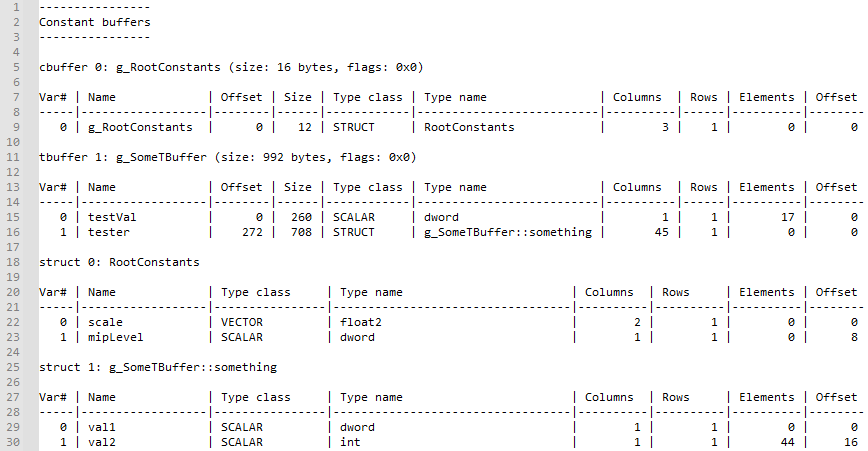

# 着色器反射工具

*此示例可用于 Microsoft 游戏开发工具包 (2022 年 3 月)。*

# 说明

此示例演示了如何访问着色器反射信息及其与根签名的关系。 此示例是通过 GXDK 的工具包（包括库）作为电脑工具执行的，可向你展示如何将此功能集成到游戏的着色器或资产管道。

# 使用示例

该工具使用由 Xbox One 或 Scarlett 着色器编译器生成的着色器对象。 要详细了解如何将着色器编译到对象文件，请参阅 `dxc.exe /?`。

你可以使用以下命令行调用该工具：

`ShaderReflect.exe <shader obj file> [root signature obj file]`

该工具将加载着色器对象文件，并将反射信息打印到主机。

输入和输出参数：

资源绑定及其与根签名参数、描述符表和静态取样器的关系：

具有递归结构细分的常量缓冲区布局：

# 实现说明

该工具依赖着色器对象文件中嵌入的反射和根签名数据来生成输出数据。

默认情况下，反射数据会嵌入着色器编译器 (dxc.exe) 生成的对象文件（STAT 区块内）。 在该工具中，系统会通过着色器编译器库的 DxcUtils 帮助程序将反射数据转换为对象模型（根接口为 `ID3D12ShaderReflection`）。 请注意，如果使用编译器的 `-Qstrip_reflect` 选项，则可以从着色器对象中省略 STAT 区块。 你还可以选择使用 `-Fre <file>` 选项将反射信息保存到单独的文件（即使使用 `-Qstrip_reflect` 从主着色器对象文件中删除反射数据也一样）。

与反射数据类似，根签名数据默认嵌入着色器对象（RTS0 区块）。 你可以使用 `-Qstrip_rootsignature` 省略主着色器对象，并使用 `-Frs <file>` 中的数据，以将其输出到单独的文件。

该工具使用 GXDK 工具包中的标头文件、库和 DLL 在电脑上执行反射操作。 你还可以在运行时使用 GameCore 操作系统随附的收件箱着色器编译器 DLL 在 Xbox 上执行反射操作。

# 平台支持

此示例针对 Scarlett 和 Xbox One 平台编写，但也可以轻松地进行调整，以支持桌面电脑上的相同接口。 请注意，Windows SDK 中提供的着色器编译器标头、库和二进制文件往往已过期，因此建议从 <https://github.com/microsoft/DirectXShaderCompiler> 下载最新版本，以获取最新功能和错误修复功能。

# 更新历史记录

2021/11/15 &ndash; 创建示例。

