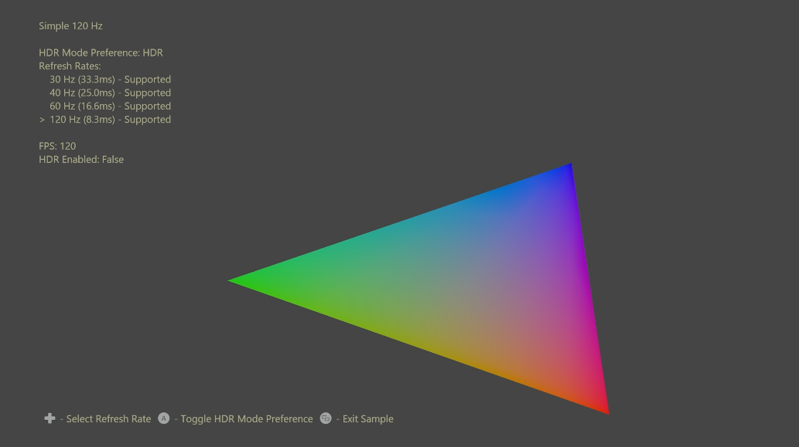

# シンプルな 120 Hz サンプル

*このサンプルは、Microsoft Game Development Kit と互換性があります (2022 年 3 月)*

# 説明

このサンプルは、GXDK を使用したいくつかのリフレッシュ レート (30 Hz、40 Hz、60 Hz、120 Hz) でのレンダリングの基本を示します。 ディスプレイが HDR と 120 Hz 出力を同時にサポートしていない場合に、HDR またはリフレッシュ レートの優先順位を指定する新機能が示されています。 変更後:
ハードウェア 3D LUT を使用して GameDVR 用の SDR イメージを生成します。 
| | |
|---|---|
|アプリが組み込みの Xbox Series X|S を利用して HDR レンダリングを容易にする|

# サンプルのビルド

Xbox One 開発キットを使用している場合は、アクティブなソリューション プラットフォームを `Gaming.Xbox.XboxOne.x64` に設定します。

Xbox Series X|S を使用している場合は、アクティブなソリューション プラットフォームを `Gaming.Xbox.Scarlett.x64` に設定します。

*詳細については、* *GDK ドキュメント*の「__サンプルの実行__」を参照してください。

# Controls

| 操作 | ゲームパッド |
|---|---|
| リフレッシュ レートの選択 | 方向パッドの上/下 |
| HDR モードの基本設定を切り替える | A ボタン |
| Exit | ビュー ボタン |

# 実装メモ

このサンプルでは、HDR または 120Hz のフレームレートとディクテーション設定を選択するための 2 つの重要な GXDK API を示します。

1 つ目は `ID3D12Device::SetFrameIntervalX` で、フレーム間隔 (マイクロ秒単位) およびフレーム周期 (間隔数) が設定されます。この両方によって、フレーム開始からフレームのプレゼンテーションまでに期間が決まります。 選択したフレーム間隔はディスプレイでサポートされている必要があります。これは
Xbox One の `IDXGIOutput::GetDisplayModeList` 2 つ目は、`XDisplayTryEnableHdrMode` で、ディスプレイの HDR モードを有効にしようとします。 ディスプレイが HDR または 120 Hz を同時にサポートしていない場合、ユーザーが HDR または 120Hz の設定を指定できます。 タイトルでは、いつでもこの関数を呼び出すことによって、設定を変更できます。 この操作によって `IDXGIOutput::GetDisplayModeList(X)` の結果を変更できます。その結果、サポートされているフレーム間隔がリフレッシュされます。
| | |
|---|---|
|Xbox Series X|S で `IDXGIOutput::GetDisplayModeListX` を使用してクエリを実行しました。または|

HDR ディスプレイのレンダリングでは、GameDVR、スクリーンショット、ブロードキャストに適した SDR イメージの生成にタイトル自身が関わります
HDR から SDR への色変換を自動的に実行するハードウェア 3D LUT の機能。 これにより、Xbox One で一般的に使用されるドライバーのソフトウェア 3D LUT を手動で変換したり依存したりする際にかかるすべての CPU、GPU、メモリ、帯域幅のコストがタイトルで節約されます。 これは、`DXGI_COLOR_SPACE_RGB_FULL_G2084_NONE_P2020` 色空間で単一のディスプレイ プレーンを表示し、バックバッファー テクスチャの `D3D12XBOX_RESOURCE_FLAG_ALLOW_AUTOMATIC_GAMEDVR_TONE_MAP` フラグを省略する場合の既定の設定です。
| | |
|---|---|
|およびストリーミング。 このサンプルでは、新しい Xbox Series X|S をデモします|

# 更新履歴

2020 年 6 月 4 日 -- サンプルの作成。

2022 年 3 月 -- 24Hz サポートが追加されました。

# プライバシーに関する声明

サンプルをコンパイルして実行する場合、サンプルの使用状況を追跡するために、サンプルの実行可能ファイルのファイル名が Microsoft に送信されます。 このデータ コレクションからオプトアウトするには、Main.cpp の "サンプル使用状況テレメトリ" というラベルの付いたコードのブロックを削除します。

Microsoft のプライバシー ポリシー全般の詳細については、「[Microsoft のプライバシーに関する声明](https://privacy.microsoft.com/en-us/privacystatement/)」を参照してください。

