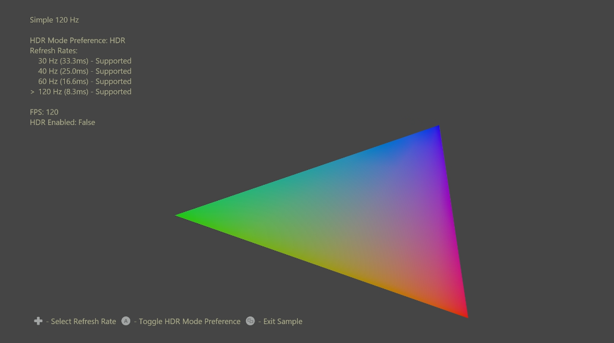

# 简单的 120 Hz 示例

*此示例与 Microsoft 游戏开发工具包（2022 年 3 月）兼容*

# 说明

此示例演示了使用 GXDK -- 30Hz、40Hz、60Hz 和 120Hz 在几种刷新率下进行绘制的基础知识。 演示了新功能，当显示器不同时支持 HDR 和 120Hz 输出时，指定 HDR 或刷新率的首选项。 若要
硬件 3D LUT，用于为 GameDVR 生成 SDR 映像。 
| | |
|---|---|
|促进应用程序利用内置 Xbox Series X|S 的 HDR 绘制操作 |

# 生成示例

如果使用 Xbox One 开发工具包，请将活动解决方案平台设置为 `Gaming.Xbox.XboxOne.x64`。

如果使用 Xbox Series X|S，请将活动解决方案平台设置为 `Gaming.Xbox.Scarlett.x64`。

*有关详细信息，请参阅* *GDK 文档*中的__运行示例__。

# 控件

| 操作 | 游戏板 |
|---|---|
| 选择&ldquo;刷新频率&rdquo; | 向上/向下方向键 |
| 切换 HDR 模式首选项 | A 按钮 |
| 退出 | &ldquo;视图&rdquo;按钮 |

# 实现说明

此示例演示了两个关键的 GXDK API，用于选择 HDR 或 120Hz 的帧速率和听写首选项。

第一个是 `ID3D12Device::SetFrameIntervalX`，它将设置帧间隔（以微秒为单位）和帧周期（以间隔数为单位），这二者共同决定从帧开始到显示的持续时间。 显示器必须支持所选的帧间隔，其为 Xbox One 上
的 `IDXGIOutput::GetDisplayModeList`。 第二个是 `XDisplayTryEnableHdrMode`，它将尝试启用显示器的 HDR 模式。 如果显示器不同时支持 HDR 和 120Hz 刷新频率，则用户可以指定首选项。 游戏可通过再次调用该函数，随时更改首选项。 请注意，这可能会更改 `IDXGIOutput::GetDisplayModeList(X)` 的结果，因为该操作需要刷新受支持的帧间隔。
| | |
|---|---|
在 Xbox Series X|S 上使用 `IDXGIOutput::GetDisplayModeListX` |查询，或|

HDR 显示器绘制需要游戏自己关注生成适合 GameDVR 的 SDR 图像、屏幕截图、广播、
硬件 3D LUT 的功能，可自动执行 HDR 到 SDR 的颜色转换。 这样，游戏将节省手动转换或依赖 Xbox One 上常用驱动程序软件 3D LUT 的所有 CPU、GPU、内存和/或带宽成本。 这是使用 `DXGI_COLOR_SPACE_RGB_FULL_G2084_NONE_P2020` 颜色空间显示单个显示平面时的默认设置，同时省略了背景缓冲纹理上的 `D3D12XBOX_RESOURCE_FLAG_ALLOW_AUTOMATIC_GAMEDVR_TONE_MAP` 标记。
| | |
|---|---|
|和流式处理。 此示例演示新的 Xbox Series X|S|

# 更新历史记录

2020/6/4 -- 示例创建。

2022 年 3 月 - 添加了 24Hz 支持。

# 隐私声明

在编译和运行示例时，将向 Microsoft 发送示例可执行文件的文件名以帮助跟踪示例使用情况。 若要选择退出此数据收集，你可以删除 Main.cpp 中标记为&ldquo;示例使用遥测&rdquo;的代码块。

有关 Microsoft 的一般隐私策略的详细信息，请参阅 [Microsoft 隐私声明](https://privacy.microsoft.com/en-us/privacystatement/)。

