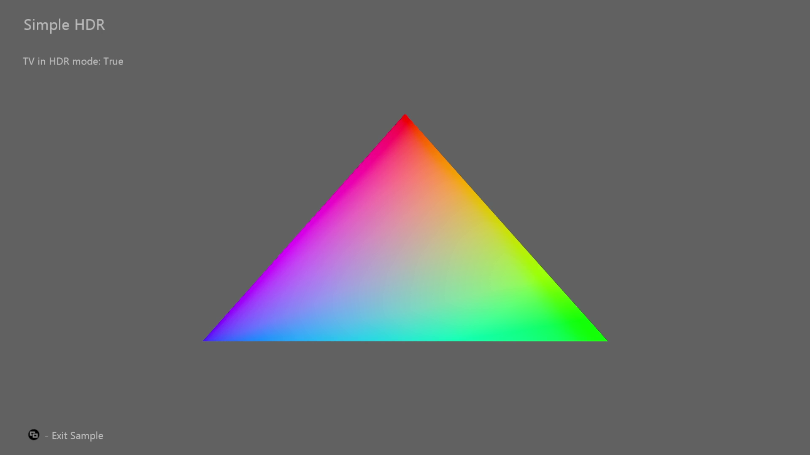

# SimpleHDR Sample

*This sample is compatible with the Microsoft Game Development Kit
(March 2022)*

# Description

This is a simple sample that shows how to implement HDR on Xbox.

# Building the sample

If using an Xbox One devkit, set the active solution platform to `Gaming.Xbox.XboxOne.x64`.

If using Project Scarlett, set the active solution platform to `Gaming.Xbox.Scarlett.x64`.

*For more information, see* __Running samples__, *in the GDK documentation.*

# Using the sample

The sample uses the following controls.

| Action                                         |  Gamepad             |
|------------------------------------------------|---------------------|
| Exit                                           |  View button         |

# Implementation notes

For HDR, the Xbox console is required to send values to the TV that is
in the Rec.2020 color space with the ST.2084 gamma curve. There are
different requirements and options for a title to handle this on Xbox
One vs. Xbox Series consoles, with regards to swap buffer formats, color
space formats and shader output. The system also needs an SDR image for
GameDVR and streaming purposes. A title can either render this SDR image
to a second swap chain buffer or let the system automatically generate
this image using auto tone mapping.

**Xbox One**

On Xbox One the swap chain buffer must be using the format
`DXGI_FORMAT_R10G10B10A2_UNORM` and the swap chain color space flag must
be DXGI_COLOR_SPACE_RGB_FULL\_**G2084**\_NONE\_**P2020**. Deciphering
the meaning of this flag is simple, it tells the graphics driver that
the title's shader will write out values to the swap chain in the
**Rec.2020** color space with the **ST.2084** gamma curve applied.

To opt into auto tone mapping, the title adds the flag
`D3D12XBOX_RESOURCE_FLAG_ALLOW_AUTOMATIC_GAMEDVR_TONE_MAP` to its swap
chain creation. Note that in this scenario the driver will allocate an
extra swap chain internally and inject a compute shader to tone map the
title's HDR image to produce an SDR image. It might be more performant
for a title to do its own tone mapping by combining shaders. In PIX, the
driver's auto tone mapping shader can be identified with the PIX named
event "\[HDR Auto Tonemap\]" right before the Present call.

**Xbox Series**

On Xbox Series consoles, the swap chain can either be
`DXGI_FORMAT_R9G9B9E5_SHAREDEXP` or `DXGI_FORMAT_R10G10B10A2_UNORM`. We
recommend using DXGI_FORMAT\_**R9G9B9E5**\_SHAREDEXP since it allows the
title to present higher precision values.

The swap chain color space flag can be one of many, controlling what
will be done on the GPU and what will be offloaded to the display
hardware. We recommend using
DXGI_COLOR_SPACE_RGB_FULL\_**G10**\_NONE\_**D65P3**. Deciphering the
meaning of this flag is similar to Xbox One. For example the previous
flag tells the driver that its shader will output linear values, or
gamma 1.0, in the P3-D65 color space. This means that the display
hardware will convert the color values to Rec.2020 and apply the ST.2084
gamma curve. The biggest reason for this recommendation is that most HDR
TVs can display, or almost display, P3 color values. If a title simply
outputs Rec.709 colors, it under utilizes the TVs display capabilities.
The sample shows a simple color gamut expansion to make bright colors
more colorful and still keep most of the image the same.

To make use of auto tone mapping, the title can simply present a single
swap chain, no need to specify an extra flag like for Xbox One. There is
also no extra CPU, GPU, memory or bandwidth cost, it's all handled in
display hardware.

Being able to offload some of the processing to display hardware is very
beneficial, especially on Lockhart consoles/

# Known Issues

None

# Privacy Statement

When compiling and running a sample, the file name of the sample
executable will be sent to Microsoft to help track sample usage. To
opt-out of this data collection, you can remove the block of code in
Main.cpp labeled "Sample Usage Telemetry".

For more information about Microsoft's privacy policies in general, see
the [Microsoft Privacy
Statement](https://privacy.microsoft.com/en-us/privacystatement/).
