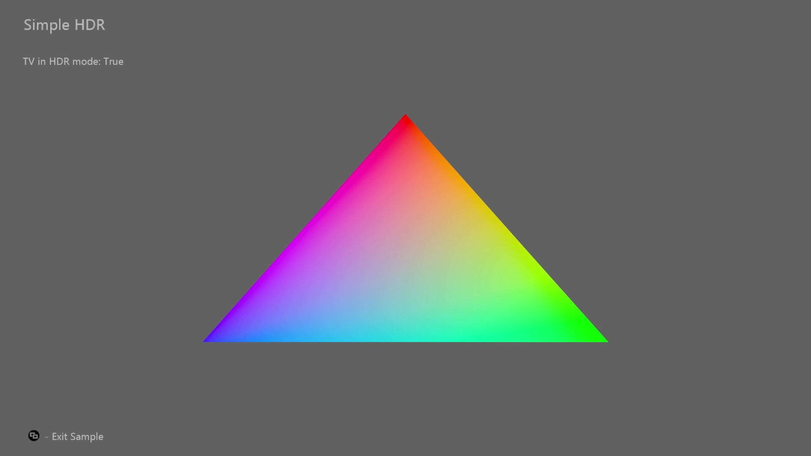

# SimpleHDR サンプル

*このサンプルは、Microsoft Game Development Kit と互換性があります (2022 年 3 月)*

# 説明

これは、Xbox で HDR を実装する方法を示す簡単なサンプルです。

# サンプルのビルド

Xbox One 開発キットを使用している場合は、アクティブなソリューション プラットフォームを `Gaming.Xbox.XboxOne.x64` に設定します。

Project Scarlett を使用している場合は、アクティブなソリューション プラットフォームを `Gaming.Xbox.Scarlett.x64` に設定します。

*詳細については、* *GDK ドキュメント*の「__サンプルの実行__」を参照してください。

# サンプルの使用方法

このサンプルでは、次のコントロールを使用します。

| 操作 | ゲームパッド |
|---|---|
| Exit | View button |

# 実装メモ

HDR の場合、Xbox 本体は、ST.2084 ガンマ曲線を持つ Rec.2020 カラー空間にあるテレビに値を送信する必要があります。 スワップ バッファーフォーマット、カラースペースフォーマット、シェーダー出力に関して、タイトルが Xbox One 本体と Xbox シリーズ本体でこれを処理するためのさまざまな要件とオプションがあります。 システムには、GameDVR とストリーミングの目的で SDR イメージも必要です。 タイトルは、この SDR イメージを 2 番目のスワップ チェーン バッファーにレンダリングするか、自動トーン マッピングを使用してこのイメージを自動的に生成させることができます。

**Xbox One**

Xbox One スワップ チェーン バッファーはフォーマット `DXGI_FORMAT_R10G10B10A2_UNORM` を使用している必要があり、スワップ チェーンの色空間フラグは DXGI_COLOR_SPACE_RGB_FULL\_**G2084**\_NONE\_**P2020**である必要があります。 このフラグの意味を解読するのは簡単です。タイトルのシェーダーは、**ST.2084** ガンマ曲線が適用された **Rec.2020** カラー空間のスワップ チェーンに値を書き出すようにグラフィックス ドライバーに指示します。

自動トーン マッピングを選択するために、タイトルはスワップ チェーンの作成にフラグ `D3D12XBOX_RESOURCE_FLAG_ALLOW_AUTOMATIC_GAMEDVR_TONE_MAP` を追加します。 このシナリオでは、ドライバーは内部的に余分なスワップ チェーンを割り当て、タイトルの HDR イメージをトーン マップして SDR イメージを生成するコンピュート シェーダーを挿入します。 シェーダーを組み合わせて独自のトーン マッピングを行う方が、タイトルにとってパフォーマンスが高い場合があります。 PIX では、ドライバーの自動トーン マッピング シェーダーは、Present 呼び出しの直前にイベント "\[HDR Auto Tonemap\]" という名前の PIX で識別できます。

**Xbox Series**

Xbox Series 本体では、スワップ チェーン `DXGI_FORMAT_R9G9B9E5_SHAREDEXP` は または `DXGI_FORMAT_R10G10B10A2_UNORM`です。DXGI_FORMAT\_**R9G9B9E5**\_SHAREDEXPを使用することをお勧めします。タイトルではより高い精度の値を表示できるためです。

スワップ チェーンの色空間フラグは、GPU で何が行われるか、およびディスプレイ ハードウェアにオフロードされる内容を制御する、多くの色空間フラグのいずれかになります。 DXGI_COLOR_SPACE_RGB_FULL\_**G10**\_NONE\_**D65P3** を使用することをお勧めします。 このフラグの意味を解読することは、Xbox One に似ています。 たとえば、前のフラグは、シェーダーが P3-D65 色空間で線形値 (ガンマ 1.0) を出力することをドライバーに指示します。 つまり、ディスプレイ ハードウェアは色の値を Rec.2020 に変換し、ST.2084 ガンマ曲線を適用します。 この推奨事項の最大の理由は、ほとんどの HDR テレビが P3 色の値を表示またはほぼ表示できるためです。 タイトルが単に Rec.709 色を出力する場合、その下ではテレビの表示機能が利用されます。 このサンプルでは、明るい色をよりカラフルにし、画像のほとんどを同じに保つための単純な色域拡張を示しています。

自動トーン マッピングを使用するために、タイトルは単に 1 つのスワップ チェーンを表示できます。Xbox One のような追加のフラグを指定する必要はありません。 CPU、GPU、メモリ、帯域幅の追加コストもかからず、すべてディスプレイ ハードウェアで処理されます。

ハードウェアを表示するために処理の一部をオフロードできることは、特に Lockhart 本体/

# 既知の問題

なし

# プライバシーに関する声明

サンプルをコンパイルして実行する場合、サンプルの使用状況を追跡するために、サンプルの実行可能ファイルのファイル名が Microsoft に送信されます。 このデータ コレクションからオプトアウトするには、Main.cpp の "サンプル使用状況テレメトリ" というラベルの付いたコードのブロックを削除します。

Microsoft のプライバシー ポリシー全般の詳細については、「[Microsoft のプライバシーに関する声明](https://privacy.microsoft.com/en-us/privacystatement/)」を参照してください。

