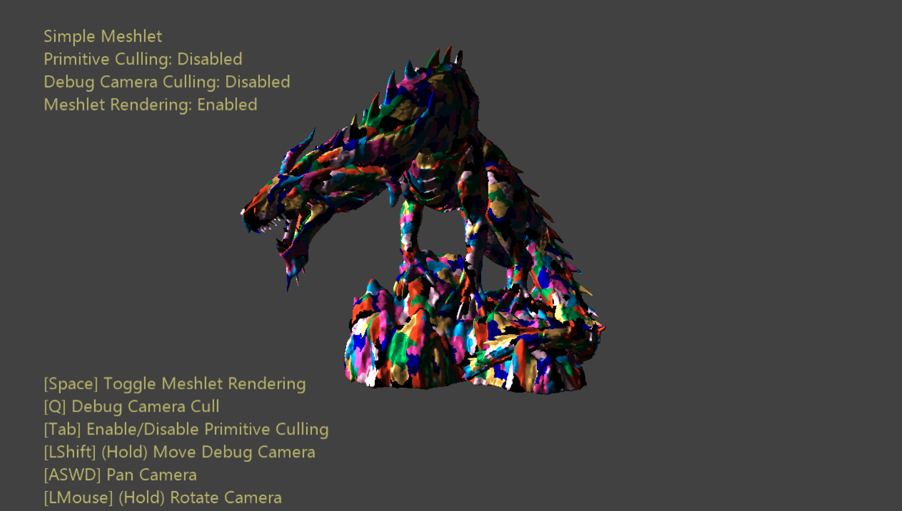

  

#   シンプルな Meshlet のサンプル

*このサンプルは、Microsoft ゲーム開発キットのプレビュー (2019 年 11 月)
および PC 用 Windows 10 "20H1" Insider に対応しています。*

# 説明

このサンプルでは、meshlet のデータ構造を紹介し、meshlet
を使用して描画する例を示します。また、メッシュ
シェーダー内でプリミティブ カリングを行う方法についても示します。

# サンプルの作成

Project Scarlett を使用している場合は、アクティブなソリューション
プラットフォームを Gaming.Xbox.Scarlett.x64 に設定します。

適切なハードウェアと Windows 10 リリースの PC
を使用している場合は、アクティブなソリューションプラットフォームを
Gaming.Desktop.x64 に設定します。

このサンプルは、Xbox One をサポートしていません。

*詳細については、GDK ドキュメントの*
「サンプルの実行」*を参照してください。*

# サンプルの使用

カメラ
コントロール以外にも、試してみることができるオプションがいくつかあります。

基礎となる meshlet
構造を視覚的に表示するには、ボタンをクリックして切り替えます。色分けされたパッチは、最大サイズ
128 の meshlet を表します。

また、プリミティブ
カリングも自由に切り替えることができます。「デバッグ」カメラはプリミティブがカリングされるビューとしてオプションで使用できるシーンに配置されました。これにより、ユーザーはカリングされたプリミティブを可視化できます。このカメラの位置
& 向きを操作するには、ボタンを押しながらカメラ
コントロールを操作します。

# コントロール​​

| 動作                         |  ゲームパッド     |  キーボード        |
|------------------------------|------------------|-------------------|
| カメラをビュー ベ クターに沿って回転/変換する |  左スティック  |  マウスホイール |
| カメラを周回させる  |  右スティック  |  LMB を押しな がらマウスの操作  |
| カメラをパンする  |  方向パッド  |  WASD または方向キー    |
| カメラをリセットする  |  右スティック (押す) |  \- |
| Meshlet の視覚エフェクトを切り替える |  X  |  Space キー |
| プリミティブ カリングを切り替える |  A  |  Tab キー |
| デバッグ カメラのカリングを切り替える |  B  |  Q |
| デバッグカメラを制御する (ホールド) |  右ショルダー  |  左シフト |
| メッシュ LOD を循環する  |  左/右トリガー  |  プラス/マイナス キー              |
| 終了する                     |  表示ボタン       |  Escape キー       |

# 実装に関する注意事項

**meshlet**
は、その名が示すとおり、より大型メッシュの固定サイズのプリミティブ
チャンクです。meshlet
構造の最大サイズが選択されたら、メッシュ全体が処理されるまで、プリミティブと頂点は
meshlets にパックされます。これにより、メッシュ meshlet
の配列になります。

このプロセスでは実際の頂点データは変更されないことに注意してください。ただし、インデックス
バッファーは 3 つの新しいバッファー (*meshlet
リスト*、*一意の頂点インデックス リスト*、*プリミティブ リスト*)
に置き換わります。*meshlet リスト* の要素は、他の 2
つの構造へのシンプルなオフセット & カウントです。これは、各 meshlet
に含まれるプリミティブと頂点を定義します。*一意の頂点インデックス
リスト* には、各 meshlet
に対して重複した頂点インデックスのチャンクが含まれています。これらは、頂点バッファーに直接インデックスを作成するために使用されます。*プリミティブ
リスト* は、各 meshlet
のプリミティブのチャンクを定義します。このリストの項目は、一意の頂点インデックス
リストに含まれるインデックスです。各プリミティブ インデックスは、meshlet
の一意の頂点インデックスのサブ範囲に対してローカルのため、その範囲は 8
ビットのみに減少します。

この構造は、メッシュ
シェーダーの固定サイズのスレッドグループへのマッピングに非常に優れており、各
meshlet を 1 つのスレッドグループにマッピングできます。各 meshlet
には一定の最大サイズが設定されているため、これは各スレッドが担当する作業に有効に相関します。これはシェーダー
BasicMeshletMS.hlsl
の基本であり、実装の点で非常に分かりやすく優れています。

**プリミティブ カリング** は、複数のカリング
テストに対してプリミティブごとのビューポートの関連性を決定するプロセスです。メッシュ
シェーダーはその出力数を動的に指定するため、それらを送信から除外するだけで、プリミティブが破棄されます。メッシュ
シェーダーに基づくプリミティブ
カリングの基本的なワークフローは、次の手順で行います。

1.  meshlet の頂点をカリング領域に変換します (通常、表示、同種、または
    NDC)。

2.  変換された頂点からプリミティブを構築してカリング テストを実施します

3.  残ったプリミティブをマーク 頂点をマークします

4.  **圧縮**により、頂点およびプリミティブの最終出力インデックスを決定します

5.  プリミティブ
    インデックスを再マッピングした頂点インデックスに再マッピングします

6.  通常どおりにエクスポートします

**圧縮**は、疎なリストを生成するアルゴリズムです。このリストは、関連性のある、またはない作業項目
( カリングされている、またはされていない)
をどちらも含む密なリストにインデックス化します。
このリストは、ルックアップ テーブルとして使用するインデックス
リスト形式になります。スレッドグループのコンテキストでは、最小 ID
のスレッドが、関連するすべての作業項目に直接アクセスできるようにします。このプロセスは、グループの共有メモリとグループ同期ポイントで処理される相互通信が必要なため、多少複雑になります。

# 更新履歴

2019 年 10 月 31 日 -- サンプルの作成。

2020 年 2 月 24 日 -- LOD 循環およびデバッグ カメラ
ビュー視錐台の可視化を追加。

# プライバシーに関する声明

サンプルをコンパイルして実行すると、サンプルの使用状況を追跡するため、サンプル実行可能ファイルのファイル名が
Microsoft に送信されます。このデータ収集を無効にするには、「Sample Usage
Telemetry」とラベル付けされた Main.cpp
内のコードのブロックを削除します。

Microsoft プライバシー ステートメントの詳細については、「[Microsoft
プライバシー
ステートメント](https://privacy.microsoft.com/en-us/privacystatement/)」を参照してください。
