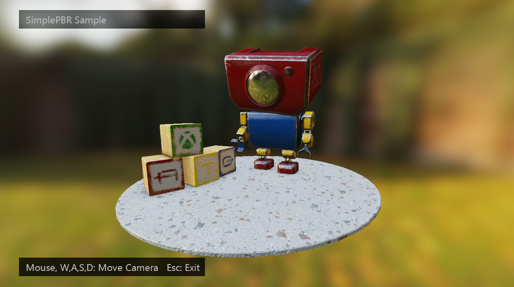

  

#   SimplePBR Sample

# *This sample is compatible with the Windows 10 October 2018 Update SDK (17763) and the Microsoft Game Development Kit (March 2022).*

# 

# Description

This sample demonstrates physically based rendering (PBR) on the Xbox
Series consoles, Xbox One consoles, and PC using DirectX 12 via the GDK.
The sample implements forward-rendered Disney-style PBR as a standalone
shader with the following parameters:

1.  Albedo: base RGB color with no lighting

2.  Normal map: uncompressed 3 channel normal map (Y positive),

> And an RMA map which specifies:

3.  Roughness: \[0\...1\], Normal distribution implying specular
    highlight size and shape. Roughness is scaled according to Disney
    paper.

4.  Metallic: (Usually 0 or 1, may blend), Controls index of refraction,
    specular vs diffuse distribution of albedo.

5.  Ambient occlusion: A value \[0\...1\] that scales specular and
    diffuse contribution.

The parameters may be expressed as constants only or as textures only
(but not a mix). The shader supports image-based lighting (with
precomputed diffuse and specular maps) and directional lights.

For more details of PBR, see the implementation/references section at
the end of this document.



# Building the Sample

If using an Xbox One devkit, set the active solution platform to `Gaming.Xbox.XboxOne.x64`.

The Gaming.Xbox.Scarlett.x64 configuration is for deploying to Xbox
Series X|S devices.

Additionally, the sample can be run on PC with the
Gaming.Xbox.Desktop.x64 active solution platform.

*For more information, see* __Running samples__, *in the GDK documentation.*

# Using the sample

The rendered scene in the sample can be navigated around using orbit
camera actions as listed in the 'Controls' section of this document.
Gamepad controls are supported for all devices, whereas mouse and
keyboard support are only available on PC.

# Controls

| Action                       |  Gamepad          |  Keyboard & Mouse  |
|------------------------------|------------------|-------------------|
| Rotate/translate camera along view vector |  Left Thumbstick  |  Mouse wheel |
| Orbit camera                 |  Right Thumbstick |  Hold LMB + Mouse  |
| Pan Camera  |  Directional Pad  |  WASD or Arrow Keys              |
| Exit                         |  View Button      |  Escape            |

# Implementation notes

The PBREffect class wraps the implementation of the shader. The shader
has two configurations -- constant and textured. The constant
configuration is mainly for debugging. In the textured configuration,
the input parameters (Albedo, and Roughness, Metallic, AO) are specified
as textures.

To create a textured shader, use the EffectFlags enum:

```cpp
m_effect = std::make_unique<DirectX::PBREffect>(device, EffectFlags::Texture, pipelineState);
```

To set texture parameters, simply pass in descriptors for each texture
and a sampler:

```cpp
m_effect->SetSurfaceTextures(m_descriptors->GetGpuHandle(AlbedoIndex), 
    m_descriptors->GetGpuHandle(NormalIndex), 
    m_descriptors->GetGpuHandle(RoughnessMetallicAOIndex),
    commonStates->AnisotropicWrap());
```

The shader compiles as part of the Visual Studio project, and is broken
up into three files

1. PBREffect_VSConstant -- shared vertex shader
2. PBREffect_PSConstant -- constant parameter pixel shader
3. PBREffect_PSTextured -- textured parameter pixel shader

There are also two HLSL includes

1. PBREffect_Math -- shared math functions for BRDF etc.
2. PBREffect_Common -- Root signature, constants, and shared lighting
    function "PBR_LightSurface".

## Lighting

PBREffect supports both directional and image-based lighting. The caller
must supply a precomputed irradiance texture (for diffuse environment
lighting) and a radiance texture (for specular environment lighting).
The textures should be DDS cubemaps in a HDR format.

The caller must also specify the number of MIP levels in the radiance
texture. See [AMD Cubemapgen for physically based
rendering](https://seblagarde.wordpress.com/2012/06/10/amd-cubemapgen-for-physically-based-rendering/)
for more details on generating precomputed maps for PBR.

```cpp
m_effect->SetIBLTextures(m_descriptors->GetGpuHandle(m_radTexDescIndex),
    m_radianceTexture->GetDesc().MipLevels,
    m_descriptors->GetGpuHandle(m_irrTexDescIndex),
    m_commonStates->AnisotropicClamp());
```

Optional, the caller can also specify directional lights using the
SetLight\* methods. The shader will blend the directional and image
lighting.

## References

<https://www.allegorithmic.com/system/files/software/download/build/PBR_Guide_Vol.1.pdf>

<https://disney-animation.s3.amazonaws.com/library/s2012_pbs_disney_brdf_notes_v2.pdf>

<http://blog.selfshadow.com/publications/s2015-shading-course/>

<http://graphicrants.blogspot.com/2013/08/specular-brdf-reference.html>

<https://github.com/dariomanesku/cmftStudio>

# Update history

09/20/2021 -- SimplePBR Sample Initial Release

10/15/2021 -- Fixed GPU hang issue after exiting Sample and added dark
UI rectangles for improved text readability. Also added support for
1440p.

# Privacy statement

When compiling and running a sample, the file name of the sample
executable will be sent to Microsoft to help track sample usage. To
opt-out of this data collection, you can remove the block of code in
Main.cpp labeled "Sample Usage Telemetry".

For more information about Microsoft's privacy policies in general, see
the [Microsoft Privacy
Statement](https://privacy.microsoft.com/en-us/privacystatement/).
