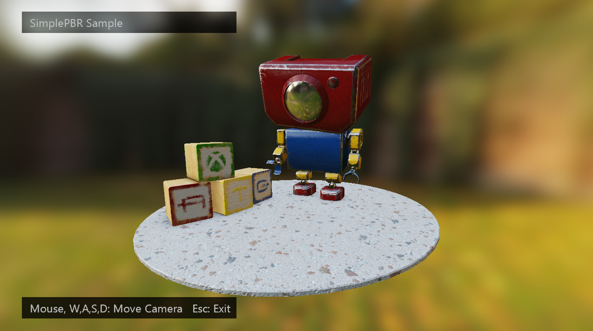

  

#   SimplePBR 샘플

# *이 샘플은 Windows 10 2018년 10월 업데이트 SDK(17763) 및 Microsoft 게임 개발 키트(2020년 11월)과 호환됩니다.*

# 

# 설명

이 샘플은 GDK를 통해 DirectX 12를 사용하는 Xbox Series 콘솔, Xbox One
콘솔 및 PC에서 물리적 기반 렌더링(PBR)을 보여줍니다. 이 샘플은 다음 매개
변수를 사용하여 포워드 렌더링된 Disney 스타일 PBR을 독립형 셰이더로
구현합니다.

1.  알베도: 조명이 없는 기본 RGB 색

2.  기본 맵: 압축되지 않은 3채널 표준 맵(Y 양수)

> 그리고 다음을 지정하는 RMA 맵:

3.  거칠기: \[0\...1\], 반사 강조 표시 크기와 모양을 나타내는 정규
    분포입니다. 거칠기는 Disney 용지에 따라 크기가 조정됩니다.

4.  메탈릭: (일반적으로 0 또는 1이 혼합될 수 있음), 굴절 인덱스,
    알베도의 반사 및 확산 분포를 제어합니다.

5.  앰비언트 차폐: 반사 및 확산 기여도의 크기를 조정하는 값
    \[0\...1\]입니다.

매개 변수는 상수로만 또는 텍스처로만 표현할 수 있습니다(혼합은 아님).
셰이더는 이미지 기반 조명(사전 계산된 확산 및 반사 맵 포함)과 방향
조명을 지원합니다.

PBR에 대한 자세한 내용은 이 문서의 끝에 있는 구현/참조 섹션을
참조하세요.

# 샘플 빌드

Xbox One 개발 키트를 사용하는 경우 활성 솔루션 플랫폼을
Gaming.Xbox.XboxOne.x64로 설정합니다.

Gaming.Xbox.Scarlett.x64 구성은 Xbox 시리즈 디바이스에 배포하기 위한
것입니다.

또한 Gaming.Xbox.Desktop.x64 활성 솔루션 플랫폼을 사용하여 PC에서 샘플을
실행할 수 있습니다.

*자세한 내용은 GDK 설명서에서* 샘플 실행을 *참조하세요.*

# 샘플 사용

샘플에서 렌더링된 장면을 이 문서의 '컨트롤' 섹션에 나열된 대로 궤도
카메라 동작을 사용하여 탐색할 수 있습니다. 게임 패드 컨트롤은 모든
디바이스에서 지원되지만 마우스 및 키보드는 PC에서만 지원됩니다.

# 컨트롤

| 작업                         |  게임 패드        |  키보드 및 마우스  |
|------------------------------|------------------|-------------------|
| 보기 벡터를 따라 카메라 회전/변환 |  왼쪽 엄지스틱  |  마우스 휠 |
| 궤도 카메라  |  오른쪽 엄지스틱  |  LMB + 마우스 누르기            |
| 카메라 이동  |  방향 패드  |  WASD 또는 화살표 키                |
| 끝내기                       |  보기 버튼        |  이스케이프        |

# 구현 참고 사항

PBREffect 클래스는 셰이더의 구현을 래핑합니다. 셰이더에는 상수 및
텍스처의 두 가지 구성이 있습니다. 상수 구성은 주로 디버깅을 위한
것입니다. 텍스처 구성에서 입력 매개 변수(알베도 및 거칠기, 메탈릭, AO)는
텍스처로 지정됩니다.

텍스처 셰이더를 만들려면 EffectFlags 열거형을 사용합니다.

m_effect = std::make_unique\<DirectX::PBREffect\>(device,
EffectFlags::Texture, pipelineState);

텍스처 매개 변수를 설정하려면 각 텍스처 및 샘플러에 대한 설명자를
전달하면 됩니다.

m_effect-\>SetSurfaceTextures(m_descriptors-\>GetGpuHandle(AlbedoIndex),

m_descriptors-\>GetGpuHandle(NormalIndex),

m_descriptors-\>GetGpuHandle(RoughnessMetallicAOIndex),

commonStates-\>AnisotropicWrap());

셰이더는 Visual Studio 프로젝트의 일부로 컴파일되고 세 개의 파일로
나뉩니다.

1.  PBREffect_VSConstant - 공유 꼭짓점 셰이더

2.  PBREffect_PSConstant - 상수 매개 변수 픽셀 셰이더

3.  PBREffect_PSTextured - 텍스처 매개 변수 픽셀 셰이더

두 개의 HLSL include도 있습니다.

1.  PBREffect_Math - BRDF 등에 대한 공유 수학 함수

2.  PBREffect_Common - 루트 서명, 상수 및 공유 조명 함수
    "PBR_LightSurface"

## 조명

PBREffect는 방향 및 이미지 기반 조명을 모두 지원합니다. 호출자는 사전
컴퓨팅된 방사 조도 텍스처(확산 환경 조명용) 및 방사형 텍스처(반사 환경
조명용)를 제공해야 합니다. 텍스처는 HDR 형식의 DDS 큐브맵이어야 합니다.

또한 호출자는 방사형 텍스처의 MIP 수준 수를 지정해야 합니다. PBR용으로
사전 컴퓨팅된 맵을 생성하는 방법에 대한 자세한 내용은 "[물리적 기반의
렌더링을 위한 AMD
Cubemapgen](https://seblagarde.wordpress.com/2012/06/10/amd-cubemapgen-for-physically-based-rendering/)"을
참조하세요.

m_effect-\>SetIBLTextures(

m_descriptors-\>GetGpuHandle(m_radTexDescIndex),

m_radianceTexture-\>*GetDesc*().*MipLevels*,

m_descriptors-\>GetGpuHandle(m_irrTexDescIndex),

m_commonStates-\>AnisotropicClamp());

필요에 따라, 호출자는 SetLight\* 메서드를 사용하여 방향성 광원을 지정할
수도 있습니다. 셰이더는 방향 및 이미지 조명을 혼합합니다.

## 참조

<https://www.allegorithmic.com/system/files/software/download/build/PBR_Guide_Vol.1.pdf>

<https://disney-animation.s3.amazonaws.com/library/s2012_pbs_disney_brdf_notes_v2.pdf>

<http://blog.selfshadow.com/publications/s2015-shading-course/>

<http://graphicrants.blogspot.com/2013/08/specular-brdf-reference.html>

<https://github.com/dariomanesku/cmftStudio>

# 업데이트 기록

2021년 9월 20일 - SimplePBR 샘플 초기 릴리스

2021년 10월 15일 - 샘플 종료 후 발생하는 GPU 중단 문제가 해결되고 텍스트
가독성을 개선하기 위해 어두운 UI 사각형이 추가되었습니다. 1440p 지원이
추가되었습니다.

# 개인정보처리방침

샘플을 컴파일하고 실행하는 경우 샘플 사용량을 추적할 수 있도록 샘플 실행
파일의 파일 이름이 Microsoft에 전송됩니다. 이 데이터 수집을
옵트아웃하려면 \"샘플 사용량 원격 분석\"으로 레이블이 지정된
Main.cpp에서 코드 블록을 제거할 수 있습니다.

Microsoft의 개인정보 정책에 대한 자세한 내용은 [Microsoft
개인정보처리방침](https://privacy.microsoft.com/en-us/privacystatement/)을
참조하세요.
