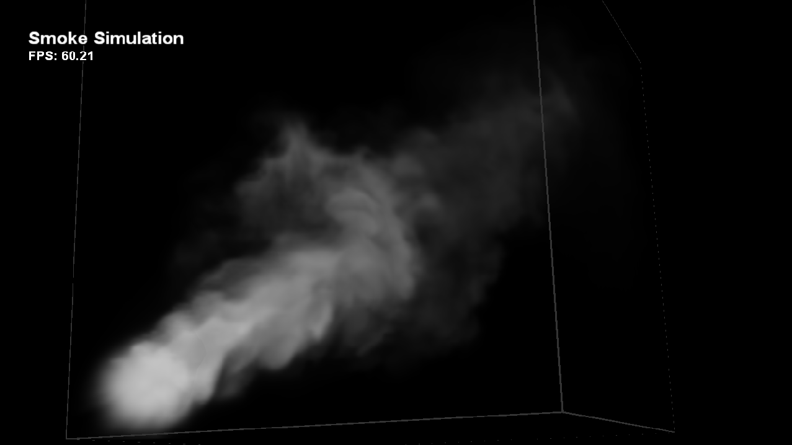

# スモーク シミュレーション

*このサンプルは、Microsoft Game Development Kit と互換性があります (2022 年 3 月)*

# 説明

このサンプルでは、コンピュート シェーダー 6.0 と 3D テクスチャを使用して基本的な 3D ナビエ-ストークス流体シミュレーションを実装する方法を示します。 このサンプルでは、単純な光線進行アルゴリズムを使用して容積測定データをレンダリングする方法も示します。

# サンプルのビルド

Xbox One 開発キットを使用している場合は、アクティブなソリューション プラットフォームを `Gaming.Xbox.XboxOne.x64` に設定します。

Xbox Series X|S 開発キットを使用している場合は、アクティブ ソリューション プラットフォームを `Gaming.Xbox.Scarlett.x64` に設定します。

*詳細については、* *GDK ドキュメント*の「__サンプルの実行__」を参照してください。

# サンプルの使用方法

このサンプルでは、次のコントロールを使用します。

| 操作 | ゲームパッド |
|---|---|
| サンプルを終了する。 | 選択 |
| カメラを回転させる | 右スティック |
| エミッタを回転させる | 左スティック |
| エミッタを移動する | 左/右トリガー |
| エミッタの方向をリセットする | X ボタン |
| シミュレーションの一時停止を切り替える | A ボタン |
| シミュレーションをリセットする | B ボタン |

# 実装メモ

**シミュレーションテクニック**

このサンプルで使用されるシミュレーションの技法の詳細については、「GPU Gem 第 38 章 GPU 上の高速流体ダイナミクス シミュレーション」を参照してください。 この記事ではシミュレーションの技法について説明し、2D 流体に適用しますが、このサンプルでは 3D データにまで拡張します。 このサンプルでは、シミュレーションは 128x128x128 グリッドで実行され、その状態は 3D テクスチャに格納されます。

コンピュート シェーダー 5.0 を使用すると、3D テクスチャのすべてのスライスを一度に直接操作できます。 これにより、Geometry shader (ジオメトリ シェーダー) を使用する別の方法よりも効率が良くなるため、更新する 3D テクスチャ スライスを指定するために使用することができます。

**レンダリングの技法**

シミュレーションの結果は、特定のシミュレーション ステップでの流体の状態を表す 3D 速度フィールドです。 速度を直接見ることができないので、速度フィールドでの持ち持ち歩きが観測できるトレース粒子が必要です。 そのため、シミュレーション自体に必要なすべての 3D テクスチャに加えて、これらのパーティクルを格納する 3D テクスチャもあります。 この 3D テクスチャは、レンダリング フェーズで視覚化したものです。

レンダリング時に、キューブの前面をレンダリングします。 ピクセル シェーダーでは、目の位置からキューブ上の現在のポイントにレイをキャストし、色と不透明度を蓄積しながら、最後の段落で説明した 3D テクスチャをレイに沿って一定の間隔でサンプリングします。

また、このサンプルでは、レイキャスト アルゴリズムの単純で効果的な加速技法も示しました。 シミュレーション中に、1/8 サイズの 3D テクスチャが並列縮小を使用して生成されます。 レンダリングでは、一定の間隔で元の 3D テクスチャを直接サンプリングする代わりに、空のスペースをサンプリングして多くの時間を無駄にすることがあるので、最初にこの 1/8 サイズの 3D テクスチャをサンプリングし、サンプリングされた値がしきい値よりも小さい場合は、空間内のチャンクをスキップします。 この手法は、ここでの煙のように、3D テクスチャに格納されているデータがスパースである場合に特に効果的です。

# 更新履歴

2019 年 4 月 -- 従来の Xbox サンプル フレームワークから新しいテンプレートに移植します。

# プライバシーに関する声明

サンプルをコンパイルして実行する場合、サンプルの使用状況を追跡するために、サンプルの実行可能ファイルのファイル名が Microsoft に送信されます。 このデータ コレクションからオプトアウトするには、Main.cpp の "サンプル使用状況テレメトリ" というラベルの付いたコードのブロックを削除します。

Microsoft のプライバシー ポリシー全般の詳細については、「[Microsoft のプライバシーに関する声明](https://privacy.microsoft.com/en-us/privacystatement/)」を参照してください。

