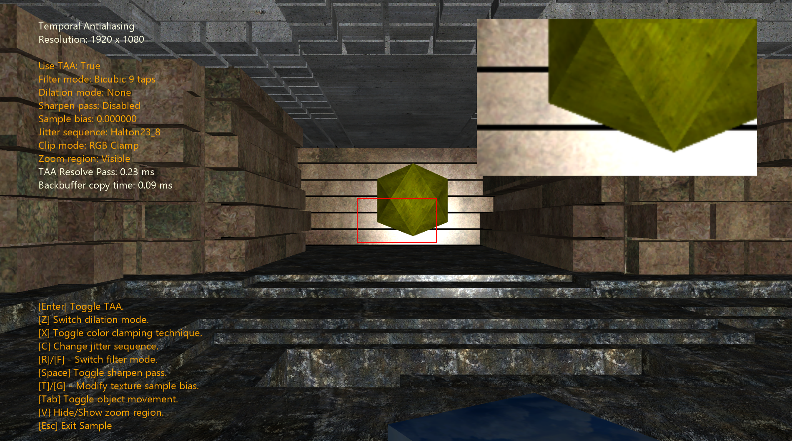
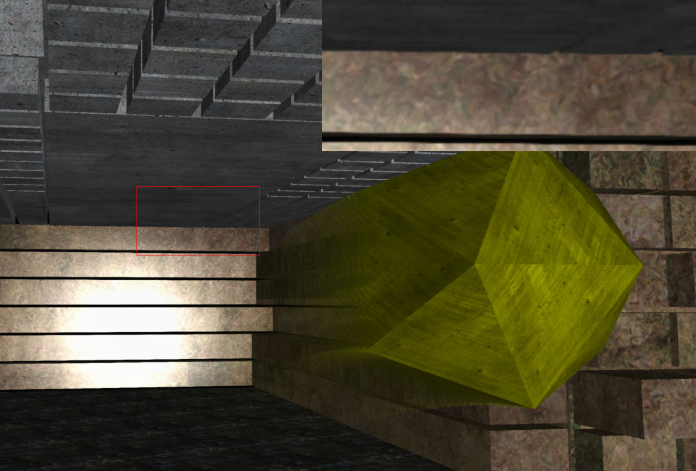
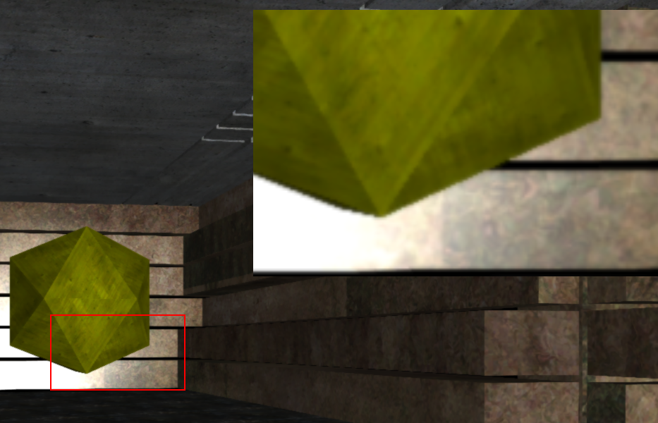
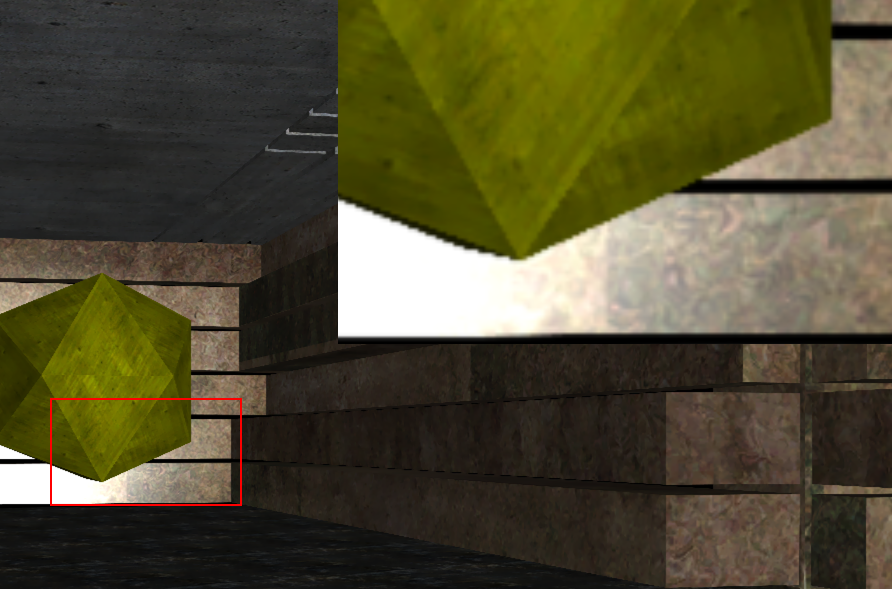
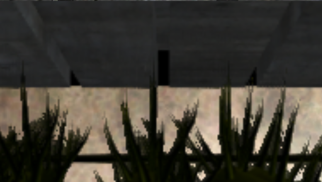
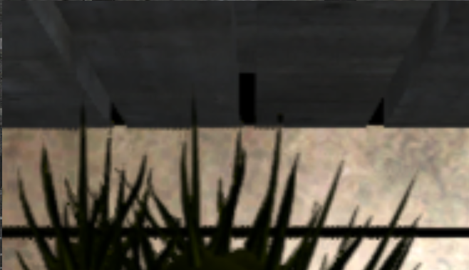

# Temporal AntiAliasing

*This sample is compatible with the Microsoft Game Development Kit (March 2023)*

# Description

This sample demonstrates how to implement Temporal Antialiasing (TAA), plus a series of other techniques which help improve the algoritm stability and fix some of its inherent issues.



# Building the sample

If using an Xbox One devkit, set the active solution platform to `Gaming.Xbox.XboxOne.x64`.

If using Xbox Series X|S, set the active solution platform to `Gaming.Xbox.Scarlett.x64`.

If running on PC, set the active solution platform to `Gaming.Xbox.Desktop.x64`.

*For more information, see* __Running samples__, *in the GDK documentation.*

# Controls

| Action                                 |  Gamepad           |  Keyboard       |
|--------------------------------------- |--------------------|-----------------|
| Enable TAA                             |  A                 | Enter           |
| Switch dilation techniques             |  B                 | Z               |
| Switch between color-clamp techniques  |  X                 | X               |
| Change jitter sequence                 |  Y                 | C               |
| Change history buffer filter mode      |  Right/Left DPad   | R/F (up/down)   |
| Toggle the sharpen pass                |  Start             | Space           |
| Change the jitter scale                |  Up/Down DPad      | T/G (up/down)   |
| Toggle movement for dynamic objects    |  RB                | Tab             | 
| Hide or show the zoomed in region      |  LB                | V               |
| Exit the sample.                       |  View Button       | Esc             |

# Implementation notes

The principle behind TAA is that samples can be accumulated temporaly, saving us from having to render more than once.
By introducing a sub-pixel jitter when rendering, we can make each frame be slightly offset from the rest. These can be accumulated
in a history buffer and then this can be resolved against the current-frame color value.

TAA is a comparatively cheap method of antialiasing. It does not scale with geometry (since it is a post-processing pass), and it lends itself
well to other temporal techniques. Also because it is a post-process pass, it works well with Deferred rendering. This sample implements 
TAA after a deferred pass.

Two big issues with TAA are the following: 

1- Matching a currently shaded pixel against its history is not always possible. The object could have been occluded last frame, and when trying to
   find its previous pixel, it might not exist. this produces a ghosting artifact in the image whenever the camera or an object moves around. 

2- Since it works by blurring the current frame against a history of past ones, it introduces blurring not only in the edges, but also the textures 
   interiors. There are a number of things that can be done to address this, which will be expanded upon later in the document.

## History buffer

The first implementations of TAA accumulated previous frames by storing each in a texture. This worked well but it was very bandwidth-heavy. More recent 
implementations (and this sample) use an accumulation buffer called **history buffer**. The way this work is we keep two textures, one for the accumulation until 
the previous frame, and one for the current. Every frame, we use an exponential moving average to combine the current rendered frame (the result of the deferred
rendering) and the previous history into the current history buffer. For this sample, the exponential alpha used is 0.9. This translates into the following:

``` float4 currentHistory = (1 - 0.9) * currentColor + 0.9 * previousHistory ```


## Reprojection:

The TAA algorithm works by comparing the current pixel against past frames. But if the camera moves, then we cannot just use the same pixel coordinate to find
the previous iteration of our pixel. Reprojection is a technique in which, starting from a pixel position, we go back to the corresponding world position (by
using the inverse view and projection matrices), and then we can apply the previous frame's view and projection to land in the correct pixel position.

A simplified example:

```
// Assuming you start from a pixel center
float2 pixelCenter;
float2 NDCposition = pixelCenter * HalfResolution + HalfResolution;
float depth = sampleDepth();
float4 viewPosition = InvProjection * float4(NDCposition, depth, 1.0);
float4 viewPosition /= viewPosition.w;
float4 worldPosition = InvView * viewPosition;

float4 previousClipPosition = PreviousFrameViewProjection * worldPosition;
float2 previousNDC = previousClipPosition.xy / previousClipPosition.w;
float2 previousPixel = ((previousNDC + 1.0) / 2.0) * Resolution;
```

One thing to keep in mind is that the Y axis is reversed between NDC (Y increases upwards) and screen space (top left origin, Y increases down), so the steps above need 
to flip Y for this to work.

## Motion Vectors:

The previous solution works very well for static scenes where only the camera moves. The sample refers to this as background motion. For pixels that land on dynamic 
objects, we need to take into account their movement when trying to reproject, since otherwise we won't end in the correct coordinate. Motion vectors store a "velocity",
which in this case represents the delta in position between this and the previous frame for any object. We store this in screen space (pixel coords).

In this implementation, the background velocity (obtained through reprojection) and the dynamic object's velocity vectors are combined in one texture (MotionVectors).
This is done in the fullscreen pass, right after the Geometry pass.

## Jitter quasy random sequences

The choice of how much to offset the rendering (subpixel offsetting) is very important, since depending on how many different positions 
we choose, and how these are
spatially positioned, the quality of the result will be impacted. Quasy-random sequences have shown to be the best to get a good 
distribution of different positions. 
This sample has 3 choices of quasi-random sequences which can be switched with the controls. Also, the jitter scale can be changed between 
values of 0.2 and 1.0. The higher the Jitter scale values, the smoother the edges will look (but the Jitter might become visible depending 
on the scene).

## Color Clamping:

Ghosting was mentioned previously as one of the big issues with temporal anti-aliasing. Ghosting occurs when a pixel being evaluated does not have a valid history
in the accumulation buffer. The best way to combat ghosting is to use color clamping. Simply put, this technique consist on sampling a neighbourhood of pixels (around 
the current pixel) of the color buffer (the frame we just rendered) and gathering information such as min, max. With this, we can evaluate if the history currently falls 
within this neighbourhood of values. If it does not, we need to do something to avoid ghosting artifacts.

This sample implements three variants of color clamping:

- AABB clamping, which simply clamps the history agains the neighbourhood min and max RGB values.

- AABB clipping, which clips the history against the neighborhood's AABB, getting a result closer to the current color than we would have gotten by clamping 
  (but more expensive).

- Variance clipping: This method defines the min and max by treating the neighbourhood as a normal distribution of RGB values, and getting the first and second 
  moments. With this, we can use the mean plus/minus some measure of the std deviation to clamp the values of the history. This method is usually preferred, as
  it gets results which are closer to the neighborhood than the AABB approaches.

This technique gets rid of most of the ghosting. Below is a screenshot of the sample with color clamping disabled.



## History Buffer Filtering: When sampling from the history buffer

The other big issue with TAA, blurring, has to do with how we sample from the history buffer. Usually when reprojecting we won't land on a pixel center exactly. We can
either try to point sample from the history buffer (which leads to some distracting line-snapping artifacts due to the fact that we are mapping a point in between samples to
a single pixel), or we can use bilinear filtering. This last one works alright, but blurries the image a little bit each frame, which ends up accumulating and generating a 
result which does get rid of the aliasing, but also brings too much blurriness.

A solution is to use bicubic filtering, which is more expensive, but generates a closer resonstruction (since it has more information). The current implementation is using a
catmull-rom bicubic filtering, and two options for an optimization which brings the texture taps down from 16 (originally) to either 9 or 5. The idea is explained further in the
[original paper](https://developer.nvidia.com/gpugems/gpugems2/part-iii-high-quality-rendering/chapter-20-fast-third-order-texture-filtering) and also in 
[this website](https://vec3.ca/bicubic-filtering-in-fewer-taps/) where it expands on considerations to have if using catmull-rom as a cubic filter. The 5 taps is a further 
optimization presented in a Siggraph talk (*Filmic SMAA: Sharp morphological and temporal antialiasing.*). The GDK implementation is based on an [intel project](https://github.com/GameTechDev/TAA) built on top of [Microsoft's Mini-engine](https://github.com/microsoft/DirectX-Graphics-Samples/tree/master/MiniEngine).


Bilinear vs Bicubic comparison: 





##  Velocity Dilation

These are some techniques which can be used to get more stable results when in motion. 
- Closest Depth: When evaluating a pixel for its velocity, sample the pixels around it and choose the one with the closest depth value.
- Biggest velocity: Same as before, but choose based in which pixel has the velocity with the biggest magnitude.

Both this methods will work by effectively expanding the borders. This only works when in motion.

Example: No Dilation vs Biggest Velocity.





## Sharpen pass

This is an optional pass which can be used to sharpen the image and offset some of the blurriness added. Note that it can bring some of the hard edges back. It seems 
like a good match when choosing to sample the history buffer with a bi-linear instead of a bi-cubic filter, since the latter will not blurr the image as much.

Below, a comparison of an image using just bilinear vs bilinear with the sharpen pass:


## Mip bias

This is another way to combat the added blurriness the technique creates. When sampling textures, a negative mip bias can be added so higher resolution mips will be filtered.
This can offset the blurriness, at the expense of higher bandwidth cost.

# Notes

-   A future revision will implement FP16 for scarlett.

# Update history

01/18/2024 -- Created Sample.

# Privacy Statement

When compiling and running a sample, the file name of the sample
executable will be sent to Microsoft to help track sample usage. To
opt-out of this data collection, you can remove the block of code in
Main.cpp labeled "Sample Usage Telemetry".

For more information about Microsoft's privacy policies in general, see
the [Microsoft Privacy
Statement](https://privacy.microsoft.com/en-us/privacystatement/).
