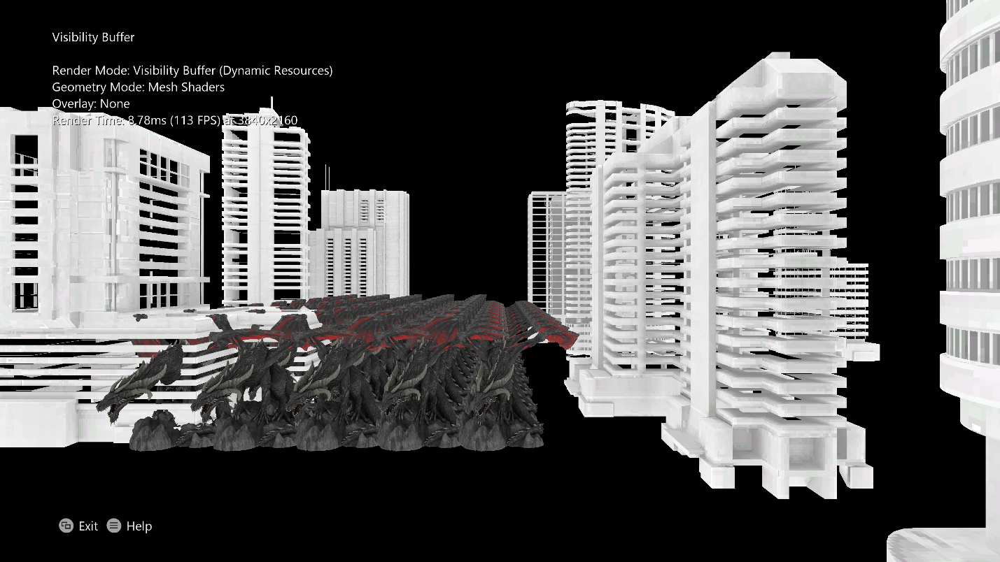

# 표시 유형 버퍼 샘플

*이 샘플은 Microsoft 게임 개발 키트(2021년 4월)와 호환됩니다.*

# 설명

이 샘플은 메시 셰이더 및 HLSL 6.6 동적 리소스를 사용하는 표시 유형
버퍼(지연) 렌더링 기술을 보여줍니다.

# 샘플 빌드

Xbox One 개발 키트를 사용하는 경우 활성 솔루션 플랫폼을
Gaming.Xbox.XboxOne.x64로 설정합니다.

Xbox Series X|S를 사용하는 경우 활성 솔루션 플랫폼을
Gaming.Xbox.Scarlett.x64로 설정합니다.

PC용 빌드(Gaming.Desktop.x64)에는 HLSL SM 6.6 기능을 사용하기 때문에
[DirectX Agility
SDK](https://devblogs.microsoft.com/directx/gettingstarted-dx12agility/)가
필요합니다. Agility SDK는 샘플에 NuGet 패키지로 포함되어 있습니다. 또한
Microsoft.Windows.SDK.CPP NuGet 패키지를 사용하여 DXC.exe 컴파일러의
최신 Windows SDK(22000) 버전을 가져옵니다. 개발자는
[Github](https://github.com/microsoft/DirectXShaderCompiler/releases)에서
직접 최신 DXC를 사용할 수도 있습니다.

*자세한 내용은 GDK 설명서에서* 샘플 실행을 *참조하세요.*

# 샘플 사용

이 샘플에는 장면 내 어디든 카메라를 배치할 수 있는 비행/1인칭 카메라가
있습니다. 컨트롤에 대한 전체 설명은 다음과 같습니다.

# 컨트롤

| 작업                                              |  게임 패드        |
|---------------------------------------------------|------------------|
| 보기 컨트롤                                       |  시작 버튼        |
| 표시 유형 버퍼(지연된) 렌더링과 전달 렌더링 간에 토글합니다. 표시 유형 버퍼 렌더링은 동적 리소스를 사용합니다. 전달 렌더링은 그렇지 않습니다. |  A |
| 주기 표시 유형 버퍼 오버레이. 기본 ID 또는 개체 ID를 오버레이로 표시합니다. 내부적으로 둘 다 단일 32비트 UINT 렌더링 대상으로 렌더링됩니다. |  B |
| 정점 셰이더/메시 셰이더 형상 렌더링을 전환합니다. 표시 유형 버퍼 모드에만 적용됩니다. 정점 셰이더만 Xbox One에서 지원됩니다. |  X |
| 카메라 앞으로 / 뒤로 / 스트레이프                 |  왼쪽 스틱        |
| 카메라 Yaw/피치                                   |  오른쪽 스틱      |
| 카메라 위/아래  |  왼쪽/오른쪽 트리거           |
| 빠른 비행 모드(터보)  |  클릭 + 왼쪽 스틱 길게 누르기      |
| 종료                                              |  보기 버튼        |

# 구현 참고 사항

두 개의 렌더링 경로가 표시됩니다(A를 눌러 토글됨).

Forward 경로에서는 일반적인 래스터화가 수행되고 모든 리소스(인덱스 버퍼,
정점 버퍼, 텍스처, 샘플러 등)는 루트 서명을 통해 또는 입력 어셈블러에
바인딩됩니다.

표시 유형 버퍼 경로에서 \"지연된\" 래스터화가 수행되며 지오메트리
셰이딩을 위한 메시 셰이더 또는 정점 셰이더 옵션과 최종 장면 셰이딩을
수행하는 컴퓨트 셰이더가 있습니다. 메시 셰이더를 사용하는 경우 HLSL 6.6
기능인 ResourceDescriptorHeap\[\] 및 SamplerDescriptorHeap\[\]을 통해
모든 리소스에 \"바인딩 없이\" 액세스할 수 있습니다. 정점 셰이더 모드에서
인덱스 버퍼와 정점 버퍼는 성능상의 이유로 입력 어셈블러에 바인딩됩니다.

정점 셰이더 모드에서는 인덱스 버퍼만 바인딩하고
ResourceDescriptorHeap\[\]을 통해 정점 버퍼에 액세스할 수도 있지만 이로
인해 일부 하드웨어에서 상당한 성능 손실이 발생했습니다.

메시 셰이더는 Xbox One에서 지원되지 않으므로 정점 셰이더 모드만 사용할
수 있습니다.

[표시 유형 버퍼]{.underline}

표시 유형 버퍼 경로는 \"지연된\" 렌더러의 구현입니다. 그러나 초기
래스터화 경로는 처음 12비트(4096개 가능한 개체)의 객체 식별자와 마지막
20비트(개체당 1,048,576 삼각형)의 기본 식별자를 포함하는 단일 32비트
UINT 렌더링 대상(표시 유형 버퍼)만 출력합니다. 그런 다음 계산 셰이더
패스는 표시 유형 버퍼를 사용하고 ResourceDescriptorHeap에서 개체별 상수
정보를 로드한 다음 ResourceDescriptorHeap에서 인덱스 버퍼/정점
버퍼/텍스처를 로드합니다. 그런 다음 컴퓨트 셰이더는 각 삼각형의 히트
포인트를 재구성하고 적절한 보간된 텍스처 좌표와 화면 공간 파생물을
결정합니다. 이것은 첫 번째 패스 후에 이 데이터가 중간 렌더링 대상에
저장되었을 일반 지연 렌더러와 다릅니다. 마지막으로
SamplerDescriptorHeap을 사용하여 SamplerState 개체를 로드하고 텍스처를
샘플링하여 화면에 출력합니다.

[기하 도형 셰이더]{.underline}

이 샘플은 정점 셰이더와 메시 셰이더(지원되는 경우)를 모두 구현합니다.
표시 유형 버퍼는 정점 셰이더 전달 후 SV_PrimitiveID 시스템 의미 체계에서
가져오거나 메시 셰이더의 기본 출력으로 전달할 수 있는 기본 ID를 포함해야
합니다.

메시 셰이더의 경우 간단한 시작 시간 메시렛 분할 알고리즘이 수행됩니다.
이 알고리즘은 사전 최적화된 인덱스 버퍼를 예상합니다(예: -op 플래그가
있는 DirectXMesh의 MeshConvert 출력). 그런 다음 인덱스 버퍼를 기존 기본
순서를 유지하면서 최대 정점/최대 기본 제한을 충족하는 메시렛으로
분할합니다. 그러면 매우 간단한 메시 셰이더가
ResourceDescriptorHeap\[\]을 통해 메시렛 정보를 로드하고 일반 정점
셰이딩을 수행하고 기본형별 내보내기에서 primitiveID를 출력할 수
있습니다. 이 ID는 원래 인덱스 버퍼와 동일한 순서를 유지하므로 계산
셰이더가 메시렛 형식을 이해할 필요 없이 동일한 계산 셰이더와 함께 사용할
수 있습니다.

[성능]{.underline}

이 기술의 성능은 여러 요인에 따라 달라집니다. 메시 셰이더와 정점 셰이더
간의 기하 도형 음영 비용과 장단점은 대상 GPU 플랫폼 및 자산 크기에 따라
달라집니다.

또한 전달 렌더러의 픽셀 셰이더 작업은 정점 셰이더 작업과 병렬로 실행될
수 있지만 Visibility Buffer Renderer는 모든 정점이 처리된 후 계산에서
\"픽셀 셰이딩\"을 수행해야 합니다. 즉, 픽셀 작업이 정점 작업보다 더
중요하지 않으면 오버드로 비용이 더 큰 정점 셰이더 작업에 의해
숨겨집니다.

그러나 컴퓨트 셰이더는 매우 효율적이며 픽셀 셰이더 작업이 지배적인 경우
표시 유형 버퍼 렌더러의 성능이 향상될 수 있습니다. 이는 주로 오버드로가
완전히 부족하고 메시 셰이더의 약간의 성능 향상 때문이지만 쿼드 도우미
레인을 피하는 이점과 픽셀 셰이더 웨이브를 늦출 수 있는 기본 출력의
단점이 있을 수도 있습니다.

이 샘플에서는 정방향 렌더러와 표시 유형 버퍼 렌더러가 모두 셰이딩의 끝에
반복에서 여러 중복 텍스처 페치를 수행합니다. 이것은 오버드로 성능 차이를
더 잘 반영하기 위해 픽셀 셰이더 비용을 증가시키려는 시도입니다. 이것이
없으면 정점 셰이더 작업이 항상 지배적이기 때문입니다.

마지막으로 이 샘플에는 기존의 지연 렌더러가 구현되어 있지 않지만 이
방법에는 이점이 있을 수 있습니다. 주요 참고 사항은 표시 유형 버퍼가
확산/일반/반사 등을 위한 다중 대상과 달리 단일 32비트 대상인 렌더링 대상
메모리 요구 사항이 훨씬 낮다는 것입니다. 마찬가지로 초기 패스에서 하나의
대상만 작성되고 컴퓨팅 셰이더에서 하나의 UAV만 출력되기 때문에 필
레이트가 훨씬 적습니다. 필요한 리소스는 필요할 때 설명자 힙에서 직접
가져옵니다.

# 개인정보처리방침

샘플을 컴파일하고 실행하는 경우 샘플 사용량을 추적할 수 있도록 샘플 실행
파일의 파일 이름이 Microsoft에 전송됩니다. 이 데이터 수집을
옵트아웃하려면 \"샘플 사용량 원격 분석\"으로 레이블이 지정된
Main.cpp에서 코드 블록을 제거할 수 있습니다.

Microsoft의 개인 정보 정책에 대한 자세한 내용은 [Microsoft
개인정보처리방침](https://privacy.microsoft.com/en-us/privacystatement/)을
참조하세요.
