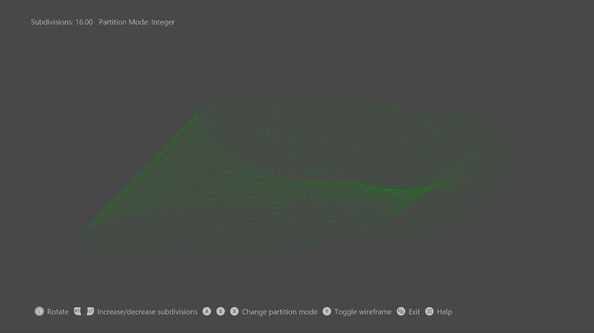

# Simple Bezier Sample

*This sample is compatible with the Microsoft Game Development Kit (June
2020)*

# Description

This sample demonstrates how to create hull and domain shaders to draw a
tessellated Bezier surface representing a Mobius strip, using DirectX
12.

# Building the sample

If using an Xbox One devkit, set the active solution platform to `Gaming.Xbox.XboxOne.x64`.

If using an Xbox One X|S devkit, set the active solution platform to `Gaming.Xbox.Scarlett.x64`.

*For more information, see* __Running samples__, *in the GDK documentation.*

# Using the sample

This sample uses the following controls.

| Action                                     |  Gamepad                 |
|--------------------------------------------|-------------------------|
| Shaded/wireframe rendering                 |  Y button                |
| Select tessellation method: -   Integer -   Fractional even -   Fractional odd |  X button A button B button |
| Decrease/increase number of patch divisions \<4, 16\> |  Hold left/right trigger |
| Rotate camera left/right  |  Move left thumbstick left/right              |
| Show controller help                       |  Menu button             |
| Exit                                       |  View button             |

# Implementation notes

Input geometry consists of four patches with 16 control points each, all stored in a vertex buffer. A simple vertex shader passes the control points straight to the hull shader. The hull shader drives the fixed function tessellator stage through a tessellation factor from a constant buffer, both of which then pass the control points and the UVW to the domain shader. The domain shader is run once per vertex, and calculates the final vertex's position and attributes. The vertex\'s position is calculated by using a Bernstein polynomial; the normal is calculated as the cross product of the U and V derivatives. The pixel shader performs N dot L lighting to draw a shaded Mobius strip. 

# Privacy Statement

When compiling and running a sample, the file name of the sample
executable will be sent to Microsoft to help track sample usage. To
opt-out of this data collection, you can remove the block of code in
Main.cpp labeled "Sample Usage Telemetry".

For more information about Microsoft's privacy policies in general, see
the [Microsoft Privacy
Statement](https://privacy.microsoft.com/en-us/privacystatement/).
