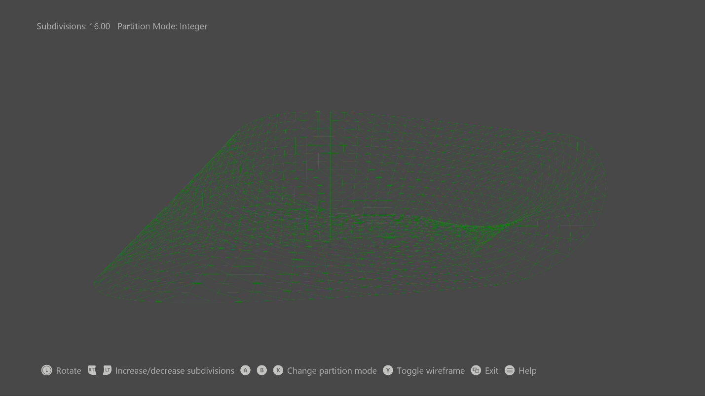

# 単純なベジエのサンプル

*このサンプルは、Microsoft ゲーム開発キットのプレビュー (2019 年 11 月)
に対応しています。*

# 説明

このサンプルでは、ハル シェーダーとドメイン
シェーダーを作成して、メビウスの帯を表すテッセレーションされたベジエ表面を、DirectX
12 を使って描画する方法を示します。

# サンプルのビルド

Xbox One の devkit を使用している場合は、アクティブなソリューション
プラットフォームを Gaming.Xbox.XboxOne.x64 に設定します。

Project Scarlett を使用している場合は、アクティブなソリューション
プラットフォームを Gaming.Xbox.Scarlett.x64 に設定します。

*詳細については、GDK
ドキュメント*の「サンプルの実行」を*参照してください*。

# サンプルの使用

このサンプルでは、次のコントロールが使用されます。

| 動作                                       |  コントローラー          |
|--------------------------------------------|-------------------------|
| 網掛け/ワイヤーフレーム レンダリング       |  Y ボタン                |
| テッセレーション メソッドを選択: -   Integer -   Fractional even -   Fractional odd |  X ボタン A ボタン B ボタン |
| パッチの分割数の増減、\<4, 16\>            |  左/右トリガーを保持する |
| カメラを左/右に回転させる  |  左サムステ ィックを左/右に移動する |
| コントローラーのヘルプを表示する           |  メニュー ボタン         |
| 終了                                       |  ビュー ボタン           |

# 実装に関する注意事項

# 入力ジオメトリは、それぞれが頂点バッファーに格納されている、16 個のコントロール ポイントを持つ 4 つのパッチから構成されています。単純な頂点シェーダーは、コントロール ポイントをハル シェーダーに直接渡します。ハル シェーダーは、定数バッファーからのテッセレーション 要素を使用して、固定機能テッセレーター ステージを駆動します。いずれの場合も、コントロール ポイントと UVW をドメインシェーダーに渡します。ドメイン シェーダーは頂点ごとに 1 回実行され、最後の頂点の位置と属性を計算します。頂点の位置は、バーンスタイン多項式を使用して計算されます。法線は、U および V 導関数の外積として計算されます。ピクセル シェーダーは N ドット L ライティングを実行して、シェーディングされたメビウスの帯を描画します。

# プライバシーに関する声明

サンプルをコンパイルして実行すると、サンプルの使用状況を追跡するため、サンプル実行可能ファイルのファイル名が
Microsoft に送信されます。このデータ収集を無効にするには、「Sample Usage
Telemetry」とラベル付けされた Main.cpp
内のコードのブロックを削除します。

Microsoft のプライバシー方針の詳細については、「[Microsoft
プライバシーに関する声明](https://privacy.microsoft.com/en-us/privacystatement/)」を参照してください。
