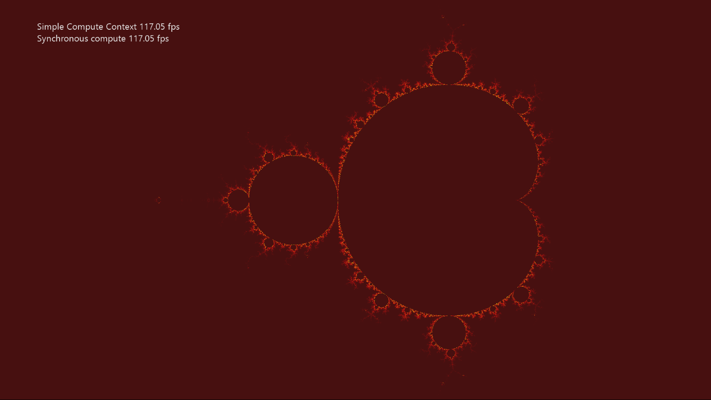

# SimpleCompute サンプル

*このサンプルは Microsoft Game Development Kit (2020 年 6 月) と互換性があります*

# 説明

SimpleCompute は DirectCompute™ の使用方法を示しています (つまり、 DirectX 12 を使用した Direct3D コンピュート シェーダー)。 このサンプルでは、グラフィック コマンド リストの両方に演算処理を送信する方法と、D3D12_COMMAND_LIST_TYPE_COMPUTE インターフェイスを使用して非同期コンピュート シェーダー ワークロードを送信する方法を示します。 コンピュート シェーダーを使用してマンデルブロ集合を計算することによって、テクスチャを更新します。

# サンプルのビルド

Xbox One 開発キットを使用している場合は、アクティブなソリューション プラットフォームを `Gaming.Xbox.XboxOne.x64` に設定します。

Xbox One X|S 開発キットを使用している場合は、アクティブなソリューション プラットフォームを `Gaming.Xbox.Scarlett.x64` に設定します。

*詳細については、**GDK ドキュメント*の「__サンプルの実行__」 を参照してください。

# サンプルの使用方法

| 操作 | ゲームパッド |
|---|---|
| 非同期コンピューティングの切り替え | A button |
| ビューポートを既定値にリセットする | Y button |
| ビューポートのパン | 左スティック |
| ビューポートのズーム | 右スティック |
| ズーム速度を上げる | 右トリガー |
| Exit | ビュー ボタン |
| メニュー | ヘルプの表示/非表示 |

# 実装メモ

このサンプルの主な目的は、単純な計算シェーダーの作成と使用についてリーダーを理解することです。

- **CreateDeviceDependentResources**: ここでは、コンパイルされたコンピューティング シェーダーが読み込まれ、さまざまな Direct3D レンダリング リソースが作成されます。 シェーダーは、Visual Studio によってコンパイルされます。

- **レンダリング**: サンプルが非同期計算を使用していない場合、結果を必要とする描画呼び出しがディスパッチされる前に、計算シェーダーがディスパッチされます。 これにより、フレームごとにテクスチャが更新されます。

- **AsyncComputeProc**: サンプルが非同期コンピューティングを使用している場合、処理を開始するように伝えるとすぐに、計算シェーダーがこのスレッドからディスパッチされます。 レンダリングは、依存する描画呼び出しを実行する前に、非同期タスクが完了すると通知されるまで待機します。

# プライバシーに関する声明

サンプルをコンパイルして実行する場合、サンプルの使用状況を追跡するために、サンプルの実行可能ファイルのファイル名が Microsoft に送信されます。 このデータ コレクションからオプトアウトするには、Main.cpp の "サンプル使用状況テレメトリ" というラベルの付いたコードのブロックを削除します。

Microsoft のプライバシー ポリシー全般の詳細については、「[Microsoft のプライバシーに関する声明](https://privacy.microsoft.com/en-us/privacystatement/)」を参照してください。

