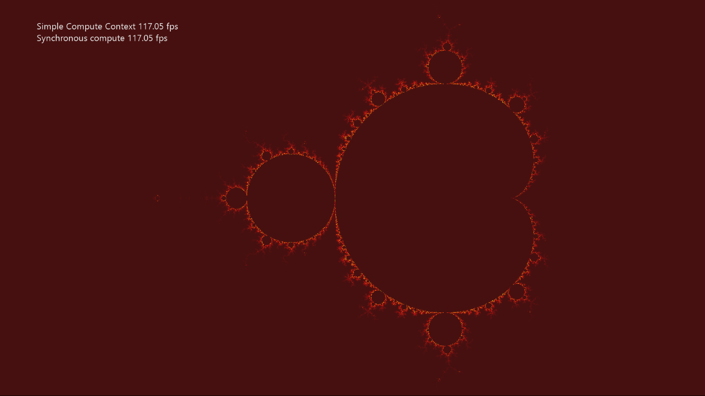

# SimpleCompute 示例

*此示例可用于 Microsoft 游戏开发工具包（2020 年 6 月）*

# 说明

SimpleCompute 演示如何使用 DirectCompute™（即 Direct3D 计算着色器）与 DirectX 12。 此示例演示如何将计算工作提交到图形命令列表以及如何使用 D3D12_COMMAND_LIST_TYPE_COMPUTE 接口来提交异步计算着色器工作负荷。 它通过使用计算着色器计算曼德勃罗集来更新纹理。

# 生成示例

如果使用 Xbox One 开发工具包，请将活动解决方案平台设置为 `Gaming.Xbox.XboxOne.x64`。

如果使用 Xbox One X|S 开发工具包，请将活动解决方案平台设置为 `Gaming.Xbox.Scarlett.x64`。

*有关详细信息，请参阅*__运行示例__，详见*GDK 文档。*

# 使用示例

| 操作 | 游戏板 |
|---|---|
| 切换异步计算 | A button |
| 将视区重置为默认值 | Y button |
| 平移视区 | 左摇杆 |
| 缩放视区 | 右摇杆 |
| 提高缩放速度 | 右扳机键 |
| 退出 | &ldquo;视图&rdquo;按钮 |
| 菜单 | 显示/隐藏帮助 |

# 实现说明

此示例的主要目的是让读者熟悉如何创建和使用简单的计算着色器。

- **CreateDeviceDependentResources**：这是加载已编译计算着色器和创建各种 Direct3D 呈现资源的位置。 着色器由 Visual Studio 编译。

- **Render**：如果示例未使用异步计算，则在调度需要结果的绘图调用之前调度计算着色器。 这会更新每个帧的纹理。

- **AsyncComputeProc**：如果示例使用的是异步计算，则计算着色器在告知开始处理后立即从此线程调度。 在执行从属绘图调用之前，Render 将一直等到异步任务完成。

# 隐私声明

在编译和运行示例时，将向 Microsoft 发送示例可执行文件的文件名以帮助跟踪示例使用情况。 若要选择退出此数据收集，你可以删除 Main.cpp 中标记为&ldquo;示例使用遥测&rdquo;的代码块。

有关 Microsoft 的一般隐私策略的详细信息，请参阅 [Microsoft 隐私声明](https://privacy.microsoft.com/en-us/privacystatement/)。

