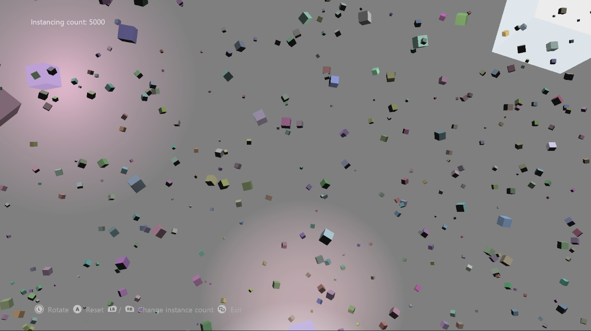

  

#   簡単なインスタンス化のサンプル

*このサンプルは、Microsoft ゲーム開発キットのプレビュー (2019 年 11 月)
に対応しています。*

# 説明

このサンプルでは、Direct3D 12 API でインスタン化を行う方法を実演します。

# サンプルのビルド

Xbox One の devkit を使用している場合は、アクティブなソリューション
プラットフォームを Gaming.Xbox.XboxOne.x64 に設定します。

Project Scarlett を使用している場合は、アクティブなソリューション
プラットフォームを Gaming.Xbox.Scarlett.x64 に設定します。

*詳細については、GDK
ドキュメント*の「サンプルの実行」を*参照してください*。

# サンプルの使用

| 動作                                   |  コントローラー              |
|----------------------------------------|-----------------------------|
| カメラを回転させる                     |  左サムスティック            |
| インスタンス数を変更する               |  LB / RB                     |
| シミュレーションをリセットする         |  A                           |
| 終了                                   |  ビュー ボタン               |

# 実装に関する注意事項

インスタンス化されたジオメトリを描画する際は、次の 4
つのものを考える必要があります。

1.  **ジオメトリ データ**

> このサンプルの場合、ジオメトリ
> データには、頂点と、キューブの面を指定するインデックスおよび頂点を格納したインデックス
> バッファが含まれています。また、このデータには、このキューブをワールドに描画するのに必要な*パイプライン状態オブジェクト*も含まれています。これらのコンポーネントはすべて、インスタンス化されていないジオメトリと同じ方法で設定、操作します。(SimpleInstancing.cpp
> の *CreateDeviceDependentResources* を参考にしてください)

2.  **インスタンス データ**

> D3D12 の標準のインスタンスト
> レンダリングでは、インスタンスごとのデータを 1
> つ以上の頂点バッファ経由でやりとりします。これらの頂点バッファは、他の頂点バッファと同じ方法で作成されます。このサンプルでは
> 2 つの頂点バッファを使用します。1
> つは静的バッファで、インスタンスごとのカラー データを格納しています
> (サンプルが存在する間変化しません)。もう 1
> つは動的バッファであり、インスタンスごとの位置と方向の情報を格納しています
> (1 フレームごとに変化します)。

3.  **インスタンス化のレイアウト**

> インスタンス化されたジオメトリを D3D
> で描画するには、渡される頂点データを解釈する方法の情報が必要です。そのためには、標準レンダリングとほぼ同じ方法で
> *D3D12_INPUT_ELEMENT_DESC*
> 構造体という配列を使用します。ただし、この構造体にはいつくかの要素が追加されています。ジオメトリ
> データでは、通常どおり、*InputSlotClass* 要素に
> *D3D12_INPUT_CLASSIFICATION_PER_VERTEX_DATA
> フラグを*指定しますが、インスタンスごとのデータでは*D3D12_INPUT_CLASSIFICATION_PER_INSTANCE_DATA*
> の値を使用します。*InputSlot*
> 要素も、各データの取得元となる頂点ストリームを指定するのに使用されます。
>
> 頂点シェーダーでは、ジオメトリ
> データとインスタンスごとのデータが一まとまりになっているものとして定義された頂点構造体を使用します
> (*D3D12_INPUT_ELEMENT_DESC*
> 配列に指定されたレイアウトを反映しています)。
>
> ***注:** このサンプルでは、AlignedByteOffset 要素に
> D3D12_APPEND_ALIGNED_ELEMENT
> 定数を使用し、入力レイアウト内のデータが自動的に正しく配置されるようにしています。頂点バッファの構造体内のデータが正しく配置されている場合にのみ、この方法を利用できます。頂点データ内の要素をスキップする
> (または無視する)
> 場合は、頂点を配置するための正確なオフセットが必要になります。*

4.  **レンダリング**

> インスタンス化されたデータのレンダリングは、上の各点さえ押さえれば簡単です。*ID3D12GraphicsCommandList::IASetVertexBuffers*
> API で入力に使用される頂点バッファ (ここでは入力バッファ)
> を指定し、*ID3D12GraphicsCommandList::DrawIndexedInstanced* API
> でレンダリングを行います。レンダリングの設定の残りは、インスタンス化を行わない標準のレンダリングと同様に行います。

# プライバシーに関する声明

サンプルをコンパイルして実行すると、サンプルの使用状況を追跡するため、サンプル実行可能ファイルのファイル名が
Microsoft に送信されます。このデータ収集を無効にするには、「Sample Usage
Telemetry」とラベル付けされた Main.cpp
内のコードのブロックを削除します。

Microsoft のプライバシー方針の詳細については、「[Microsoft
プライバシーに関する声明](https://privacy.microsoft.com/en-us/privacystatement/)」を参照してください。
