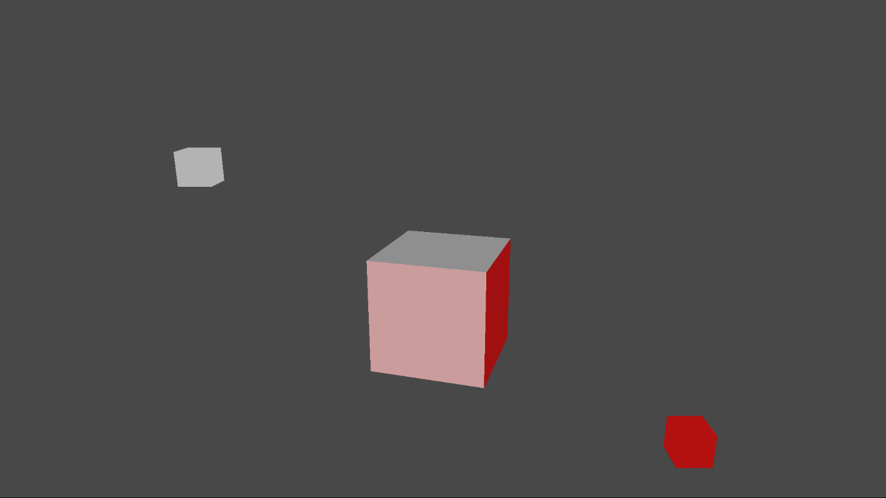

  

#   Simple Lighting Sample

*This sample is compatible with the Microsoft Game Development Kit (June
2020)*

# Description

This sample demonstrates how to create a static Direct3D 12 vertex,
index, and constant buffer to draw indexed geometry lit by using static
and dynamic Lambertian lighting.

The sample renders a large cube that is lit by two lights, one white and
one red, also represented as cubes. The white light is stationary while
the red light orbits around the central cube. The central cube also
rotates. The motion allows you to observe the effects of the colored
lights from different angles.

# Building the sample

If using an Xbox One devkit, set the active solution platform to `Gaming.Xbox.XboxOne.x64`.

If using an Xbox One X|S devkit, set the active solution platform to `Gaming.Xbox.Scarlett.x64`.

*For more information, see* __Running samples__, *in the GDK documentation.*

# Using the sample

| Action                                 |  Gamepad                     |
|----------------------------------------|-----------------------------|
| Exit                                   |  View Button                 |

#  Implementation notes

## Shaders

## The sample uses three shaders to render the scene -- a vertex shader ("TriangleVS") and two pixel shaders ("LambertPS", "SolidColorPS".) The compiled shader blobs are loaded in CreateDeviceDependentResources and then referenced when creating the Pipeline State Objects for each of the shader combinations. All shaders are defined in the same HLSL include file, "SimpleLighting.hlsli" and three stub shaders include this file. Each stub shader is compiled, for a different entry point, in order to create the three shader blobs.

## Pipeline State Objects (PSOs)

The Simple Lighting sample has two unique shader combinations: first is
TriangleVS combined with LambertPS and the second is TriangleVS with
SolidColorPS. In DirectX 12, you need to create a Pipeline State Object
(PSO) for every unique shader combination. As the name suggests, the PSO
encapsulates all the pipeline state that you will need for possibly
several draw calls using a particular set of shaders. The PSO combines a
root signature, shaders for the various stages of the pipeline, state
settings such as rasterizer state, depth stencil state, blend state,
etc. (for more details see the documentation on MSDN.)

## Root Signature

The root signature defines the types of resources that are bound to the
graphics pipeline and how the resources are laid out. A root signature
is analogous to an API function signature, it describes the types of
parameters, parameter order, and layout but does not define any actual
parameter instances. A root parameter is an actual data instance
corresponding to an element of the root signature. The vertex shader for
the sample needs only a single structure for the shader constants and so
the root signature is consequently very simple. The root signature
contains a single root parameter of type ConstantBufferView.

## Geometry

## The geometry for the scene is composed of static vertex and index arrays which contain data for the 24 vertices representing six quads of a cube. The two arrays are declared inside of Sample::CreateDeviceDependentResources where they are immediately used by ID3D12Device::CreateCommittedResource to create ID3D12Resources for the buffers. For simplicity the sample uses D3D12_HEAP_TYPE_UPLOAD since this allows you to create each resource while initializing it with the data in a single step. However, \_UPLOAD heaps are a sub-optimal location for geometry data. A more efficient implementation would use a D3D12_HEAP_TYPE_DEFAULT for the geometry data. To initialize a \_DEFAULT heap, you need to use an \_UPLOAD heap so you end up using two heaps, which complicates the implementation.

Once the buffers for the geometry are create, the sample can create a
D3D12_VERTEX_BUFFER_VIEW for the vertices and a D3D12_INDEX_BUFFER_VIEW
for the indices. The views are used in Sample::Render when setting up
the input assembler via calls to
ID3D12GraphicsCommandList::IASetVertextBuffer and
ID3D12GraphicsCommandList::IASetVertextBuffer.

## Managing Shader Constants

For this very simple scene, all the shader constants are lumped together
into a single constant buffer which contains the following:

-   World, View and Projection Matrices

-   Light directions and colors

-   Solid color

For a more complex scene, you would normally split the constants into
multiple buffers depending on how frequently the constants are updated.

Since the large cube and the red light are animated the shader constants
need to be updated multiple times per frame in between draw calls.
Recall that the root signature contains a single root parameter of type
ConstantBufferView which will need to reference a copy of the shader
constants for use in each draw call. Since the CPU and GPU operate in
parallel, the CPU should not attempt to update any constant buffer until
the GPU is done using it. If there were only a single constant buffer,
the CPU would have to block until the GPU finishes drawing which is
unrealistic since the constants need to be updated for several draw
calls. Therefore, the sample uses several constant buffers so that the
CPU can continue to send constants to the GPU while the GPU is drawing.

The sample is simple and has a fixed number of draw calls per frame,
which is known at compile time. The sample creates one buffer for each
draw call multiplied by the number of back buffers in the swap chain.
This number guarantees that there will always be a free buffer for the
CPU to write to. All the constant buffers are stored in a single
contiguous upload buffer created in
Sample::CreateDeviceDependentResources. The upload buffer is immediately
mapped to obtain the base memory address for both the CPU address space
and the GPU address space.

In the Sample::Render method, constants are written to a location
indexed off of the CPU base address of the constants upload heap. The
same index is combined with the GPU address to bind the buffer to the
pipeline via a call to
ID3D12GraphicsCommandList::SetGraphicsRootConstantBufferView. The index
must account for the back buffer cadence as well as the draw count. For
more details please see the Sample::Render implementation.

## CPU/GPU Synchronization

If the CPU is able to issue command lists to the GPU faster than the GPU
can process them, then eventually the CPU will have to wait for the GPU
to catch up. This sample uses the constant buffer memory in a
round-robin fashion which means that the buffer slots will be reused
after a fixed period. In general, before reusing a shared resource, it
is important to use some kind of synchronization strategy to make sure
that the resource is not in-use. The sample uses an ID3D12Fence to
synchronize the CPU and GPU. The CPU inserts a command into the command
queue to "signal" the fence object with the frame index value. The
provided frame index value then becomes visible to the CPU as soon as
the signal command is processed on the GPU. This enables the CPU to
compare the current frame index with the last frame index signaled by
the GPU in order to determine how far behind the GPU is compared to the
CPU. If the difference between the GPU frame count and the CPU frame
count exceeds the number of back buffers, then the CPU will need to
wait.

# Privacy Statement

When compiling and running a sample, the file name of the sample
executable will be sent to Microsoft to help track sample usage. To
opt-out of this data collection, you can remove the block of code in
Main.cpp labeled "Sample Usage Telemetry".

For more information about Microsoft's privacy policies in general, see
the [Microsoft Privacy
Statement](https://privacy.microsoft.com/en-us/privacystatement/).
