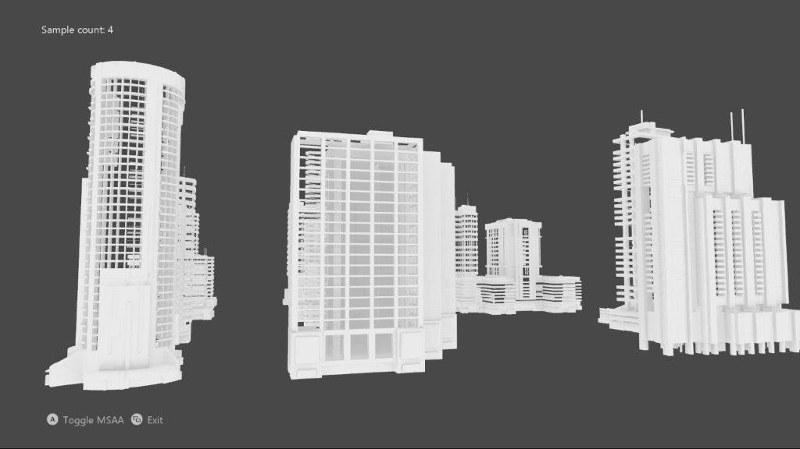

# 간단한 MSAA

*이 샘플은 Microsoft 게임 개발 키트 미리 보기(2019년 11월)와
호환됩니다.*

# 설명

이 샘플은 DirectX 12를 사용하여 3D 장면의 MSAA 렌더 대상 및 깊이/스텐실
버퍼를 구현합니다.

# 샘플 빌드

Xbox One 개발 키트를 사용하는 경우 활성 솔루션 플랫폼을
Gaming.Xbox.XboxOne.x64로 설정하세요.

Project Scarlett을 사용하는 경우 활성 솔루션 플랫폼을
Gaming.Xbox.Scarlett.x64로 설정하세요.

*자세한 내용은 GDK 문서에서* 샘플 실행하기*를 참조하세요.*

# 샘플 사용

| 작업                        |  게임패드                               |
|-----------------------------|----------------------------------------|
| MSAA 및 단일 샘플 토글      |  A 단추                                 |
| 종료                        |  보기 단추                              |

# 구현 참고 사항

이 UI는 MSAA을 사용하지 않고 그려지며, MSAA 스왑 체인의 암시적인 확인에
의존하는 대신, 명시적 확인을 사용합니다.

# 개인정보처리방침

샘플을 컴파일하고 실행할 때 샘플의 사용을 추적하는 데 도움이 되도록 샘플
실행 파일의 파일 이름이 Microsoft에 전송됩니다. 이 데이터 수집을
옵트아웃하려면 Main.cpp에서 \"샘플 사용 원격 분석\"이라고 레이블이
지정된 코드 블록을 제거할 수 있습니다.

Microsoft의 개인 정보 보호 정책에 대한 자세한 내용은 [Microsoft
개인정보처리방침](https://privacy.microsoft.com/en-us/privacystatement/)을
참조하세요.
