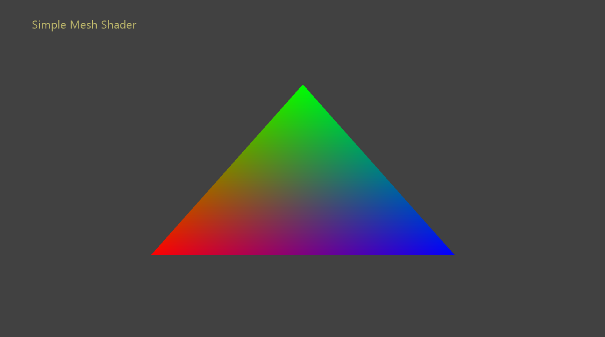

  

#   Simple Mesh Shader Sample

*This sample is compatible with the Microsoft Game Development Kit
(March 2022) and Windows 10 (Version 2004) May 2020 Update*

# Description

This sample is a companion to the well-aged sample SimpleTriangle with
the exception being that it uses mesh shaders. Its purpose is to simply
demonstrate all the pieces necessary to get a mesh shader pipeline
initialized and running on both PC & the Xbox Series X|S.

Note: There is no mesh shader support on the Xbox One console family,
and as such no build configuration is available for that platform.

# Building the sample

If using a Xbox Series X|S devkit, set the active solution platform to `Gaming.Xbox.Scarlett.x64`.

If using PC with appropriate hardware and Windows 10 release, set the
active solution platform to x64.

This sample does not support Xbox One.

*For more information, see* __Running samples__, *in the GDK documentation.*

# Using the sample

| Action                          |  Gamepad                            |
|---------------------------------|------------------------------------|
| Exit                            |  View Button                        |

# Implementation notes

The steps demonstrated by this sample are as follows:

1.  Initialize the ID3D12Device & request API objects for rendering with
    DirectX12.

2.  Check for mesh shader feature support using the
    ID3D12Device::CheckFeatureSupport() function.

3.  Create a mesh shader pipeline using the
    ID3D12Device2::CreatePipelineState() function.

4.  Bind the root signature, pipeline state, and resources to a command
    list. Dispatch the mesh bound pipeline using the
    ID3D12GraphicsCommandList6::DispatchMesh() function with the
    requisite parameters.

# Update history

10/31/2019 -- Sample creation.

4/28/2020 - Updated to use the D3DX12 helpers for mesh shader pipeline
creation

# Privacy Statement

When compiling and running a sample, the file name of the sample
executable will be sent to Microsoft to help track sample usage. To
opt-out of this data collection, you can remove the block of code in
Main.cpp labeled "Sample Usage Telemetry".

For more information about Microsoft's privacy policies in general, see
the [Microsoft Privacy
Statement](https://privacy.microsoft.com/en-us/privacystatement/).
