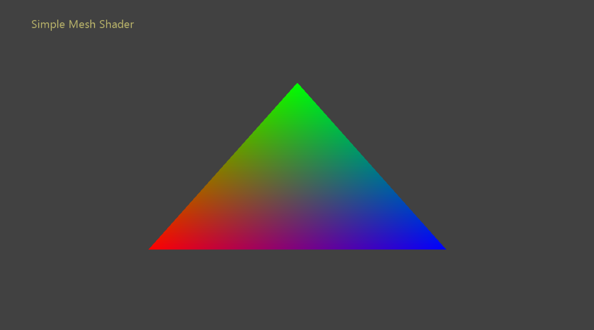

  

#   단순한 메시 셰이더 샘플

*이 샘플은 Microsoft 게임 개발 키트 미리 보기(2019년 11월) 및 PC용
Windows 10 "20H1" 참가자와 호환됩니다.*

# 설명

이 샘플은 메시 셰이더를 사용한다는 점을 제외하고 잘 숙성된 샘플
SimpleTriangle과 함께 제공됩니다. 이 샘플은 PC 및 Scarlett GXDK에서 메시
셰이더 파이프라인을 초기화하고 실행하는 데 필요한 모든 요소를 간단히
보여 주기 위해 작성되었습니다.

참고: Xbox One 콘솔 제품군에서는 메시 셰이더가 지원되지 않으므로 해당
플랫폼에 대한 빌드 구성을 사용할 수 없습니다.

# 샘플 빌드

Project Scarlett을 사용하는 경우 활성 솔루션 플랫폼을
Gaming.Xbox.Scarlett.x64로 설정하세요.

적절한 하드웨어 및 Windows 10 릴리스가 있는 PC를 사용하는 경우 활성
솔루션 플랫폼을 Gaming.Desktop.x64로 설정합니다.

이 샘플은 Xbox One을 지원하지 않습니다.

*자세한 내용은 GDK 문서에서* 샘플 실행하기*를 참조하세요.*

# 샘플 사용

| 작업                            |  게임패드                           |
|---------------------------------|------------------------------------|
| 종료                            |  보기 단추                          |

# 구현 참고 사항

이 샘플에 나오는 단계는 다음과 같습니다.

1.  DirectX12를 사용하여 렌더링하기 위해 ID3D12Device를 초기화하고 API
    개체를 요청합니다.

2.  ID3D12Device::CheckFeatureSupport() 함수를 사용하여 메시 셰이더 기능
    지원을 확인합니다.

3.  ID3D12Device2::CreatePipelineState() 함수를 사용하여 메시 셰이더
    파이프라인을 만듭니다.

4.  루트 시그니처, 파이프라인 상태 및 리소스를 명령 목록에 바인딩합니다.
    ID3D12GraphicsCommandList6::DispatchMesh() 함수를 필수 매개 변수와
    함께 사용하여 메시 바인딩 파이프라인을 디스패치합니다.

# 업데이트 기록

2019년 10월 31일 -- 샘플 만들기

# 개인정보처리방침

샘플을 컴파일하고 실행할 때 샘플의 사용을 추적하는 데 도움이 되도록 샘플
실행 파일의 파일 이름이 Microsoft에 전송됩니다. 이 데이터 수집을
옵트아웃하려면 Main.cpp에서 \"샘플 사용 원격 분석\"이라고 레이블이
지정된 코드 블록을 제거할 수 있습니다.

Microsoft의 일반 개인정보취급방침에 대한 자세한 내용은 [Microsoft
개인정보처리방침](https://privacy.microsoft.com/en-us/privacystatement/)을
참조하세요.
