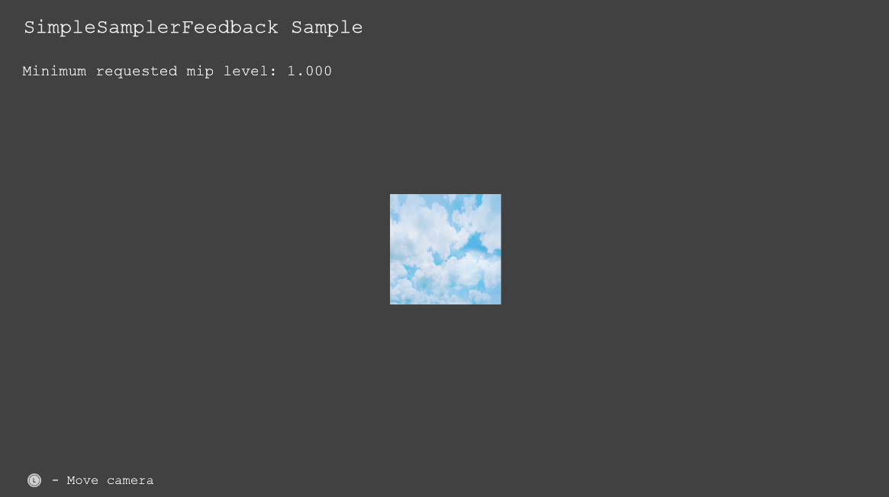

  

#   簡単なサンプラー フィードバックのサンプル

*このサンプルは、Microsoft ゲーム開発キットのプレビュー (2019 年 11 月)
に対応しています。*

# 説明

サンプラー フィードバックは、テクスチャ
サンプリングの情報と位置を把握、記録するための Direct3D
の機能です。この機能を使用して、テクスチャスペース
シェーディングやテクスチャス
トリーミングを実施できます。このサンプルでは、サンプラー
フィードバックのごく簡単な実装を実演します。

このサンプルでは、テクスチャを貼り付けたクワッドをレンダリングします。カメラをクワッドに対して近づけたり遠ざけたりできます。カメラがクワッドに近づくと、レンダリング中、高解像度のミップ
(低いミップレベル) で表示されます。サンプラー
フィードバックは、この情報を MinMip フィードバック
マップに書き出します。

注:サンプラー フィードバックは Xbox One
ではサポートされていないため、これは Scarlett
専用のサンプルとなっています。

# サンプルのビルド

このサンプルは、Scarlett
だけをサポートしているので、アクティブなソリューションプ
ラットフォームは Gaming.Xbox.Scarlett.x64 になります。

*詳細については、GDK
ドキュメント*の「サンプルの実行」を*参照してください*。

# サンプルの使用

| 動作                                   |  コントローラー              |
|----------------------------------------|-----------------------------|
| カメラを移動する                       |  左サムスティック            |
| 終了                                   |  ビュー ボタン               |

# 実装に関する注意事項

**作成**

フィードバック マップには、MinMip と RegionUsed の 2
つの形式があります。このサンプルでは MinMip
フィードバックを実装します。つまり
DXGI_FORMAT_SAMPLER_FEEDBACK_MIN_MIP_OPAQUE を使用してフィードバック
マップを作成します。

通常、サンプラー フィードバックはタイルリ
ソースと共に使用されます。したがってフィードバックマップは通常、対応するタイル状のテクスチャの一片に合わせたサイズになります。つまり、64KB
のタイル 1 枚につき 1 テクセルです。このごく簡単な例では、1 x 1
のフィードバック マップを作成します。つまり、テクスチャ全体に対して 1
つのフィードバックマップを作成します。

フィードバック
マップをシェーダーにバインドし、通常のテクスチャをフィードバック
マップに対応させるには、CreateSamplerFeedbackUnorderedAccessView API
を使用します。

**シーンのレンダリング**

シーンを表示する前に、フィードバック
マップをクリアする必要があります。マップをクリアしても値を 0
にはできません。仮にこれを 0
にすると、シーンをレンダリングするためにミップレベルを 0
にしなければなりません。したがって、このサンプルでは、−1
の値になるようにマップをクリアします。これはミップが要求されなかった状態に相当します。

サンプラー フィードバックのシェーダー インストラクションはシェーダー
モデル 6.5
でサポートされています。このサンプルのピクセルシェーダーは、WriteSamplerFeedback
メソッドを使用します。Pixelshader.hlsl ファイルにはサンプラー
フィードバックをエミュレートするシェーダーのコードが入っています。これは、サンプラー
フィードバックをサポートしていないプラットフォームで役立つ場合があります。

**リード バック**

CPU 上の値を読み込むには、ResolveSubresourceRegion
を使用してフィードバック
マップをトランスコードする必要があります。このサンプルでは、リードバックに使用するリードバック
テクスチャを作成します。Scarlett では、フィードバック マップの値は 5.3
ポイントに固定されています。

# 更新履歴

2019 年 12 月 5 日 -- サンプル作成。

# プライバシーに関する声明

サンプルをコンパイルして実行すると、サンプルの使用状況を追跡するため、サンプル実行可能ファイルのファイル名が
Microsoft に送信されます。このデータ収集を無効にするには、「Sample Usage
Telemetry」とラベル付けされた Main.cpp
内のコードのブロックを削除します。

Microsoft のプライバシー方針の詳細については、「[Microsoft
プライバシーに関する声明](https://privacy.microsoft.com/en-us/privacystatement/)」を参照してください。
