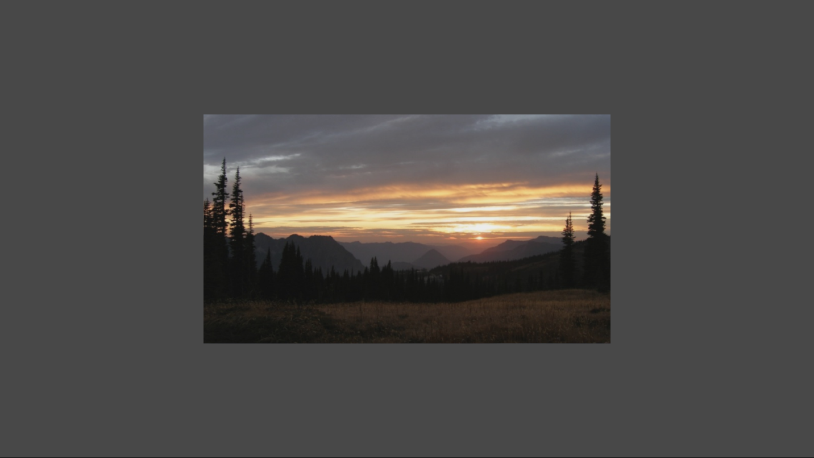

# 簡単なテクスチャのサンプル

*このサンプルは、Microsoft ゲーム開発キットのプレビュー (2019 年 11 月)
に対応しています。*

# 説明

このサンプルでは、Direct3D 12
を使用して、簡単なテクスチャを貼り付けたクワッドを描画する方法を実演します。

# サンプルのビルド

Xbox One の devkit を使用している場合は、アクティブなソリューション
プラットフォームを Gaming.Xbox.XboxOne.x64 に設定します。

Project Scarlett を使用している場合は、アクティブなソリューション
プラットフォームを Gaming.Xbox.Scarlett.x64 に設定します。

*詳細については、GDK
ドキュメント*の「サンプルの実行」を*参照してください*。

# サンプルの使用

このサンプルでは、終了する以外の操作はできません。

# 実装に関する注意事項

テクスチャは、Windows Imaging Component (WIC)
を使用する簡単なヘルパーを用いてロードされます。学習しやすいよう単純に設計されています。本番環境での使用については、DirectX
Tool Kit の
[DDSTextureLoader](https://github.com/Microsoft/DirectXTK12/wiki/DDSTextureLoader)
と
[WICTextureLoader](https://github.com/Microsoft/DirectXTK12/wiki/WICTextureLoader)
を確認してください。

# プライバシーに関する声明

サンプルをコンパイルして実行すると、サンプルの使用状況を追跡するため、サンプル実行可能ファイルのファイル名が
Microsoft に送信されます。このデータ収集を無効にするには、「Sample Usage
Telemetry」とラベル付けされた Main.cpp
内のコードのブロックを削除します。

Microsoft のプライバシー方針の詳細については、「[Microsoft
プライバシーに関する声明](https://privacy.microsoft.com/en-us/privacystatement/)」を参照してください。
