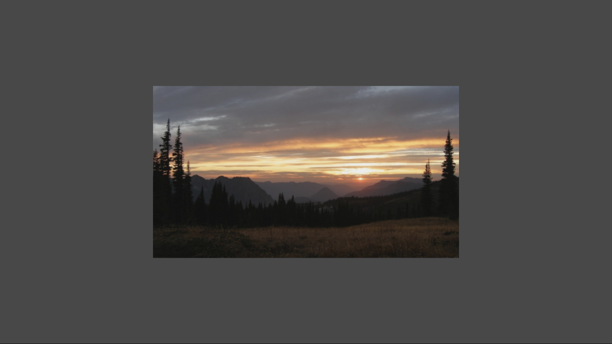

# 简单纹理示例

此示例与 Microsoft 游戏开发工具包预览版（2019 年 11 月）兼容

# 说明

本示例演示如何使用 Direct3D 12 呈现简单的带纹理的四边形。

# 构建示例

如果使用 Xbox One 开发工具包，请将活动解决方案平台设置为
Gaming.Xbox.XboxOne.x64。

如果使用 Project Scarlett，请将活动解决方案平台设置为
Gaming.Xbox.Scarlett.x64。

有关详细信息，请参阅 GDK 文档中的"运行示例"。

# 使用示例

本示例只使用退出控件，不涉及其他控件。

# 实现说明

本示例借助使用 Windows 图像处理组件 (WIC)
的简单帮助程序加载纹理，旨在简化学习。对于生产用途，应查看 DirectX
工具包的 DDSTextureLoader 和
[WICTextureLoader](https://github.com/Microsoft/DirectXTK12/wiki/WICTextureLoader)。

# 隐私声明

在编译和运行示例时，示例可执行文件的文件名将发送给
Microsoft，用于帮助跟踪示例使用情况。要选择退出此数据收集，你可以删除
Main.cpp 中标记为"示例使用遥测"的代码块。

有关 Microsoft 的一般隐私策略的详细信息，请参阅《[Microsoft
隐私声明](https://privacy.microsoft.com/en-us/privacystatement/)》。
