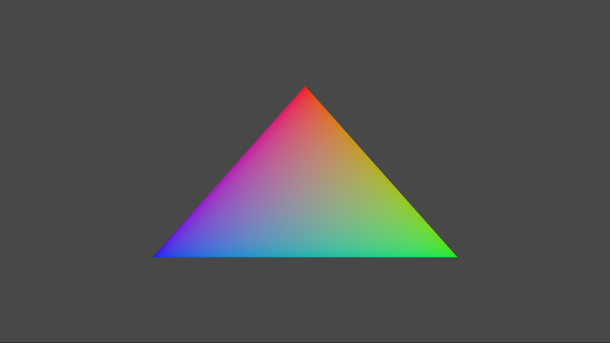

# Simple Triangle Sample

*This sample is compatible with the Microsoft Game Development Kit (October 2024 or later)*

# Description

This sample demonstrates how to create a static Direct3D 12 vertex
buffer to render a triangle on screen.

# Building the sample

If using an Xbox One devkit, set the active solution platform to `Gaming.Xbox.XboxOne.x64`.

If using an Xbox Series X|S devkit, set the active solution platform to `Gaming.Xbox.Scarlett.x64`.

*For more information, see* __Running samples__, *in the GDK documentation.*

# Using the sample

The sample has no controls other than exiting.

# Implementation notes

The primary purpose of this sample is to familiarize the reader with the
ATG samples template structure, as well as provide a simple
demonstration of using Direct3D 12 APIs.

> **CreateDeviceDependentResources**: This is where the compiled vertex
> and pixel shaders blobs are loaded and the various Direct3D rendering
> resources are created. *The shaders are compiled by Visual Studio.*
>
> **Render:** This is where the triangle is rendered and presented to
> the screen.

For details on device creation and presentation handling, see
[DeviceResources](https://github.com/Microsoft/DirectXTK12/wiki/DeviceResources).

For details on the use of the loop timer, see
[StepTimer](https://github.com/Microsoft/DirectXTK/wiki/StepTimer).

# Privacy Statement

When compiling and running a sample, the file name of the sample
executable will be sent to Microsoft to help track sample usage. To
opt-out of this data collection, you can remove the block of code in
Main.cpp labeled "Sample Usage Telemetry".

For more information about Microsoft's privacy policies in general, see
the [Microsoft Privacy
Statement](https://privacy.microsoft.com/en-us/privacystatement/).
