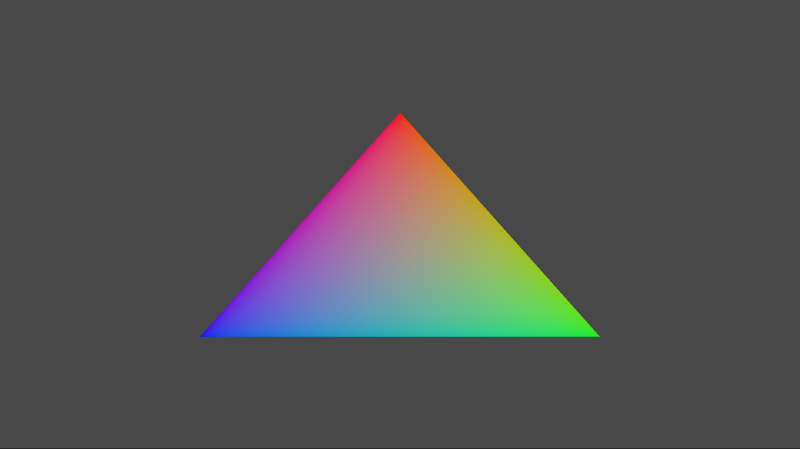

# 간단한 삼각형 샘플

*이 샘플은 Microsoft 게임 개발 키트 미리 보기와 호환됩니다(2019년
11월).*

# 설명

이 샘플에서는 화면에 삼각형을 렌더링하는 정적 Direct3D 12 버텍스 버퍼를
만드는 방법을 보여 줍니다.

# 샘플 빌드

Xbox One 개발 키트를 사용하는 경우 활성 솔루션 플랫폼을
Gaming.Xbox.XboxOne.x64로 설정하세요.

Project Scarlett을 사용하는 경우 활성 솔루션 플랫폼을
Gaming.Xbox.Scarlett.x64로 설정하세요.

*자세한 내용은 GDK 문서에서* 샘플 실행하기*를 참조하세요.*

# 샘플 사용

이 샘플에는 종료 이외의 다른 컨트롤이 없습니다.

# 구현 참고 사항

이 샘플의 주요 목적은 독자에게 ATG 샘플 템플릿 구조를 소개하고 Direct3D
12 API를 사용하는 간단한 데모를 제공하는 것입니다.

> **CreateDeviceDependentResources**: 컴파일된 꼭짓점과 픽셀 셰이더
> BLOB을 로드하고 다양한 Direct3D 렌더링 리소스를 만듭니다. *셰이더는
> Visual Studio에서 컴파일됩니다.*
>
> **Render:** 삼각형을 렌더링하고 화면에 표시합니다.

디바이스 만들기 및 프레젠테이션 처리에 대한 자세한 내용은
[DeviceResources](https://github.com/Microsoft/DirectXTK12/wiki/DeviceResources)를
참조하세요.

루프 타이머를 사용하는 방법에 대한 자세한 내용은
[StepTimer](https://github.com/Microsoft/DirectXTK/wiki/StepTimer)를
참조하세요.

# 개인정보처리방침

샘플을 컴파일하고 실행할 때 샘플 사용을 추적하는 데 도움이 되도록 샘플
실행 파일의 파일 이름이 Microsoft에 전송됩니다. 이 데이터 수집을
옵트아웃하려면 Main.cpp에서 \"샘플 사용 원격 분석\"이라고 레이블이
지정된 코드 블록을 제거할 수 있습니다.

Microsoft의 일반 개인 정보 보호 정책에 대한 자세한 내용은 [Microsoft
개인정보처리방침](https://privacy.microsoft.com/en-us/privacystatement/)을
참조하세요.
