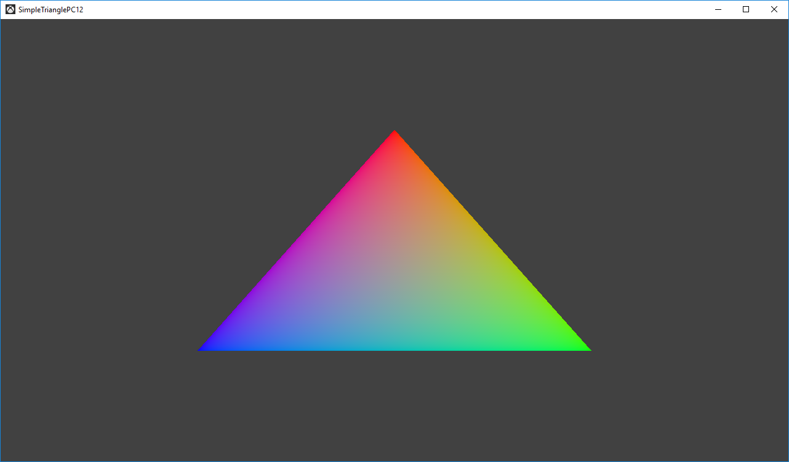

# Simple Triangle Sample (PC)

*This sample is compatible with the Microsoft Game Development Kit
(March 2022)*

# Description

This sample demonstrates how to create a static Direct3D 12 vertex
buffer to render a triangle on screen.

# Using the sample

The sample has no controls other than exiting.

This sample will run on any Windows 10 system equipped with a DirectX 12
capable video card. In the Debug configuration if no DirectX 12 capable
video card is found, it will use WARP12 if available (requires the
*Graphics Tools* optional Windows component).

# Implementation notes

The primary purpose of this sample is to familiarize the reader with the
ATG samples template structure, as well as provide a simple
demonstration of using Direct3D 12 APIs.

> **CreateDeviceDependentResources**: This is where the compiled vertex
> and pixel shaders blobs are loaded and the various Direct3D rendering
> resources are created. *The shaders are compiled by Visual Studio.*
>
> **Render:** This is where the triangle is rendered and presented to
> the screen.

For details on device creation and presentation handling, see
[DeviceResources](https://github.com/Microsoft/DirectXTK12/wiki/DeviceResources).

For details on the use of the loop timer, see
[StepTimer](https://github.com/Microsoft/DirectXTK/wiki/StepTimer).

# Update history

|Date|Notes|
|---|---|
|November 2019|Initial version.|
|October 2021|Workaround for debug layer validation issue on Windows 11 with hybrid graphics systems.|
|February 2022|Fix for HDR10 handling on PC with Alt+Win+B hotkey in DeviceResources. Opt-in support for DirectX 12 Agility SDK.|
|November 2022|Converted to use 'stock' x64 instead of Gaming.Desktop.x64.|
|March 2023|Added use if WinPixEventRuntime.|
|September 2023| HLSL 2021 language syntax fix.|
|October 2024|Updated for changes to Extension Libraries directory layout.|
