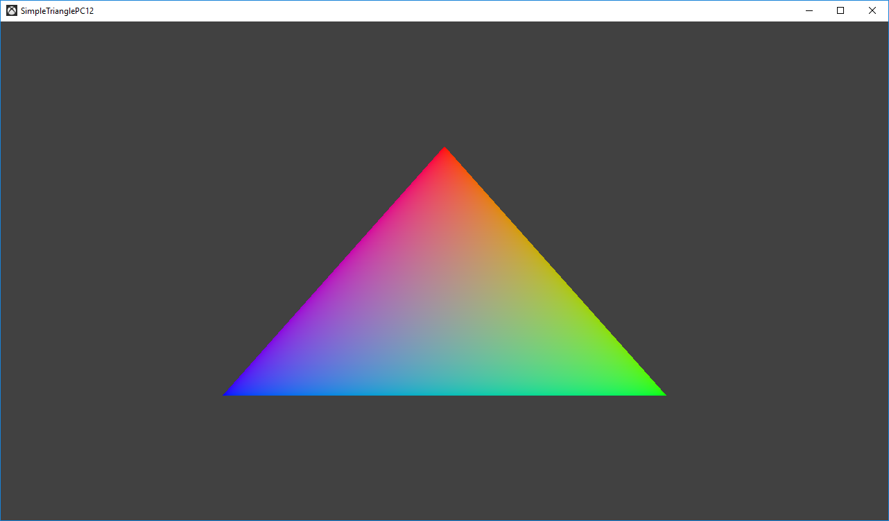

# 简单三角形示例 (PC)

*此示例可用于 Microsoft 游戏开发工具包 (2022 年 3 月)*

# 说明

此示例演示了如何创建静态 Direct3D 12 顶点缓冲区以在屏幕上渲染三角形。

# 使用示例

该示例除了退出之外，没有其他控制。

此示例将在配备有支持 DirectX 12 的视频卡的任何 Windows 10 系统上运行。 在调试配置中，如果找不到支持 DirectX 12 的视频卡，它将使用 WARP12（如有）（需要*图形工具*可选 Windows 组件）。

# 实现说明

此示例的主要目的是使读者熟悉 ATG 示例模板结构，并简单演示如何使用 Direct3D 12 API。

> **CreateDeviceDependentResources**：这是加载编译的顶点
> 和像素着色器 Blob 以及创建各种 Direct3D 呈现
> 资源的位置。 *着色器由 Visual Studio 编译。*
>
> **Render：**这是渲染三角形并将其呈现到
> 屏幕的位置。

有关设备创建和呈现处理的详细信息，请参阅 [DeviceResources](https://github.com/Microsoft/DirectXTK12/wiki/DeviceResources)。

有关使用循环计时器的详细信息，请参阅 [StepTimer](https://github.com/Microsoft/DirectXTK/wiki/StepTimer)。

