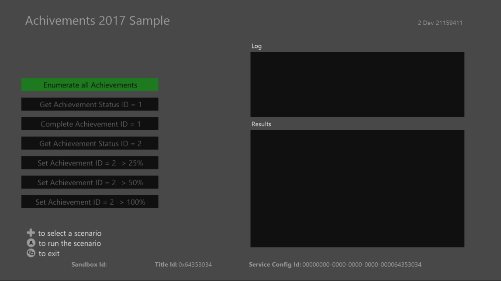

  

#   Title-Managed Achievements Sample

*This sample is compatible with the Microsoft Game Development Kit with
Xbox Extensions (March 2022)*

# Description

This sample demonstrates using the Title-Managed Achievements (also
referred to as "Simplified Achievements" and "Achievements 2017") C-API
provided by the Microsoft Game Development Kit. The sample includes
scenarios for:

-   Querying Xbox Live for all achievements for the title, including
    handling multiple pages of results

-   Querying for a single achievement

-   Updating the progress on an achievement

# Building the sample

If using an Xbox One devkit, set the active solution platform to `Gaming.Xbox.XboxOne.x64`.

If using an Xbox Series X|S devkit, set the active solution platform to `Gaming.Xbox.Scarlett.x64`.

If using a PC, set the active solution platform to x64.

*For more information, see* __Running samples__, *in the GDK documentation.*

# Running the sample

-   You will need an Xbox Live test account signed in to send
    achievement progress updates.

-   Set the target device to use the XDKS.1 sandbox.

# Using the sample

## 

| Action                                 |  Gamepad                     |
|----------------------------------------|-----------------------------|
| Select the scenario to run  |  D-Pad Up/Down or Keyboard arrows                      |
| Run a scenario                         |  A Button or Enter           |
| Sign-in a different user               |  View Button or Tab          |
| Exit                                   |  Menu button or Esc          |

The log window will display information about which API's are being
called, while the Results window will display some of the service's
response contents.

# Scenarios to try

-   Enumerating all achievements

    -   Note that because the sample artificially limits the "take"
        count to 1 and there are two achievements registered to this
        sample, it takes two calls to the API to get all of the
        achievements.

-   Get a single achievement

    -   Use this to check the status of a specific achievement. You may
        prefer this if you do not wish to query all the achievements for
        a title.

-   Complete an achievement in a single call

    -   This sets an achievement progress value to 100 in a single call.
        Many achievements will work this way (player entered a new
        level, watched a cinematic, etc.)

-   Complete an achievement using multiple calls

    -   This will set the achievement to the value specified in the
        button. An achievement which has not had any progress uploaded
        is marked as "Not Started". An achievement that has had a value
        less than 100 uploaded will be marked "In Progress".

    -   Notice the responses given by submitting progress:

        -   If you set achievement 2 to "25%", the first time it will
            succeed. If you set it to that value again, it will respond
            with a "Not Modified" response.

        -   If you set achievement 2 to "50%" after that, it will
            succeed again. If you try and set it to 25% or 50% after
            that, it will respond with "Not Modified" again. Also note
            that in both those cases, it will return the highest
            percentage value it has received when Get Achievement is
            called.

        -   Once achievement 2 is set to 100%, it will be marked
            "Achieved" and will no longer be modifiable by any calls.

# Implementation notes

The Title-Managed Achievements API works differently from the
Events-Based Achievements (also referred to as "Cloud-Powered
Achievements" and "Achievements 2013") API. This
[documentation](https://docs.microsoft.com/en-us/gaming/xbox-live/achievements-2017/simplified-achievements)
explains many of the differences, as well as the reasoning behind those
differences.

# Known issues

Once all achievements have been attained by the user, you cannot
retrigger the achievements. You will need to select a new user to show
it again, or use the **XblPlayerDataReset** tool located here:

<https://github.com/microsoft/xbox-live-developer-tools/releases>

# 

# Update history

**Update:** June 2022

**Update:** February 2022

**Initial Release**: April 2019

# 

# Privacy Statement

When compiling and running a sample, the file name of the sample
executable will be sent to Microsoft to help track sample usage. To
opt-out of this data collection, you can remove the block of code in
Main.cpp labeled "Sample Usage Telemetry".

For more information about Microsoft's privacy policies in general, see
the [Microsoft Privacy
Statement](https://privacy.microsoft.com/en-us/privacystatement/).
