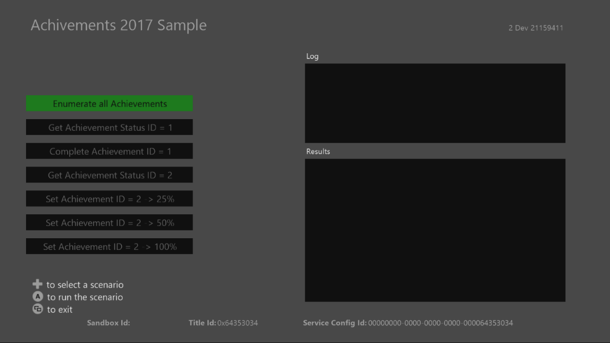

  

#   도전 과제 2017 샘플

*이 샘플은 Microsoft 게임 개발 키트 미리 보기(2019년 11월)와
호환됩니다.*

# 

# 설명

이 샘플에서는 Microsoft 게이밍 SDK에서 제공하는 도전 과제 2017(\"간단한
도전 과제\") C-API를 사용하는 방법을 보여 줍니다. 샘플에는 다음에 대한
시나리오가 포함됩니다.

-   여러 결과 페이지 처리를 포함하는 타이틀에 대한 모든 도전 과제에서
    Xbox Live 쿼리

-   단일 성과에 대한 쿼리

-   성과에 대한 진행 상황 업데이트

# 샘플 빌드

Xbox One 개발 키트를 사용하는 경우 활성 솔루션 플랫폼을
Gaming.Xbox.XboxOne.x64로 설정하세요.

Project Scarlett을 사용하는 경우 활성 솔루션 플랫폼을
Gaming.Xbox.Scarlett.x64로 설정하세요.

*자세한 내용은 GDK 문서에서* 샘플 실행하기*를 참조하세요.*

# 샘플 실행

-   도전 과제 진행 상황 업데이트를 보내려면 로그인되어 있는 Xbox Live
    테스트 계정이 있어야 합니다.

-   Xbox One devkit: 콘솔의 샌드박스를 XDKS.1로 설정

# 샘플 사용

## 

| 작업                                   |  게임패드                    |
|----------------------------------------|-----------------------------|
| 실행할 시나리오 선택                   |  D-패드 위/아래로            |
| 시나리오 실행                          |  A 단추                      |
| 보기 단추                              |  종료                        |

로그 창에는 호출되는 API에 대한 정보가 표시되지만 결과 창에는 서비스의
응답 내용 일부가 표시됩니다.

# 시도할 시나리오

-   모든 도전 과제 나열

    -   샘플은 \"take\" 수가 1로 제한되고, 이 샘플에 두 개의 도전 과제가
        등록되어 있으므로 해당 API를 두 번 호출하여 모든 도전 과제를
        수행합니다.

-   단일 도전 과제 가져오기

    -   특정 도전 과제의 상태를 확인하는 데 사용합니다. 타이틀에 대한
        모든 도전 과제를 쿼리하지는 않으려는 경우 이 작업을 수행할 수
        있습니다.

-   단일 호출로 도전 과제 완료

    -   이렇게 하면 단일 호출로 도전 과제 진행률 값이 100으로
        설정됩니다. 많은 도전 과제는 이 방식으로 작동합니다(플레이어가
        새 레벨 시작, 영화 시청 등).

-   여러 호출을 사용하여 도전 과제 완료

    -   이렇게 하면 도전 과제가 단추에 지정된 값으로 설정됩니다.
        진행률이 업로드되지 않은 도전 과제는 \"시작되지 않음\"으로
        표시됩니다. 100보다 작은 값이 업로드된 도전 과제는 \"진행
        중\"으로 표시됩니다.

    -   진행률을 제출하여 응답을 확인합니다.

        -   도전 과제 2를 \"25%\"로 설정하는 작업은 처음에는 성공적으로
            수행됩니다. 다시 이 값으로 설정하면 \"수정되지 않음\" 응답이
            표시됩니다.

        -   이 작업 후에 도전 과제 2를 \"50%\"로 설정하면 다시
            성공적으로 수행됩니다. 이 작업 후에 25% 또는 50%로 다시
            설정하면 \"수정되지 않음\" 응답이 표시됩니다. 또한 두 경우
            모두에서 도전 과제 가져오기를 호출할 때 수신된 가장 높은
            백분율 값이 반환됩니다.

        -   도전 과제 2가 100%로 설정되면 \"달성\"으로 표시되고 더 이상
            다른 호출에서 수정할 수 없게 됩니다.

# 구현 참고 사항

도전 과제 2017 API는 도전 과제 2013(\"클라우드 기반 도전 과제\"라고도
함) API와 다르게 작동합니다. 이
[문서](https://docs.microsoft.com/en-us/gaming/xbox-live/achievements-2017/simplified-achievements)에서는
몇 가지 차이점을 설명하고 해당 차이점이 나타나는 이유를 설명합니다.

# 알려진 문제

사용자가 모든 도전 과제를 달성하면 해당 도전 과제를 다시 시작할 수
없습니다. 다시 표시하려면 새 사용자를 선택해야 합니다.

# 

# 업데이트 기록

**초기 릴리스**: 2019년 4월

# 

# 개인정보처리방침

샘플을 컴파일하고 실행할 때 샘플의 사용을 추적하는 데 도움이 되도록 샘플
실행 파일의 파일 이름이 Microsoft에 전송됩니다. 이 데이터 수집을
옵트아웃하려면 Main.cpp에서 \"샘플 사용 원격 분석\"이라고 레이블이
지정된 코드 블록을 제거할 수 있습니다.

Microsoft의 일반 개인정보취급방침에 대한 자세한 내용은 [Microsoft
개인정보처리방침](https://privacy.microsoft.com/en-us/privacystatement/)을
참조하세요.
